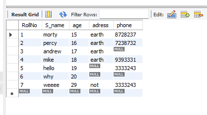
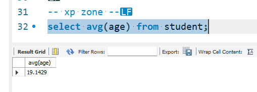
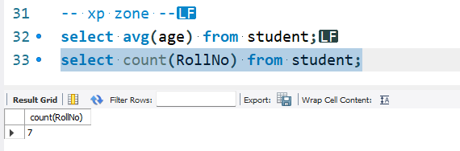
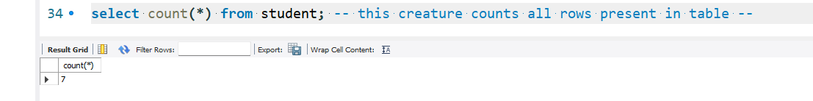
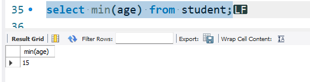
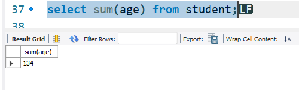

```sql
-- create database probz --
use probz;
create table student(
RollNo integer primary key,
S_name text,
age integer,
adress varchar(69),
phone double
);

insert into student values (1,'morty',15,'earth',8728237);
insert into student values (2,'percy',16,'earth',7238732);
insert into student values (3,'andrew',17,'earth',null);
insert into student values (4,'mike',18,'earth',9393331);
insert into student values (5,'hello',19,null,3333243);
insert into student values (6,'why',20,null,null);
insert into student values (7,'weeee',29,'not',3333243);

select * from student;
rename table student to hola;
select * from hola;
-- drop section --
drop table student;
drop table hola;
-- drop section end --

truncate table hola;
alter table hola add column kek integer;
update hola set age = 25  where rollno=1;

-- xp zone --
select avg(age) from student;
select count(RollNo) from student;
select count(*) from student; -- this creature counts all rows present in table --
select min(age) from student;
select max(age) from student;
select sum(age) from student;

```
***

 
***

average
 

***
count
 
 
***
 
 
 