***Q.1 Explain ACID properties of transaction***  
#answer  
ACID Properties of Transactions:  
1. **Atomicity**: The entire transaction is treated as a single unit. Either all operations in the transaction are completed or none are. If a failure occurs, the system rolls back to the state before the transaction started, ensuring no partial operations remain.  
2. **Consistency**: A transaction takes the database from one consistent state to another. It ensures that any changes made by a transaction are valid according to predefined rules, constraints, and triggers.  
3. **Isolation**: Transactions are executed in isolation from each other, ensuring that intermediate results of a transaction are not visible to other concurrent transactions. This prevents conflicts when multiple transactions are being processed simultaneously.  
4. **Durability**: Once a transaction is committed, the changes it made are permanent, even in the event of a system crash. The system ensures that the results of committed transactions are not lost.  

***

***Q.2 Draw and explain state diagram of transactions***  
#answer

***
***Q.3 Define Transaction with an example***  
#solvify:  
- A transaction in a Database Management System (DBMS) is a sequence of operations performed as a single logical unit of work.  
- A transaction ensures that the database moves from one consistent state to another even in the presence of system failures.  
- Transactions are fundamental to maintaining the integrity and consistency of data in databases.  

**Example**:  
- In a banking system, a transaction might involve transferring money from one account to another. The transaction would include the following steps:  
  - **Read** the balance of Account A.  
  - **Deduct** the amount to be transferred from Account A.  
  - **Add** the amount to Account B.  
  - **Commit** the transaction, making the changes permanent.  

- If any step fails (e.g., insufficient funds in Account A), the transaction would be rolled back to its initial state, ensuring no incorrect partial updates are made.  

***

***Q.4 Explain the steps involved in query processing and optimization.***  
#answer

***

***Q.5 Give the advantages of concurrency in DBMS.***  
#answer

***

***Q.6 Explain Timestamp Based Protocols***  
#answer

***

***Q.7 Explain Validation based protocol.***  
#answer

***

***Q.8 SQL query on subquery and join.***  
#answer

***

***Q.9 Numerical on conflict serializibility.***  
#answer

***

***Q.10 Explain the concepts of LOCK in concurrency control.***  
#answer

***

***Q.11 Explain starvation of transaction. Also state steps to avoid starvation.***  
#answer
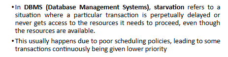 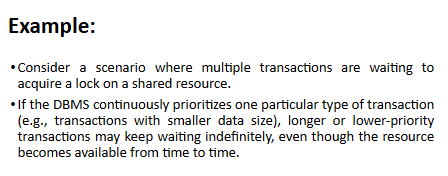 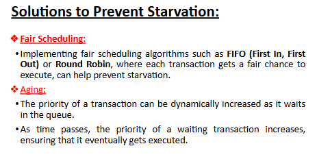 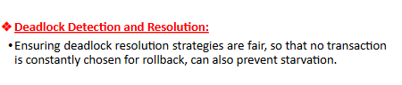 
***

***Q.12 Describe two-phase locking protocol.***  
#answer
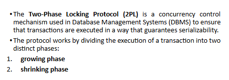 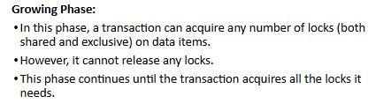 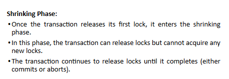 

***

***Q.13 Define deadlock with the help of an example.***  
#answer

***

***Q.14 Explain wait-for graph for deadlock detection.***  
#answer

***

***Q.15 Numerical on Timestamp Based Protocols***  
#answer

***

***Q.16 Explain conflict serializability with example***  
#solvify:  
- **Conflict Serializability**: Two schedules are conflict equivalent if they involve the same set of transactions and operations, and conflicting operations are in the same order.  
- Conflicting operations are those that:  
  - Belong to different transactions.  
  - Access the same data item.  
  - At least one operation is a write.  

- If a schedule can be transformed into a **serial schedule** by swapping non-conflicting operations, it is **conflict serializable**.  

**Example**:  
| T1          | T2          |
|-------------|-------------|
| **Read(X)** |             |
| **Write(X)**|             |
|             | **Read(X)** |
|             | **Write(X)** |

- In this example:  
  - **T1** reads the value of **X**, then writes a new value to **X**.  
  - **T2** reads the updated value of **X** and then writes another value to **X**.  
- Since both T1 and T2 are accessing the same data item (**X**) with at least one write operation, these operations conflict.  
- The schedule can be transformed into a **serial schedule** where T1 completes all its operations before T2 starts. This schedule is conflict serializable because it is equivalent to a **serial execution**.  

***

***Q.17 Describe view serializability with example.***  
#solvify:  
- **View Serializability**: Two schedules are view equivalent if:
  - The transactions in both schedules read the same initial values.  
  - If a transaction in one schedule reads a value written by another transaction, the same holds true in the other schedule.  
  - The final write operations in both schedules are the same.  

- View serializability is a broader concept than conflict serializability. All conflict-serializable schedules are view serializable, but not all view-serializable schedules are conflict serializable.  

### Example of View Serializability:

| T1          | T2            |
|-------------|---------------|
| **Write(X)**|               |
|             | **Read(X)**   |
|             | **Write(Y)**  |
| **Read(Y)** |               |

- In this example, if T1 writes to **X** and T2 reads from **X** and writes to **Y**, the view of the final states in both schedules will maintain the same initial values and write operations, establishing view equivalence.

***

***Q.18 Explain cascade and cascadeless schedule.***  
#answer

***

***Q.19 Enlist the key features of NoSQL database***  
#answer
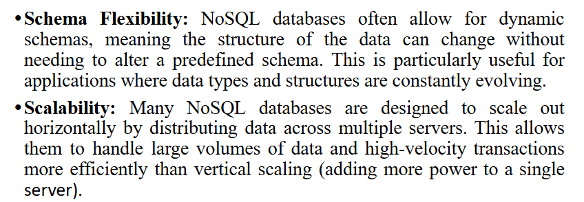 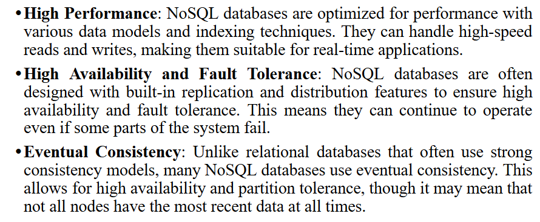 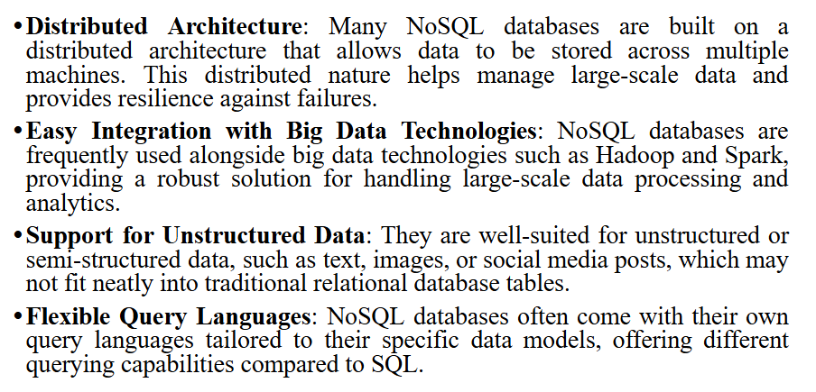 
***

***Q.20 State advantages and disadvantages of using NoSQL databases.***  
#answer

***

***Q.21 Differentiate between SQL and NoSQL databases briefly.***  
#answer
| **Sr. No** | **RDBMS**                                       | **NoSQL**                                 |
|------------|-------------------------------------------------|------------------------------------------|
| 1          | Relational or traditional database system        | Non-relational or distributed database system |
| 2          | These databases have fixed or static schema      | They have dynamic schema                 |
| 3          | These databases are not suited for hierarchical data storage | These databases are suited for hierarchical data storage |
| 4          | These databases are best suited for complex queries | These databases are not well suited for complex queries |
| 5          | Vertically scalable                              | Horizontally scalable                    |
| 6          | Follows ACID property                            | Follows CAP (consistency, availability, partition tolerance) |
| 7          | Examples: MySQL, Oracle, MS-SQL Server, etc     | Examples: MongoDB, Cassandra, etc       |

***

***Q.22 List two common types of NoSQL databases.***  
#answer
> [!caution] mentioned 4 types instead of 2

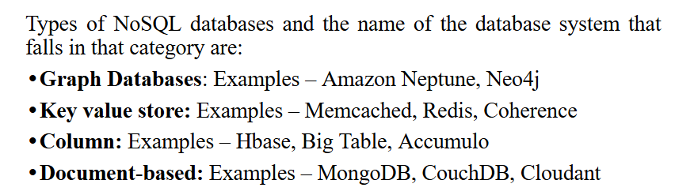 

***

***Q.23 Give compatibility function.***  
#answer
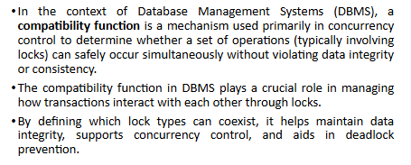 

***

***Q.24 State the significance of SQL in Cassandra.***  
#answer

***

***Q.25 Describe the basic steps involved in creating a new database in Cassandra.***  
#answer

***

***Q.26 Describe the basic steps involved in creating a new database in MongoDB.***  
#answer

***

***Q.27 Describe the steps involved in setting up a MongoDB database, creating collections, and inserting documents into a collection.***  
#answer

***
