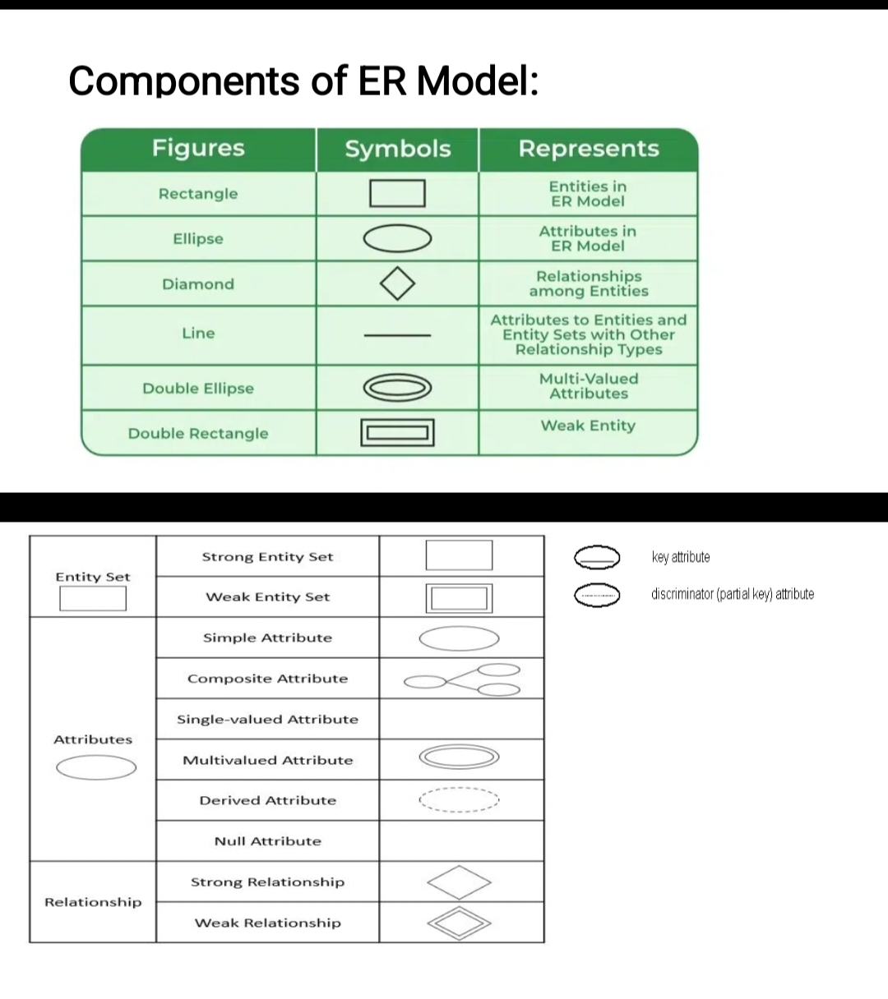
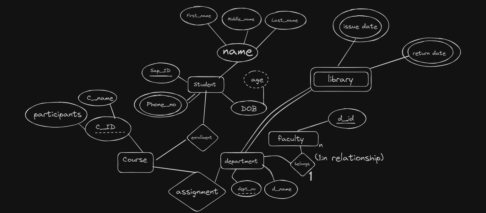

theory

### Why We Need ER Model

An Entity-Relationship (ER) model is crucial for database design. It maps out data entities, their attributes, and relationships, ensuring data consistency and simplifying database planning. This model serves as a blueprint for constructing an efficient database and facilitates communication among stakeholders.

### What is ER Model

The ER model is a conceptual framework that describes a database's structure using entities, attributes, and relationships. it visually represents how data entities interact, making it easier to organize and understand complex data relationships before creating the database.

### Data Models

A data model is a framework that defines how data is structured, stored, and related within a database. It helps organize and manage data efficiently.

### Types of Data Models

1. **Hierarchical Model**: Organizes data in a tree-like structure with parent-child relationships. Each parent can have multiple children, but each child has only one parent (e.g., file systems).

2. **Network Model**: Allows more complex relationships by enabling multiple parent-child relationships. Data is organized in a graph structure, where nodes represent entities and edges represent relationships (e.g., network databases).

3. **Relational Model**: Uses tables (relations) to represent data and their relationships. Each table consists of rows (records) and columns (attributes). This model is highly flexible and widely used in databases (e.g., SQL databases).

4. **Entity-Relationship (ER) Model**: Represents data using entities (objects), attributes (properties), and relationships between entities. It's a conceptual model used for database design.

5. **Object-Oriented Model**: Integrates data and its behavior by using objects, similar to object-oriented programming. It allows complex data types and relationships (e.g., object-oriented databases).
### Components of ER Model (in Table)

| Component     | Description                                                               |
|---------------|---------------------------------------------------------------------------|
| Entity        | An object or concept about which data is stored (e.g., Customer, Product).|
| Attribute     | A property or characteristic of an entity (e.g., Customer Name).          |
| Relationship  | A link between entities showing their interaction (e.g., Purchases).      |
| Primary Key   | A unique identifier for an entity instance (e.g., Customer ID).           |
| Cardinality   | The numerical relationship between entities (e.g., One-to-Many).          |

 

procedure (at your own risk, not verified/correct)
