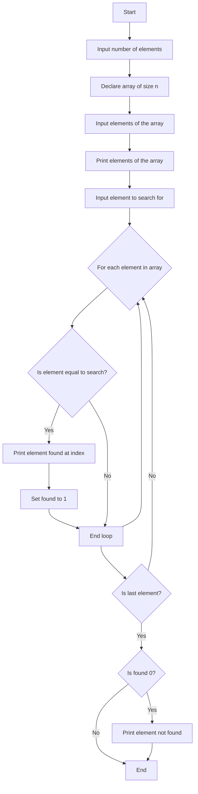

find element in an array at each phase using search index


#include <stdio.h>

int main() {
    int n, i, search, found = 0;

    printf("Enter the number of elements in the array: ");
    scanf("%d", &n);

    int arr[n];

    printf("Enter the elements of the array:\n");
    for (i = 0; i < n; i++) {
        scanf("%d", &arr[i]);
    }

    printf("The elements of the array are:\n");
    for (i = 0; i < n; i++) {
        printf("%d ", arr[i]);
    }
    printf("\n");

    printf("Enter the element to search for: ");
    scanf("%d", &search);

    for (i = 0; i < n; i++) {
        if (arr[i] == search) {
            printf("Element %d found at index %d\n", search, i);
            found = 1;
        }
    }

    if (found == 0) {
        printf("Element %d not found in the array\n", search);
    }

    return 0;
}
```
