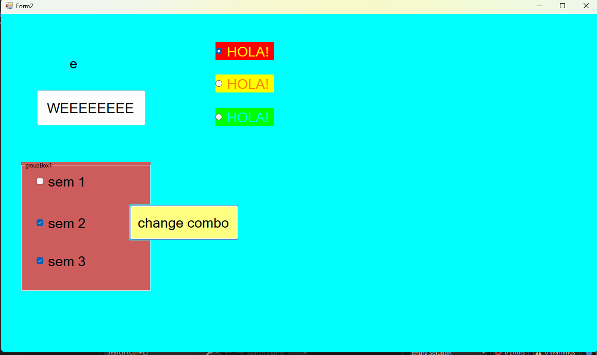
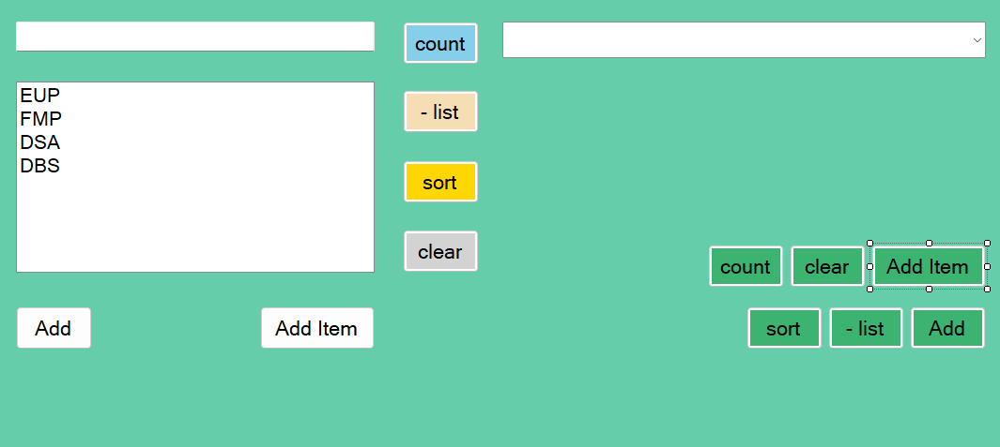
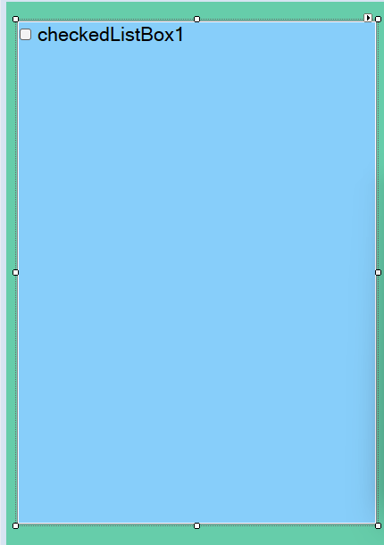
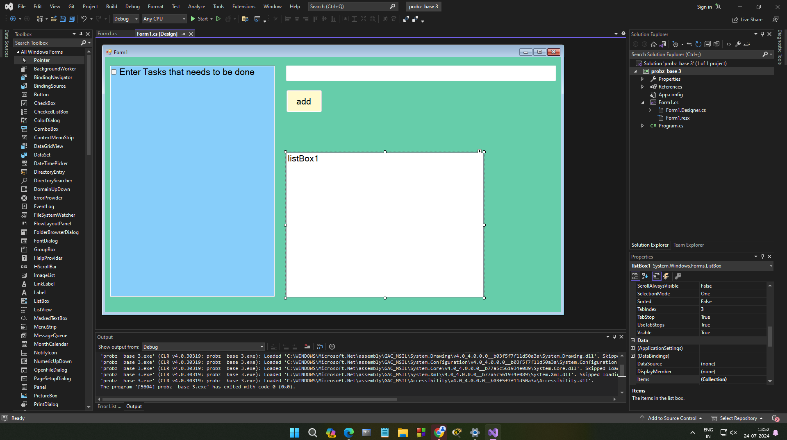

# p3 24/07/2024
eup

 
```csharp
//change combo button code 
private void button2_Click(object sender, EventArgs e)
        {
            if (checkBox1.Checked == false && checkBox2.Checked == false && checkBox3.Checked == false)
            {
                this.BackColor = Color.FromArgb(0, 0, 0);
            }

            if (checkBox1.Checked == true && checkBox2.Checked == true && checkBox3.Checked == true)
            {
                this.BackColor = Color.FromArgb(255, 255, 255);
            }

            if(checkBox1.Checked == true && checkBox2.Checked == true && checkBox3.Checked == false)
            {
                this.BackColor = Color.FromArgb(255,255, 0);
            }

            if(checkBox1.Checked == true && checkBox2.Checked == false && checkBox3.Checked == true)
            {
                this.BackColor = Color.FromArgb(255, 0, 255);
            }

            if(checkBox1.Checked == false && checkBox2.Checked == true && checkBox3.Checked == true)
            {
                this.BackColor = Color.FromArgb(0, 255,255);
            }


        }
    }
}

```

project name: Probz Base 2
favcolor: MeduimAquaramine


for list box control, inorder to add items directly in design window
click on properties then go to data binding tab then click on collection
```csharp
  public partial class Form1 : Form
    {
        public Form1()
        {
            InitializeComponent();
        }

        private void button1_Click(object sender, EventArgs e)
        {
            listBox1.Items.Add("meth");
            listBox1.Items.Add("ee");
        }

        private void button2_Click(object sender, EventArgs e)
        {
            //textbox data commes to list box
            listBox1.Items.Add(textBox1.Text);
            textBox1.Clear();
            textBox1.Focus();
        }

        private void button6_Click(object sender, EventArgs e)
        {
            //clear button
            textBox1.Clear();
        }

        private void button4_Click(object sender, EventArgs e)
        {
            //remove item / - list
            listBox1.Items.Remove(listBox1.SelectedItem);
            //listBox1.Items.RemoveAt(listBox1.SelectedIndex);
        }

        private void button5_Click(object sender, EventArgs e)
        {
            //sort button
            listBox1.Sorted= true;
        }

        private void button3_Click(object sender, EventArgs e)
        {
            //count
            int count = listBox1.Items.Count;
            MessageBox.Show("listbox items:" + count);
        }


```


```csharp

//combo button codes
        private void button9_Click(object sender, EventArgs e)
        {

            //combo1.Items.Remove(comboBox1.SelectedItem);
            comboBox1.Items.RemoveAt(comboBox1.SelectedIndex);
        }

        private void button7_Click(object sender, EventArgs e)
        {

            comboBox1.Items.Add("Maths");
            comboBox1.Items.Add("CS");
        }

        private void button8_Click(object sender, EventArgs e)
        {
            comboBox1.Items.Add(textBox1.Text);
            textBox1.Clear();
            textBox1.Focus();
        }

        private void button10_Click(object sender, EventArgs e)
        {
            comboBox1.Sorted = true;
        }

        private void button11_Click(object sender, EventArgs e)
        {
            comboBox1.Items.Clear();
        }

        private void button12_Click(object sender, EventArgs e)
        {

            int count = comboBox1.Items.Count;
            MessageBox.Show("Total items in combobox" + count);
        }
    }
}


```
 

project name: probz base 3


to directly edit items in that list thingy there is small right arrow on the screeen itself
 
look carefully

 
```csharp
 public partial class Form1 : Form
    {
        public Form1()
        {
            InitializeComponent();
        }

        private void Form1_Load(object sender, EventArgs e)
        {

        }

        private void button1_Click(object sender, EventArgs e)
        {
            //add button code
            foreach(string S in checkedListBox1.CheckedItems)
            {
                listBox1.Items.Add(S);
            }
        }
    }
}

```