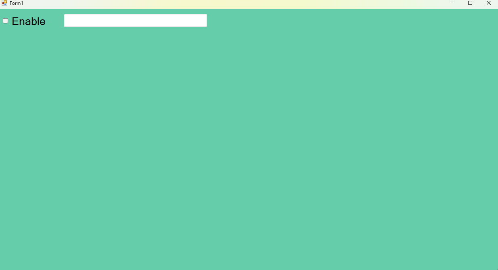
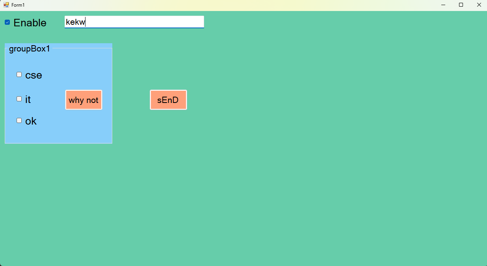
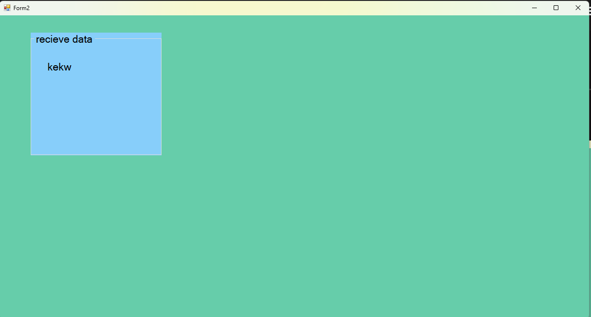

  # eup 25/07/2024

form 1
 
 

form 2
 
form 1
```csharp
using System;
using System.Collections.Generic;
using System.ComponentModel;
using System.Data;
using System.Drawing;
using System.Linq;
using System.Text;
using System.Threading.Tasks;
using System.Windows.Forms;
using static System.Windows.Forms.VisualStyles.VisualStyleElement.Button;

namespace probzbase4
{
    public partial class Form1 : Form
    {
        //send data to other form access modifier
        public static String S;
        public Form1()
        {
            InitializeComponent();
        }

        private void Form1_Load(object sender, EventArgs e)
        {
            groupBox1.Hide();
            button2.Hide();
        }

        private void checkBox1_CheckedChanged(object sender, EventArgs e)
        {
            groupBox1.Enabled = false;
            if (checkBox1.Checked)
            {

                groupBox1.Show();
                button2.Show();
                groupBox1.Enabled = true;
            }
            else
            {
                groupBox1.Hide();
                button2.Hide();
            }


        }

        private void groupBox1_Enter(object sender, EventArgs e)
        {

        }

        private void button1_Click(object sender, EventArgs e)
        {
            if (checkBox2.Checked == true)
            {
                MessageBox.Show("Cse");
            }
            if (checkBox3.Checked == true)
            {
                MessageBox.Show("it");
            }

            if (checkBox4.Checked == true)
            {
                MessageBox.Show("okj");
            }

            if (checkBox2.Checked == false && checkBox3.Checked == false && checkBox4.Checked == false)
            {
                MessageBox.Show("nothin");
            }

            //how to send data from form 1 to form 2

        }

        private void button2_Click(object sender, EventArgs e)
        {
            //goto next button + send data
            S = textBox1.Text;
            this.Hide();
            Form2 f2 = new Form2();
            f2.Show();
        }
    }
}


```

form 2
```csharp
using System;
using System.Collections.Generic;
using System.ComponentModel;
using System.Data;
using System.Drawing;
using System.Linq;
using System.Text;
using System.Threading.Tasks;
using System.Windows.Forms;

namespace probzbase4
{
    public partial class Form2 : Form
    {
        public Form2()
        {
            InitializeComponent();
        }

        private void Form2_Load(object sender, EventArgs e)
        {
            //send data code to another form
            // i wrote code in form load event instead of button 
            label1.Text = Form1.S;
        }


    }
}


```