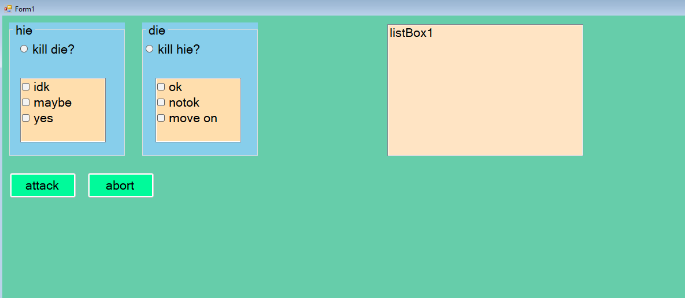
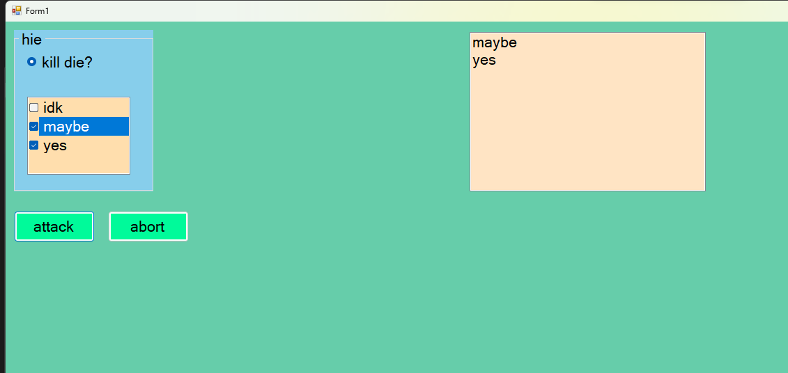
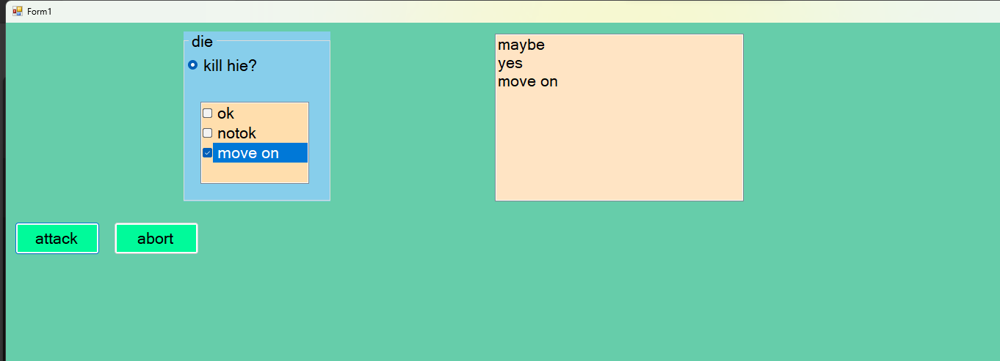

# eup 31/07/2024

  Probz base kekw

 
  

```csharp
using System;
using System.Collections.Generic;
using System.ComponentModel;
using System.Data;
using System.Drawing;
using System.Linq;
using System.Text;
using System.Threading.Tasks;
using System.Windows.Forms;
using static System.Windows.Forms.VisualStyles.VisualStyleElement.Button;

namespace pvz
{
    public partial class Form1 : Form
    {
        public Form1()
        {
            InitializeComponent();
            groupBox1.Show();
            groupBox2.Show();
            radioButton1.Enabled = false;
            radioButton2.Enabled = false;
            timer1.Start();
        }

        private void radioButton1_CheckedChanged(object sender, EventArgs e)
        {

            groupBox2.Hide();

        }

        private void radioButton2_CheckedChanged(object sender, EventArgs e)
        {

            groupBox1.Hide();
        }

        private void button2_Click(object sender, EventArgs e)
        {
            radioButton1.Checked = false;
            radioButton2.Checked = false;
            groupBox1.Show();
            groupBox2.Show();
            
        }

        private void button1_Click(object sender, EventArgs e)
        {
            foreach (string s in checkedListBox1.CheckedItems)
            {
                if (!listBox1.Items.Contains(s))
                {
                    listBox1.Items.Add(s);
                }
                
            }

            foreach (string s in checkedListBox2.CheckedItems)
            {
                if (!listBox1.Items.Contains(s))
                {
                    listBox1.Items.Add(s);
                }
            }
        }

        private void groupBox1_Enter(object sender, EventArgs e)
        {
            
                radioButton1.Enabled = true;
           
        }

        private void groupBox2_Enter(object sender, EventArgs e)
        {
            
                radioButton2.Enabled = true;
            
        }

        private void timer1_Tick(object sender, EventArgs e)
        {
            radioButton1.Enabled = true;
            radioButton2.Enabled = true;

        }
    }

}

```