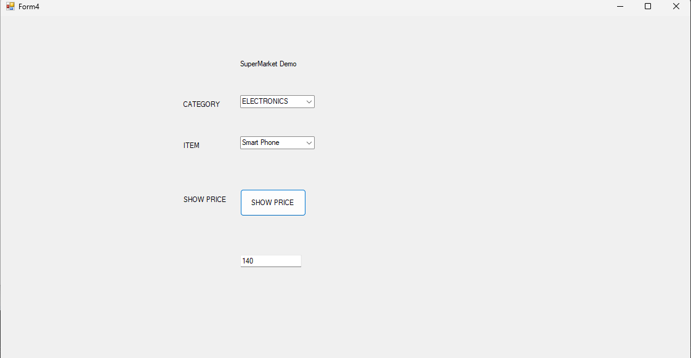

combo box 
```csharp
using System;
using System.Windows.Forms;

namespace WindowsFormsApp13
{
    public partial class Form4 : Form
    {
        public Form4()
        {
            InitializeComponent();
        }

        private void comboBox1_SelectedIndexChanged(object sender, EventArgs e)
        {
            if(comboBox1.SelectedIndex == 0)
            {
                comboBox2.Items.Add("Apple");
                comboBox2.Items.Add("Banana");
                comboBox2.Items.Add("Mango");
                comboBox2.Items.Add("Pear");

            }
            if (comboBox1.SelectedIndex == 1)
            {
                comboBox2.Items.Add("Carrot");
                comboBox2.Items.Add("Onion");
                comboBox2.Items.Add("Tomato");
                comboBox2.Items.Add("Cauliflower");

            }
            if (comboBox1.SelectedIndex == 2)
            {
                comboBox2.Items.Add("Headphones");
                comboBox2.Items.Add("Smart Watch");
                comboBox2.Items.Add("Smart Phone");
                comboBox2.Items.Add("Smart TV");

            }
        }

        private void button1_Click(object sender, EventArgs e)
        {   
            if (comboBox2.SelectedItem == "Apple")
            {
                textBox1.Text = "100";
            }
            else if (comboBox2.SelectedItem == "Banana")
            {
                textBox1.Text = "140";
            }
            else if (comboBox2.SelectedItem == "Mango")
            {
                textBox1.Text = "180";
            }
            else if (comboBox2.SelectedItem == "Pear")
            {
                textBox1.Text = "150";
            }
            else if (comboBox2.SelectedItem == "Carrot")
            {
                textBox1.Text = "140";
            }
            else if (comboBox2.SelectedItem == "Onion")
            {
                textBox1.Text = "140";
            }
            else if (comboBox2.SelectedItem == "Tomato")
            {
                textBox1.Text = "140";
            }
            else if (comboBox2.SelectedItem == "Cauliflower")
            {
                textBox1.Text = "140";
            }
            else if (comboBox2.SelectedItem == "Headphones")
            {
                textBox1.Text = "140";
            }
            else if (comboBox2.SelectedItem == "Smart Watch")
            {
                textBox1.Text = "140";
            }
            else if (comboBox2.SelectedItem == "Smart Phone")
            {
                textBox1.Text = "140";
            }
            else if (comboBox2.SelectedItem == "Smart TV")
            {
                textBox1.Text = "14000";
            }
            else
            {
                textBox1.Text = "Wrong Item";
            }
        }
    }
}


```
 
 


