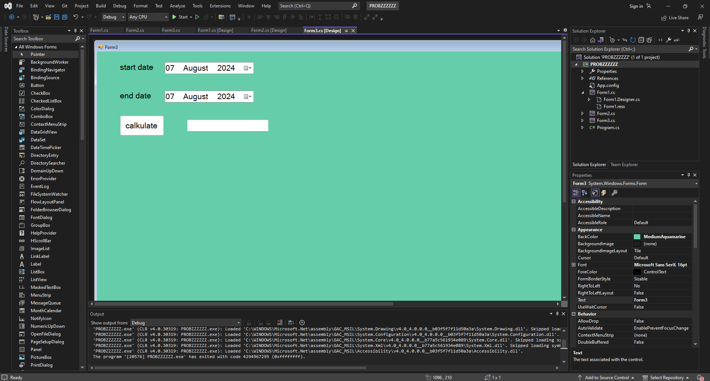

# p6 eup

 
 
 
 
 

 

form1 
```csharp
using System;
using System.Collections.Generic;
using System.ComponentModel;
using System.Data;
using System.Drawing;
using System.Linq;
using System.Text;
using System.Threading.Tasks;
using System.Windows.Forms;

namespace PROBZZZZZZ
{
    public partial class Form1 : Form
    {
        int s = 0; 
        public Form1()
        {
            InitializeComponent();
            
        }

        private void button1_Click(object sender, EventArgs e)
        {
            timer1.Start();
            
        }

        private void timer1_Tick(object sender, EventArgs e)
        {
            s += 1;
            label1.Text = s.ToString();

        }

        private void label1_Click(object sender, EventArgs e)
        {
            
        }

        private void button2_Click(object sender, EventArgs e)
        {
            timer1.Stop();
        }

        private void button3_Click(object sender, EventArgs e)
        {
            s = 0;
        }

        private void button4_Click(object sender, EventArgs e)
        {
            this.Hide();
            Form2 f2 = new Form2();
            f2.Show();
        }
    }
}

```

form2
```csharp
using System;
using System.Collections.Generic;
using System.ComponentModel;
using System.Data;
using System.Drawing;
using System.Linq;
using System.Reflection.Emit;
using System.Text;
using System.Threading.Tasks;
using System.Windows.Forms;

namespace PROBZZZZZZ
{
    public partial class Form2 : Form
    {
        int s = 0;
        public Form2()
        {
            InitializeComponent();
        }

        private void button4_Click(object sender, EventArgs e)
        {
            this.Hide();
            Form1 f1 = new Form1();
            f1.Show();
        }

        private void timer1_Tick(object sender, EventArgs e)
        {
            s += 1;
            label1.Text = s.ToString();
           
            progressBar1.Increment(12);
            label2.Text = progressBar1.Value.ToString();
            if (progressBar1.Value ==100)
            {
                timer1.Stop();
                //   MessageBox.Show("D0ne");
                this.Hide();
                Form3 f3 = new Form3();
                f3.Show();
            }
            
        }

        private void Form2_Load(object sender, EventArgs e)
        {
            timer1.Start();
        }

        private void label2_Click(object sender, EventArgs e)
        {

        }

        private void label1_Click(object sender, EventArgs e)
        {

        }
    }
}


```

form3
```csharp
using System;
using System.Collections.Generic;
using System.ComponentModel;
using System.Data;
using System.Drawing;
using System.Linq;
using System.Text;
using System.Threading.Tasks;
using System.Windows.Forms;

namespace PROBZZZZZZ
{
    public partial class Form3 : Form
    {
        public Form3()
        {
            InitializeComponent();
        }

        private void Form3_Load(object sender, EventArgs e)
        {

        }

        private void button1_Click(object sender, EventArgs e)
        {
            DateTime d1 = new DateTime();
            DateTime d2 = new DateTime();
            d1 = dateTimePicker1.Value;
            d2 = dateTimePicker2.Value;
            TimeSpan d = new TimeSpan();
            d = d2.Subtract(d1);
            int ihatedays = d.Days;
            textBox1.Text = ihatedays.ToString() + " days ";
        }
    }
}


```
***
combbox torture
```csharp
using System;
using System.Windows.Forms;

namespace WindowsFormsApp13
{
    public partial class Form4 : Form
    {
        public Form4()
        {
            InitializeComponent();
        }

        private void comboBox1_SelectedIndexChanged(object sender, EventArgs e)
        {
            if(comboBox1.SelectedIndex == 0)
            {
                comboBox2.Items.Add("Apple");
                comboBox2.Items.Add("Banana");
                comboBox2.Items.Add("Mango");
                comboBox2.Items.Add("Pear");

            }
            if (comboBox1.SelectedIndex == 1)
            {
                comboBox2.Items.Add("Carrot");
                comboBox2.Items.Add("Onion");
                comboBox2.Items.Add("Tomato");
                comboBox2.Items.Add("Cauliflower");

            }
            if (comboBox1.SelectedIndex == 2)
            {
                comboBox2.Items.Add("Headphones");
                comboBox2.Items.Add("Smart Watch");
                comboBox2.Items.Add("Smart Phone");
                comboBox2.Items.Add("Smart TV");

            }
        }

        private void button1_Click(object sender, EventArgs e)
        {   
            if (comboBox2.SelectedItem == "Apple")
            {
                textBox1.Text = "100";
            }
            else if (comboBox2.SelectedItem == "Banana")
            {
                textBox1.Text = "140";
            }
            else if (comboBox2.SelectedItem == "Mango")
            {
                textBox1.Text = "180";
            }
            else if (comboBox2.SelectedItem == "Pear")
            {
                textBox1.Text = "150";
            }
            else if (comboBox2.SelectedItem == "Carrot")
            {
                textBox1.Text = "140";
            }
            else if (comboBox2.SelectedItem == "Onion")
            {
                textBox1.Text = "140";
            }
            else if (comboBox2.SelectedItem == "Tomato")
            {
                textBox1.Text = "140";
            }
            else if (comboBox2.SelectedItem == "Cauliflower")
            {
                textBox1.Text = "140";
            }
            else if (comboBox2.SelectedItem == "Headphones")
            {
                textBox1.Text = "140";
            }
            else if (comboBox2.SelectedItem == "Smart Watch")
            {
                textBox1.Text = "140";
            }
            else if (comboBox2.SelectedItem == "Smart Phone")
            {
                textBox1.Text = "140";
            }
            else if (comboBox2.SelectedItem == "Smart TV")
            {
                textBox1.Text = "14000";
            }
            else
            {
                textBox1.Text = "Wrong Item";
            }
        }
    }
}


```
 
 


