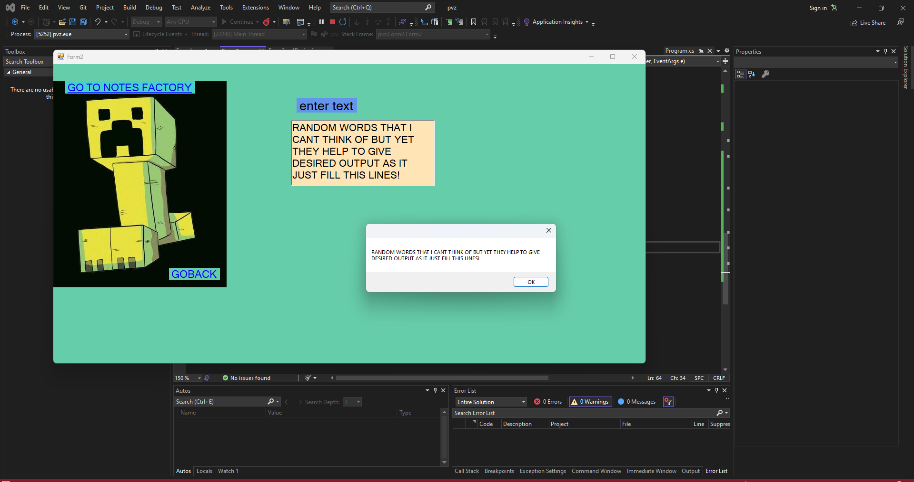
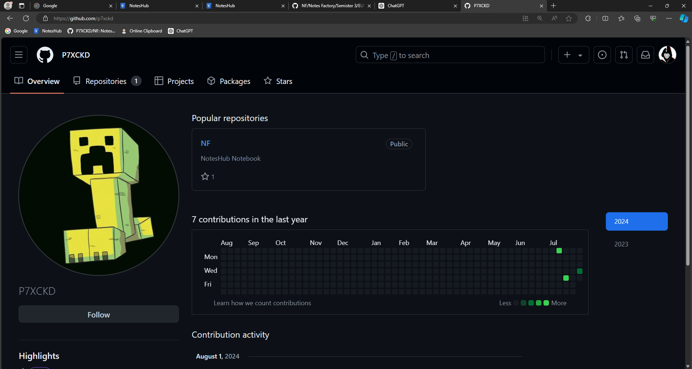

list box (image list)
 
 
  > [!warning] this is form2 
  >  form1 is just a button which connects to form 2
  ```csharp
  using System;
using System.Collections.Generic;
using System.ComponentModel;
using System.Data;
using System.Diagnostics;
using System.Drawing;
using System.Linq;
using System.Text;
using System.Threading.Tasks;
using System.Windows.Forms;

namespace pvz
{
    public partial class Form2 : Form
    {
        public Form2()
        {
       
            InitializeComponent();
        }

        

        private void linkLabel1_LinkClicked(object sender, LinkLabelLinkClickedEventArgs e)
        {
            Process.Start(new ProcessStartInfo
            {
                FileName = "https://github.com/P7XCKD/NF",
                UseShellExecute = true
            });

        }

        private void linkLabel2_LinkClicked(object sender, LinkLabelLinkClickedEventArgs e)
        {
            this.Hide();
            Form1 f1 = new Form1();
            f1.Show();
        }
        private void richTextBox1_MouseLeave(object sender, EventArgs e)
        {
            MessageBox.Show(richTextBox1.Text);
            richTextBox1.Clear();
        }
    }
}
  ```