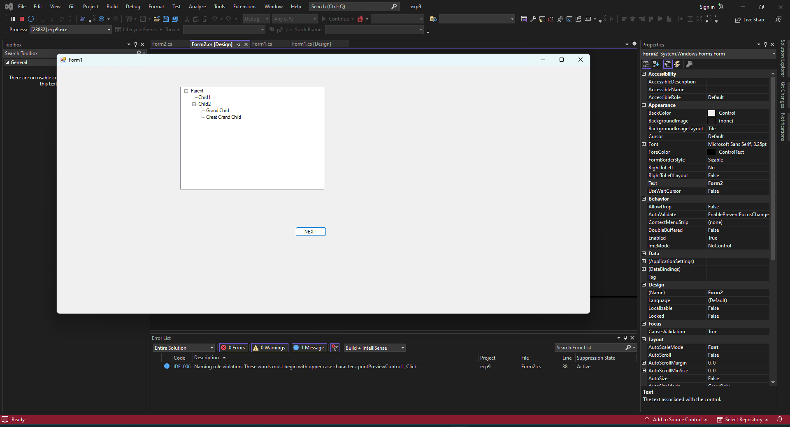

tree 
 
 
form1.cs
```csharp
using System;
using System.Collections.Generic;
using System.ComponentModel;
using System.Data;
using System.Drawing;
using System.Linq;
using System.Text;
using System.Threading.Tasks;
using System.Windows.Forms;

namespace exp9
{
    public partial class Form1 : Form
    {
        public Form1()
        {
            InitializeComponent();
            TreeView T1 = new TreeView();
            T1.Location = new System.Drawing.Point(300, 50);
            T1.Size = new System.Drawing.Size(350, 250);
            this.Controls.Add(T1);
            T1.Nodes.Add("Parent");
            T1.Nodes[0].Nodes.Add("Child1");
            T1.Nodes[0].Nodes.Add("Child2");
            T1.Nodes[0].Nodes[1].Nodes.Add("Grand Child");
            T1.Nodes[0].Nodes[1].Nodes.Add("Great Grand Child");
        }

           private void button1_Click(object sender, EventArgs e)
        {
            Form F2= new Form2();
            F2.Show();
            Form1 F1= new Form1();
            F1.Hide();
        }
    }
}


```
