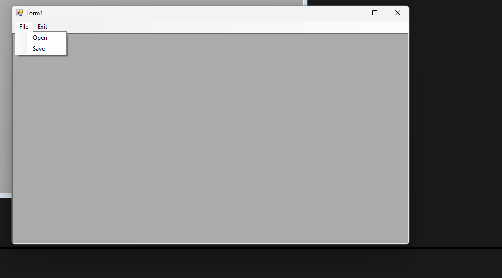
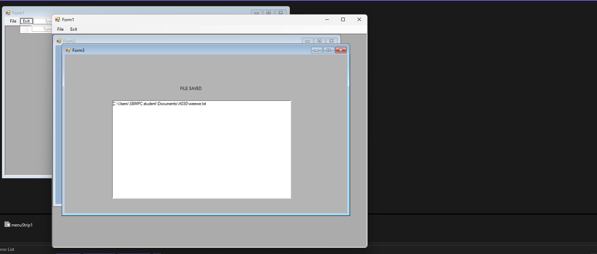

 
 
 
***
form1.cs
```csharp
using System;
using System.Collections.Generic;
using System.ComponentModel;
using System.Data;
using System.Drawing;
using System.Linq;
using System.Text;
using System.Threading.Tasks;
using System.Windows.Forms;

namespace WindowsFormsApp12
{
    public partial class Form1 : Form
    {
        public Form1()
        {
            InitializeComponent();
        }

        private void openToolStripMenuItem_Click(object sender, EventArgs e)
        {
            Form2 f2 = new Form2();
            f2.MdiParent= this;
            f2.Show();
        }

        private void saveToolStripMenuItem_Click(object sender, EventArgs e)
        {
            Form3 f3 = new Form3();
            f3.MdiParent = this;
            f3.Show();
        }

        private void exitToolStripMenuItem_Click(object sender, EventArgs e)
        {
            this.Close();
        }
    }
}


```

form2.cs
```csharp
using System;
using System.Collections.Generic;
using System.ComponentModel;
using System.Data;
using System.Drawing;
using System.Linq;
using System.Text;
using System.Threading.Tasks;
using System.Windows.Forms;


namespace WindowsFormsApp12
{
    public partial class Form2 : Form
    {
        OpenFileDialog ofd;
        public Form2()
        {
            InitializeComponent();
            ofd= new OpenFileDialog();
            ofd.ShowDialog();
            richTextBox1.Text=ofd.FileName;
        }
    }
}


```
form3.cs
```csharp
using System;
using System.Collections.Generic;
using System.ComponentModel;
using System.Data;
using System.Drawing;
using System.Linq;
using System.Text;
using System.Threading.Tasks;
using System.Windows.Forms;

namespace WindowsFormsApp12
{
    public partial class Form3 : Form
    {
        SaveFileDialog sfd;
        public Form3()
        {
            InitializeComponent();
            sfd = new SaveFileDialog();
            sfd.ShowDialog();
            richTextBox1.Text = sfd.FileName;
        }
    }
}


```
***
