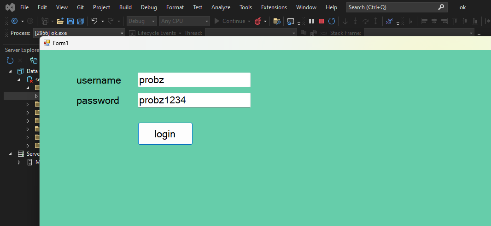

  > [!abstract] eup project
  > need to use ado.net in project

***
### oral exam questions
data set v/s data reader
connected arcithecture v/s disconnected arcihtecutre 
(ppt will be shared)
***
### connected architecture
first step = create connection object
second stop = write necessary sql queries in command object
third step = data reader

***
to add service base database 
Add new item -> add server base database (from where you used to add new forms)
to show server window -> smart enough to figure it out or else just double click on database thingy from solution explorer

right click on table folder and add new table

there is this update button right above name in table, so you need to click it to update database once and only need to do it once

you need to refresh from server explorer and you can view data by right click on table

> [!attention] note
> close all database related tabs before coding
>

```csharp
using System.Data.SqlClient;
```
add the above line to connect database


 
***
desginer
```csharp
namespace ok
{
    partial class Form1
    {
        /// <summary>
        /// Required designer variable.
        /// </summary>
        private System.ComponentModel.IContainer components = null;

        /// <summary>
        /// Clean up any resources being used.
        /// </summary>
        /// <param name="disposing">true if managed resources should be disposed; otherwise, false.</param>
        protected override void Dispose(bool disposing)
        {
            if (disposing && (components != null))
            {
                components.Dispose();
            }
            base.Dispose(disposing);
        }

        #region Windows Form Designer generated code

        /// <summary>
        /// Required method for Designer support - do not modify
        /// the contents of this method with the code editor.
        /// </summary>
        private void InitializeComponent()
        {
            this.label1 = new System.Windows.Forms.Label();
            this.label2 = new System.Windows.Forms.Label();
            this.textBox1 = new System.Windows.Forms.TextBox();
            this.textBox2 = new System.Windows.Forms.TextBox();
            this.button1 = new System.Windows.Forms.Button();
            this.SuspendLayout();
            // 
            // label1
            // 
            this.label1.AutoSize = true;
            this.label1.Location = new System.Drawing.Point(75, 52);
            this.label1.Name = "label1";
            this.label1.Size = new System.Drawing.Size(109, 26);
            this.label1.TabIndex = 0;
            this.label1.Text = "username";
            // 
            // label2
            // 
            this.label2.AutoSize = true;
            this.label2.Location = new System.Drawing.Point(75, 96);
            this.label2.Name = "label2";
            this.label2.Size = new System.Drawing.Size(105, 26);
            this.label2.TabIndex = 1;
            this.label2.Text = "password";
            // 
            // textBox1
            // 
            this.textBox1.Location = new System.Drawing.Point(213, 49);
            this.textBox1.Name = "textBox1";
            this.textBox1.Size = new System.Drawing.Size(245, 32);
            this.textBox1.TabIndex = 2;
            // 
            // textBox2
            // 
            this.textBox2.Location = new System.Drawing.Point(213, 93);
            this.textBox2.Name = "textBox2";
            this.textBox2.Size = new System.Drawing.Size(245, 32);
            this.textBox2.TabIndex = 3;
            // 
            // button1
            // 
            this.button1.Location = new System.Drawing.Point(213, 157);
            this.button1.Name = "button1";
            this.button1.Size = new System.Drawing.Size(120, 50);
            this.button1.TabIndex = 4;
            this.button1.Text = "login";
            this.button1.UseVisualStyleBackColor = true;
            this.button1.Click += new System.EventHandler(this.button1_Click);
            // 
            // Form1
            // 
            this.AutoScaleDimensions = new System.Drawing.SizeF(12F, 25F);
            this.AutoScaleMode = System.Windows.Forms.AutoScaleMode.Font;
            this.BackColor = System.Drawing.Color.MediumAquamarine;
            this.ClientSize = new System.Drawing.Size(1600, 865);
            this.Controls.Add(this.button1);
            this.Controls.Add(this.textBox2);
            this.Controls.Add(this.textBox1);
            this.Controls.Add(this.label2);
            this.Controls.Add(this.label1);
            this.Font = new System.Drawing.Font("Microsoft Sans Serif", 16F, System.Drawing.FontStyle.Regular, System.Drawing.GraphicsUnit.Point, ((byte)(0)));
            this.Margin = new System.Windows.Forms.Padding(6, 6, 6, 6);
            this.Name = "Form1";
            this.Text = "Form1";
            this.Load += new System.EventHandler(this.Form1_Load);
            this.ResumeLayout(false);
            this.PerformLayout();

        }

        #endregion

        private System.Windows.Forms.Label label1;
        private System.Windows.Forms.Label label2;
        private System.Windows.Forms.TextBox textBox1;
        private System.Windows.Forms.TextBox textBox2;
        private System.Windows.Forms.Button button1;
    }
}


```
form code
```csharp
using System;
using System.Collections.Generic;
using System.ComponentModel;
using System.Data;
using System.Drawing;
using System.Linq;
using System.Text;
using System.Threading.Tasks;
using System.Windows.Forms;
using System.Data.SqlClient;
namespace ok
{
    public partial class Form1 : Form
    {
        
        SqlCommand cmd;
        SqlDataReader dr;
        public Form1()
        {
            InitializeComponent();
        }

        private void Form1_Load(object sender, EventArgs e)
        {

        }

        private void button1_Click(object sender, EventArgs e)
        {
            using (SqlConnection con = new SqlConnection("Data Source=(LocalDB)\\MSSQLLocalDB;AttachDbFilename=E:\\unaateecse\\ok\\ser.mdf;Integrated Security=True"))
            {
                string query = "SELECT password FROM login WHERE username=@username";
                cmd = new SqlCommand(query, con);
                cmd.Parameters.AddWithValue("@username", textBox1.Text);

              
                    con.Open();
                    dr = cmd.ExecuteReader();

                if (dr.Read()) // check if there is a record
                {
                    textBox2.Text = dr["password"].ToString(); // Use column name for clarity
                }
                else
                {
                    MessageBox.Show("Not found");
                }
               
                    con.Close();
            }
        }
    }
}


```