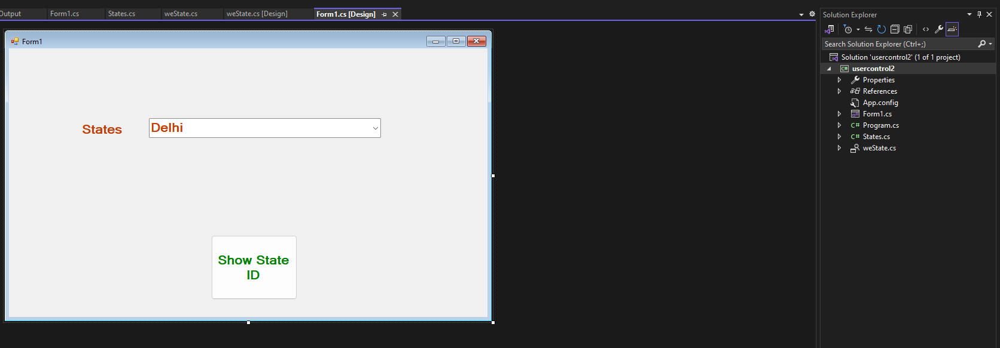
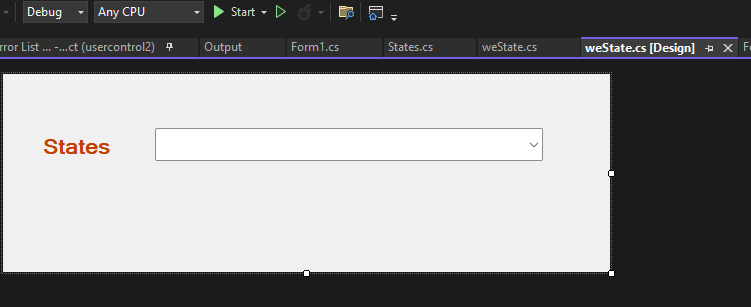
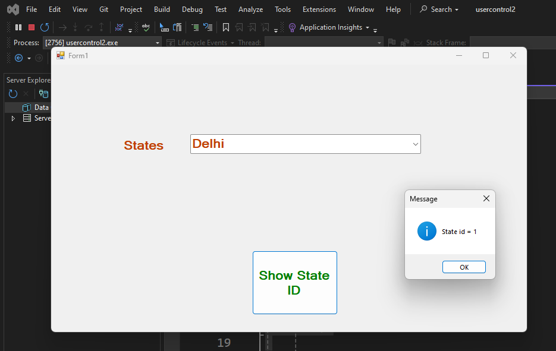

  
 
form1.cs
```CSHARP
using System;
using System.Collections.Generic;
using System.ComponentModel;
using System.Data;
using System.Drawing;
using System.Linq;
using System.Text;
using System.Threading.Tasks;
using System.Windows.Forms;

namespace usercontrol2
{
    public partial class Form1 : Form
    {
        public Form1()
        {
            InitializeComponent();
        }

        private void btnGetState_Click(object sender, EventArgs e)
        {
            MessageBox.Show(string.Format("State id = {0}", weState1.SelectedState.ID, weState1.SelectedState.Name),"Message", MessageBoxButtons.OK,MessageBoxIcon.Information);
        }
    }
}

```

states.cs
```csharp
using System;
using System.Collections.Generic;
using System.Linq;
using System.Text;
using System.Threading.Tasks;

namespace usercontrol2
{
     public class States
    {
        public int ID { get; set; }
        public string Name { get; set; }
    }
}


```
westates.cs
```csharp
using System;
using System.Collections.Generic;
using System.ComponentModel;
using System.Data;
using System.Drawing;
using System.Linq;
using System.Text;
using System.Threading.Tasks;
using System.Windows.Forms;

namespace usercontrol2
{
    public partial class weState : UserControl
    {
        public weState()
        {
            InitializeComponent();
        }
        public States SelectedState
        {
            get
            {
                return (States)cboState.SelectedItem;
            }
        }

        private void weState_Load(object sender, EventArgs e)
        {
            List<States> list = new List<States>();
            list.Add(new States() { ID = 1, Name = "Delhi" });
            list.Add(new States() { ID = 2, Name = "MP" });
            list.Add(new States() { ID = 3, Name = "Maharashtra" });
            list.Add(new States() { ID = 4, Name = "Punjab" });
            cboState.DataSource = list;
            cboState.ValueMember = "ID";
            cboState.DisplayMember= "Name";
        }
    }
}


```