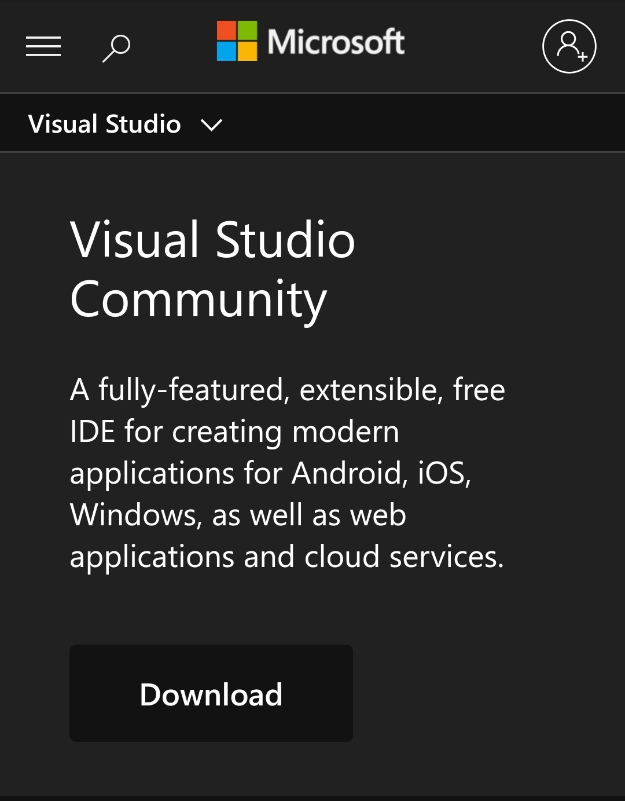
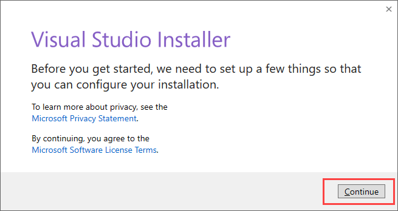
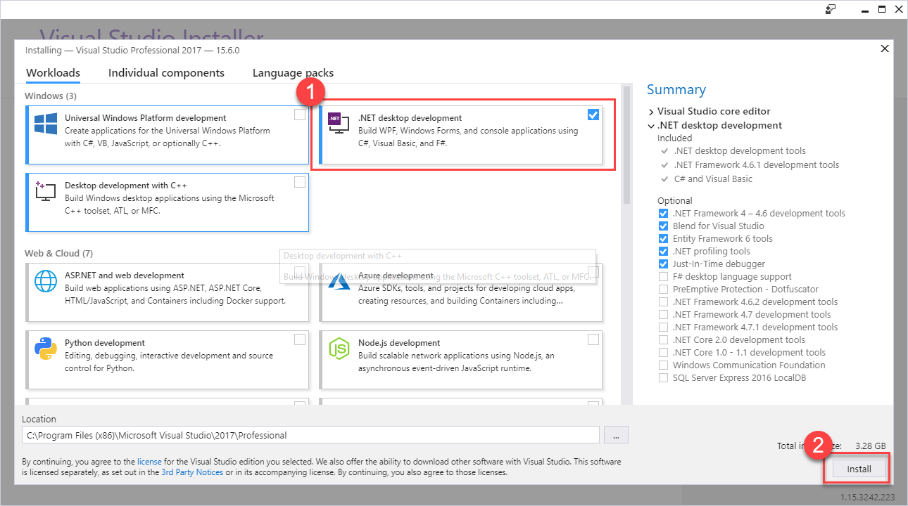
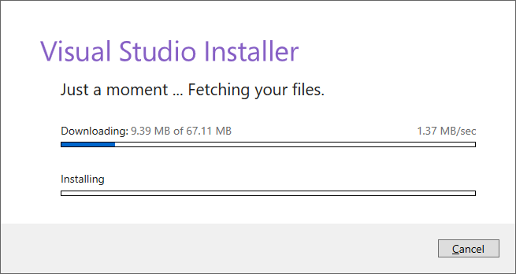

Theory

Visual Studio (VS) is an integrated development environment (IDE) created by Microsoft, widely used for developing applications using the .NET Framework. It supports a variety of programming languages such as C#, VB.NET, and F#, providing comprehensive tools for coding, debugging, and testing. VS IDE offers features like IntelliSense for code completion, a powerful debugger, integrated Git support for version control, and various extensions to enhance productivity. Its user-friendly interface and robust capabilities make it a preferred choice for developers working on .NET Framework applications, ranging from simple desktop apps to complex enterprise solutions.

Procedure:

Steps to install Visual Studio IDE:

1. **Download the Installer**:
   - Go to the Visual Studio Downloads page(https://visualstudio.microsoft.com/downloads/).
   - Choose the edition you want (Community, Professional, or Enterprise) and click on the "Free download" button for the Community edition or "Download" for the other editions.

2. **Run the Installer**:
   - Once the installer is downloaded, run it to start the installation process.
   - You may be prompted by User Account Control (UAC) to allow the installer to make changes to your device. Click "Yes" to continue.

3. **Choose Workloads**:
   - The installer will open the Visual Studio Installer window. Here, you can select the workloads you need. Workloads are collections of tools and features for specific types of development, such as .NET desktop development, ASP.NET and web development, Python development, etc.
   - Check the boxes for the workloads you want to install.

   
4. **Choose Installation Location**:
   - At the bottom of the installer window, you can change the installation locations for Visual Studio and its components if necessary.

6. **Start Installation**:
   - Click the "Install" button to begin the installation process. The installer will download and install the necessary files, 

8. **Launch Visual Studio**:
   - Once installation is complete, click the "Launch" button to start Visual Studio.
  
 
 
 
 
