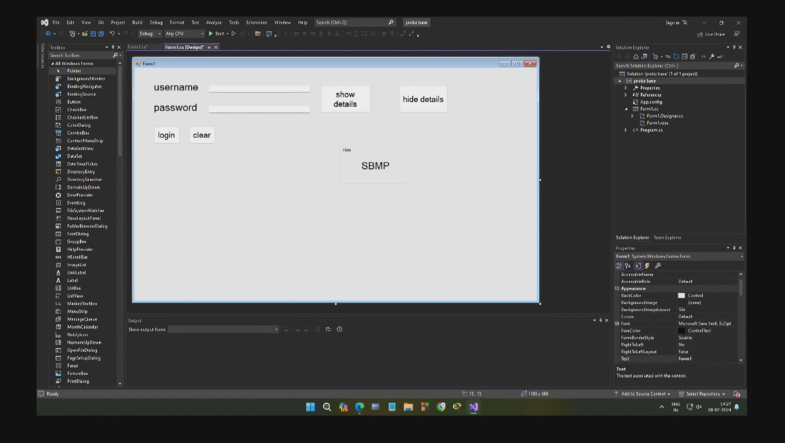

### aim: to design and validate data from login form

### Theory

The design and validation of a login form involves implementing key concepts of event-driven programming and UI design. This process ensures secure user authentication by integrating robust validation mechanisms that check the correctness and completeness of user inputs. Effective data validation is crucial to prevent unauthorized access and maintain the integrity of the system. Utilizing event handling, the login form interacts seamlessly with the user, providing feedback and managing errors efficiently to enhance the overall user experience and security of the application.


(print the below part as output)


procedure (codes, write this stuffs down)
### Procedure

```csharp

namespace probz_base
{
    public partial class Form1 : Form
    {
        public Form1()
        {
            InitializeComponent();
        }

        private void button2_Click(object sender, EventArgs e)
        {
            textBox1.Clear();
            textBox2.Clear();
        }

        private void button3_Click(object sender, EventArgs e)
        {
            groupBox1.Visible = true;
        }

        private void button4_Click(object sender, EventArgs e)
        {
            groupBox1.Visible = false;
        }

        private void button1_Click(object sender, EventArgs e)
        {
            /* if (textBox1.Text == "e" && textBox2.Text == "ee")
             {
                 MessageBox.Show("AYYYY");
             }
             else
             {
                 MessageBox.Show("NAYYYY");
             } */
            this.Hide();
            Form2 f2 = new Form2();
            f2.Show();
        }

        private void label3_Click(object sender, EventArgs e)
        {

        }

        private void button5_Click(object sender, EventArgs e)
        {
            // validation code
            String un, up;
            un = textBox1.Text;
            up = textBox2.Text;
            if (string.IsNullOrEmpty(un))
            {
                MessageBox.Show("Mpty usernameeeee");
                return;
            }
            if (string.IsNullOrEmpty(up))
            {
                MessageBox.Show("Mpty passssword");
                return;
            }
            if (up.Length < 7 || un.Length > 20)
            {
                MessageBox.Show("input min  7 and max 20");
                return;
            }
            if (!up.Any(char.IsUpper))
            {
                MessageBox.Show("use upprcase");
                return;
            }
            if (!up.Any(char.IsLower))
            {
                MessageBox.Show("use lowercase");
                return;
            }
           
        }
    }
}


```

conclusion: hence we  successfully designed a login form and validated it's data