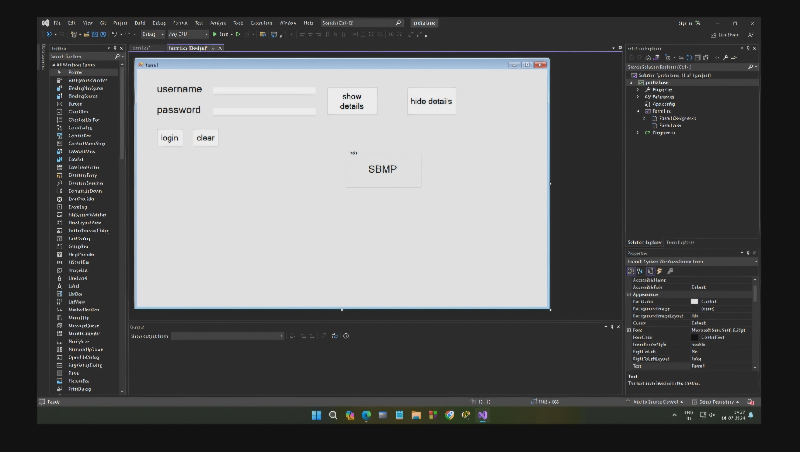
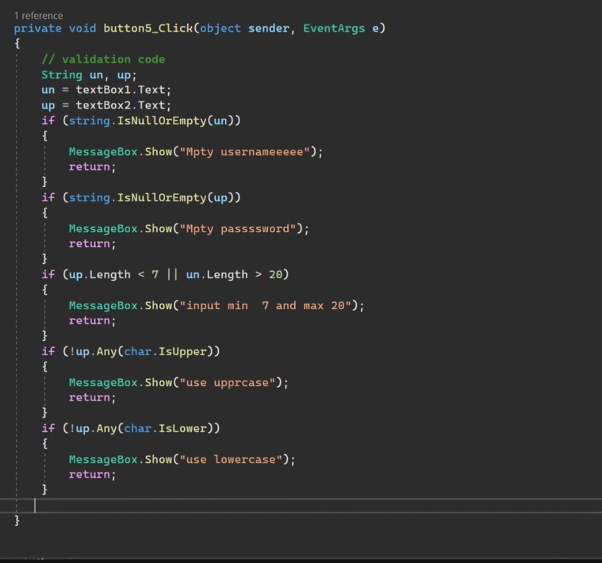
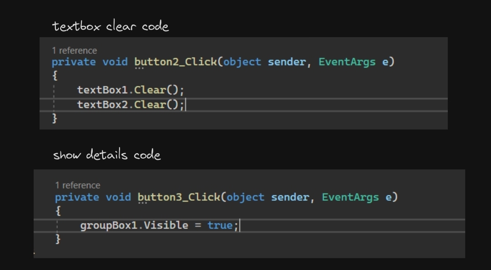

### aim: to design and validate data from login form

### Theory

The design and validation of a login form involves implementing key concepts of event-driven programming and UI design. This process ensures secure user authentication by integrating robust validation mechanisms that check the correctness and completeness of user inputs. Effective data validation is crucial to prevent unauthorized access and maintain the integrity of the system. Utilizing event handling, the login form interacts seamlessly with the user, providing feedback and managing errors efficiently to enhance the overall user experience and security of the application.

(print the below part as output)

procedure (codes, write this stuffs down)
 

 