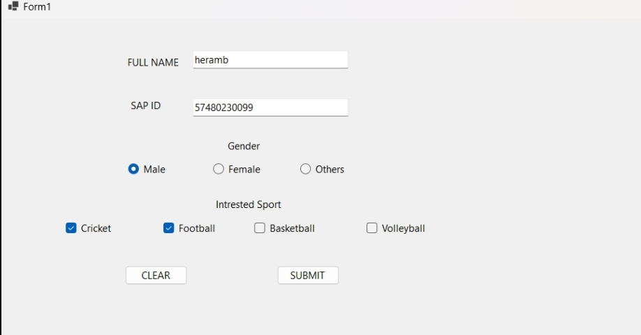

Aim:  to design windows forms using classic control

**Classic Controls**

Classic controls are Windows OS components that facilitate system settings and configurations in a way reminiscent of older Windows versions like XP. They include user interface elements such as buttons, text boxes, and menus, allowing users to adjust system settings, manage hardware, and configure software.

**Key Features:**

- **Control Panel:** A central component with applets for managing system settings, user accounts, hardware, and software. While modern Windows versions emphasize the Settings app, the Control Panel remains accessible for traditional settings management.
- **User Interaction:** Classic controls function as child windows within applications, often found in dialog boxes for user input, command selection, and information display.
- **View Options:** The Control Panel offers different views, such as "Category" and "Large/Small icons," reminiscent of older Windows layouts, allowing users to navigate settings comfortably.
- **Programming:** Developers implement classic controls via the Windows API using libraries like User32.dll and Comctl32.dll, requiring a moderate understanding of UI programming.

**Classic Control Elements:**

- **Radio Button:** Allows users to select one option from a set of mutually exclusive choices, ensuring only one option can be active at a time.
- **Text Box:** An input control for entering and editing text, used in forms for names, passwords, search queries, etc.
- **Label:** A static control displaying text to describe other controls, guiding users on required information or available options.
- **Button:** A fundamental element that triggers actions when clicked, labeled with text indicating functions like "OK," "Cancel," "Submit," etc.
- **Checkbox:** A binary choice element allowing multiple selections, ideal for settings, preferences, and forms.

```csharp
        private void button1_Click(object sender, EventArgs e)
        {
            textBox1.Clear();
            textBox2.Clear();
            radioButton1.Checked = false;
            radioButton2.Checked = false;
            radioButton3.Checked = false;
            checkBox1.Checked = false; // Clear CheckBox 1
            checkBox2.Checked = false; // Clear CheckBox 2
            checkBox3.Checked = false; // Clear CheckBox 3
            checkBox4.Checked = false; // Clear CheckBox 4

        }

       private void button2_Click(object sender, EventArgs e)
       {
           string a = textBox1.Text;
           string b = textBox2.Text;
           if (a != " ")
           {
               MessageBox.Show("Name:- " + a);
           }
           else
           {
               MessageBox.Show("Write your name");
           }
           if (b != " ")
           {
               MessageBox.Show("SAP ID:- " + b);
           }

           else
           {
               MessageBox.Show("Write your SAP NO.");
           }

           string selectedOption = "";

           if (radioButton1.Checked)
           {
               selectedOption = radioButton1.Text; // Get text from RadioButton 1
           }
           else if (radioButton2.Checked)
           {
               selectedOption = radioButton2.Text; // Get text from RadioButton 2
           }
           else if (radioButton3.Checked)
           {
               selectedOption = radioButton3.Text; // Get text from RadioButton 3
           }
           if (!string.IsNullOrEmpty(selectedOption))
           {
               MessageBox.Show("You selected: " + selectedOption);
           }
           else
           {
               MessageBox.Show("Please select an option.");
           }

           string selectedOptions = "";

           if (checkBox1.Checked)
           {
               selectedOptions += checkBox1.Text + ", "; // Get text from CheckBox 1
           }
           if (checkBox2.Checked)
           {
               selectedOptions += checkBox2.Text + ", "; // Get text from CheckBox 2
           }
           if (checkBox3.Checked)
           {
               selectedOptions += checkBox3.Text + ", "; // Get text from CheckBox 3
           }
           if (checkBox4.Checked)
           {
               selectedOptions += checkBox4.Text + ", "; // Get text from CheckBox 4
           }
           if (!string.IsNullOrEmpty(selectedOptions))
           {
               MessageBox.Show("You selected: " + selectedOptions);
           }
           else
           {
               MessageBox.Show("Please select at least one option.");
           }

       }


        
      