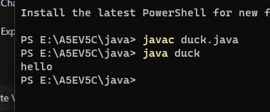

interface
file name duck.java
```java
interface Printable {

    void print();
}

class duck implements Printable {

    public void print() {
        System.out.println("hello");
    }

    public static void main(String[] args) {
        duck k = new duck();
        k.print();
    }
}


```
 