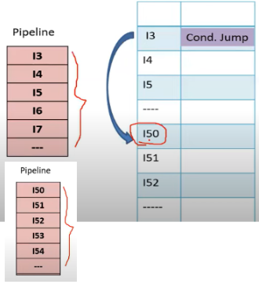

## fmp chapter 6 (Introduction to Pentium Processor) QB Solution
### Notes Factory
***
> [!attention] I can neither confirm nor deny the authenticity of this question bank solution,  in relation to what you write from here in exams
> -Pr7bz

> [!faq]  list and define the features of Pentium processor  [4-6 marks]

> [!attention] No need to write category from below table
> for 4 marks write 8 features minimum and likewise do for more marks

#answer

| **Category**           | **Feature**                                          |
|------------------------|------------------------------------------------------|
| **Generation & Speed** | - 5th generation microprocessor (1993)               |
|                        | - Operates from 60 MHz to 233 MHz                    |
| **Architecture**       | - 32-bit processor                                   |
|                        | - 64-bit data bus                                    |
|                        | - 32-bit address bus                                 |
|                        | - Address bus can access 4GB memory                  |
| **Pipelining & ALU**   | - Two separate ALUs (each 32-bit)                    |
|                        | - Five-stage integer pipelining                      |
|                        | - On-chip floating-point unit (8-stage pipeline)     |
| **Cache & Memory**     | - 8 memory banks                                     |
|                        | - On-chip instruction cache (8KB)                    |
|                        | - On-chip data cache (8KB)                           |
| **Performance**        | - Two-way superscalar (U pipe and V pipe)            |
|                        | - Branch prediction logic (256-entry BTB)            |

  ### 
 OR 

 

***
> [!help] define the role of prefetched buffer with the help of example[4 marks]

#answer

- The Pentium processor uses **two 32-byte prefetch buffers**.
- These buffers work independently but **one at a time**.

**Example:**
One buffer starts fetching instructions sequentially. For example, it fetches **Instruction bytes 1 to 4**.
 
When a branch instruction is encountered, the Branch Target Buffer (BTB) predicts the target address to adjust the flow of instructions accordingly.
 
- The other buffer may then take over, fetching from the new location (starting at **Instruction 6**), ensuring continuous instruction supply.

so the role of Prefetch buffers is to maintain a steady flow of instructions, minimizing delays, and improving the processor's performance.
> [!attention] you can change the diagram as per your own preference but with respect to example explanation
***

> [!info] define role of execution unit of Pentium processor[4marks]

#answer

1.  The execution unit contains two integer pipelines, namely U-pipe and V-pipe, and each one has its separate ALU.
2.  There are five stages in which these pipelines operate, namely, prefetch, decode-1, decode-2, execute, and writeback.
3.  The U-pipe is responsible for executing all integer as well as floating-point instructions.
4.  V-pipe executes simple integer and some floating-point instructions.
  
(DONT DRAW ARROWZZZZZZZ)
***

> [!question]draw and explain the Pentium super scalar architecture[8 marks]

#answer
  

**BUS Interface Unit:**
- Controls the system bus and handles memory and I/O addressing.
- Includes a 64-bit data bus and a 32-bit address bus.

**Superscalar Structure:**
- Features two integer units: U-Pipe and V-Pipe, each with a 32-bit ALU.
- Dual execution units enhance performance.

**Prefetch Unit:**
- Implements a five-stage pipeline.
- Contains two independent 32-byte prefetch buffers.
- **both buffers work separately**, but **they don't work at the same time**.

**Branch Prediction Unit:**
- Predicts branch instructions to minimize pipeline stalls.
- Uses a Branch Target Buffer (BTB) with 256 entries.

**Execution Unit:**
- Executes instructions in parallel with two 32-bit ALUs.
- Updates registers based on instruction execution.

**Cache Memory:**
- Integrated 16KB split cache (data and code) for faster processing.

**Floating Point Unit:**
- Executes floating-point instructions with an 8-stage pipeline.
- Supports various precision operations with eight 80-bit registers.
- it has dedicated hardware circuits for Multiplier, Divider & Adder.
***
> [!question] explain pipelining of Pentium processor with help of diagram[6 marks]

#answer

 

Pentium microprocessor contains two integer units known as U and V pipelines having their own ALU and other units.

So, Pentium can run two integer instructions in a clock cycle using U and V pipes resulting in a very high performance.

Each Pentium pipe has five stage pipelining:

* Prefetch
* Decode 1
* Decode 2
* Execute
* Write Back

Prefetch Stage: It fetches the instructions from code cache.

Decode 1: It decodes two instructions in parallel and also checks their dependency. If they are not dependent then given to U and V pipes. Also generates control word.

Decode 2: It decodes control word and also computes data address.

Execute: It takes required data from Data cache & registers and performs ALU operations.

Write Back: It updates registers, Flags & data on address.
***

> [!question] why branch prediction logic is used in Pentium processor[4 mark]
> 
#answer

Branch prediction logic is used in the Pentium processor to reduce the need for pipeline flushing by accurately predicting branch outcomes.

 

- When instruction 13 is a conditional jump to address 150 (the target address), any instructions that entered the pipeline after 13 become invalid.
- The pipeline then load a new sequence starting at address 150, replacing the invalid instructions.
- This process introduces *bubbles* in the pipeline, where no useful work is done as the pipeline stages are reloaded.
- This issue is known as the **pipeline flushing problem**.

in order to avoid this problem, Branch prediction logic is used in the Pentium processor.

***
> [!question] why branch prediction logic is used in Pentium processor and explain or write solution to overcome flushing pipelining problem[8 marks]

#answer

Branch prediction logic is used in the Pentium processor to reduce the need for pipeline flushing by accurately predicting branch outcomes.

 

- When instruction 13 is a conditional jump to address 150 (the target address), any instructions that entered the pipeline after 13 become invalid.
- The pipeline then load a new sequence starting at address 150, replacing the invalid instructions.
- This process introduces *bubbles* in the pipeline, where no useful work is done as the pipeline stages are reloaded.
- This issue is known as the **pipeline flushing problem**.

in order to overcome this problem, Branch prediction logic is used in the Pentium processor.

### Branch Prediction Logic
 
* Pentium uses a scheme called Dynamic Branch Prediction. In this scheme, a prediction is made for the branch instruction currently in the pipeline.   
* If the prediction is true then the pipeline will not be flushed and no clock cycles will be lost. If the prediction is false then the pipeline is flushed and starts over with the current instruction.
* It is implemented using 4 way set associated    memory with 256 entries. This is called Branch Target Buffer (BTB).
* Here, 4 way set is defined by history bits. Based on history bits prediction is fixed.
 
 

***
> [!question] xplain branch prediction logic of Pentium processor[6 marks]

#answer
### Branch Prediction Logic
 
* Pentium uses a scheme called Dynamic Branch Prediction. In this scheme, a prediction is made for the branch instruction currently in the pipeline.   
* If the prediction is true then the pipeline will not be flushed and no clock cycles will be lost. If the prediction is false then the pipeline is flushed and starts over with the current instruction.
* It is implemented using 4 way set associated    memory with 256 entries. This is called Branch Target Buffer (BTB).
* Here, 4 way set is defined by history bits. Based on history bits prediction is fixed.
 
 

***
### - PR7BZ