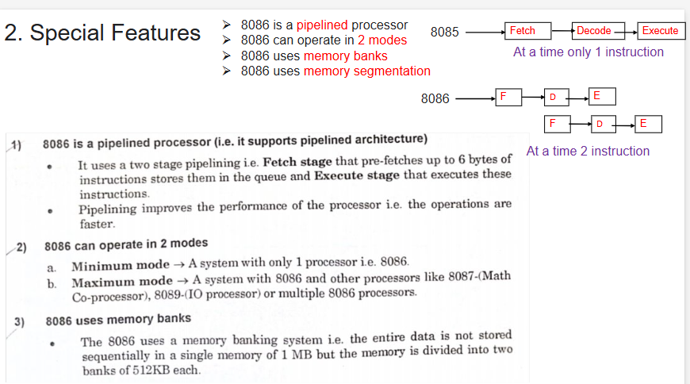
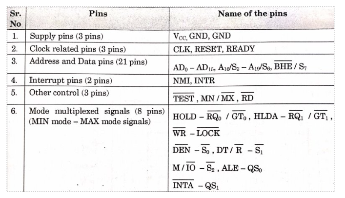
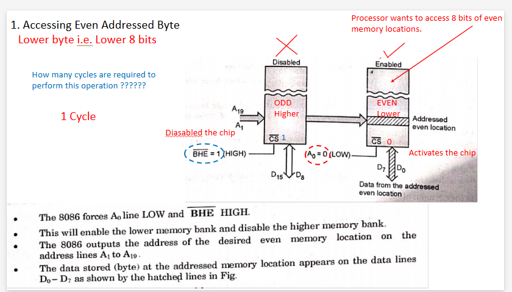

## fmp chapter 1 qb solution
***Q.1 Explain features of 8086 (each 4 mks) – min 4 points in feature.***  
#answer

 
 
 
***

***Q.2 Define term Microprocessor - def 2mks, function – 2mks. PPT 4***  
#answer

- A **microprocessor** is an electronic component that acts as the **central processing unit (CPU)** of a computer, integrated onto a single chip that contains millions of tiny components, including transistors, resistors, and diodes.

- Functions of a microprocessor include:
  - **Arithmetic Operations**: Performs calculations such as addition and subtraction.
  - **Logic Operations**: Compares values and executes logical operations.
  - **Data Transfer**: Moves data between different memory locations.

***

***Q.3 Draw and explain architecture of 8086. Only draw – 4 mks. Draw explain any specific block - (each for 2 mks). PPT 4/6/8***  
#answer
 
 
 
  

***

***Q.4 Define term pipelining and explain any two advantages of pipelining. PPT 4***  
#answer
 

***

***Q.5 Draw flag register of 8086 and explain (only draw - 2 mks, any flag explanation with example) each 2 mks. PPT 4/6***  
#answer
 
 
 
 
 
 
***

***Q.6 Explain special functions of general purpose registers (AX, BX, CX, DX)***  
- **Each register for 2 mks (minimum 2 functions)**  
- **Any one register with 3 functions for 3 mks**  
PPT 4/6/8  
#answer

  
***

***Q.7 Explain use of any pin or signal of 8086 (each for 2 mks). PPT 4***  
#answer
 
 
 
 
 
***

***Q.8 Draw and explain memory bank of 8086 (With all cases). PPT 8***  
#answer
  
 
 
 
 
 
 
***

***Q.9 Draw and explain memory segmentation of 8086. PPT 6***  
#answer
### MEMORY SEGMENTATION IN 8086

#### NEED FOR SEGMENTATION / CONCEPT OF SEGMENTATION

1. **Segmentation** means dividing memory into logically different parts called **segments**.
2. The **8086** has a **20-bit address bus**, allowing access to **2 MB** of memory.
3. This means the physical address will also be **20 bits**.
4. A **20-bit address** is not byte-compatible (equivalent to two and a half bytes).
5. To avoid dealing with this incompatible number, a **virtual model** of memory is created.
   - The memory is divided into **4 segments**: **Code, Stack, Data,** and **Extra**.
6. The **maximum size of a segment** is **64KB** and the **minimum size** is **16 bytes**.
7. Programmers can access each location using a **VIRTUAL ADDRESS**, which consists of:
   - **Segment Address**: Indicates where the segment is located in memory (base address).
   - **Offset Address**: Gives the offset of the target location within the segment.
8. Both Segment and Offset Addresses are **16 bits**, making them compatible for use by the programmer.
9. The Segment Address is provided only at the beginning of the program to initialize the segment; thereafter, only the **offset address** is needed.
10. This allows access to **1 MB** of memory using only a **16-bit offset address** for most of the program—this is the advantage of segmentation.
11. Dividing Code, Stack, and Data into different segments makes memory more organized and prevents accidental overwrites.
12. The maximum size of a segment is **64KB** because offset addresses are **16 bits** (2^16 = 64KB).
13. Programmers can create multiple Code/Stack/Data segments, utilizing the entire **1 MB**, but only one of each type can be **active** at a time.
14. The physical address is calculated using the formula:
    - **PHYSICAL ADDRESS = (SEGMENT ADDRESS × 10H) + OFFSET ADDRESS**
15. **Example**: If the Segment Address is **1234H** and the Offset Address is **000GH**, then the Physical Address is calculated as:
    - **(1234H × 10H) + 000GH = 12345H**
16. This formula ensures that the **minimum size** of a segment is **10H bytes (16 bytes)**.
 
***

***Q.10 Draw and explain significance of queue in 8086. PPT 8***  
#answer
 

***

***Q.11 When does the pipeline fail? PPT 4***  
#answer
### When Pipeline Fails

When a **Jump (JMP)** or **CALL** instruction appears in the main program, all existing instruction bytes in the queue are **flushed out**, resulting in an **empty queue**. The queue is then **reloaded** with the new instruction bytes corresponding to the locations specified in the JMP or CALL instructions. 

The refilling of the queue continues from these new locations related to the main program.
 
***

***Q.12 Explain overflow flag with the help of example.***  
- **Use of flag – 2 mks**  
- **Range of +ve and -ve numbers – 2 mks**  
- **Example in detail – 2 mks**  
PPT 6  
#answer

 

***

***Q.13 Draw functional pin diagram of 8086. Only diagram. PPT 4***  
#answer
 
***

***Q.14 Address calculation***  
#answer
 
***
