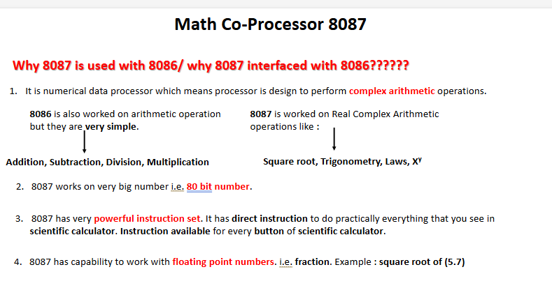

 ***Q.1 List and explain the use of any one pin of minimum mode (PPT 4)***  
#answer

 
 
***

***Q.2 List and explain the use of any one pin of maximum mode (PPT 4)***  
#answer

  
 
 
 
***

***Q.3 Explain the use of any pin or signal in minimum or maximum mode (PPT 4/6)***  
#answer
### <a href="#p"> click for minimum </a>
### <a href="#p1"> click for maximum </a>
***

***Q.4 Explain the difference between bus request and interrupt request with the help of an example (PPT 4)***  
#answer
 

***

***Q.5 Explain the following methods with the help of diagrams (PPT 8)***  
- **Demultiplexing of Address Bus** (4 marks: 2 marks for diagram, 2 marks for explanation)  
- **Demultiplexing of Data Bus** (4 marks: 2 marks for diagram, 2 marks for explanation)  
#answer
  
***

***Q.6  and Q.7 Draw Minimum mode of 8086 (no explanation) and Draw Maximum mode of 8086 (no explanation) (PPT 4)***  
#answer
### <a href="#p"> click for minimum </a>
### <a href="#p1"> click for maximum </a>

***

***Q.8 Draw and explain minimum mode of 8086 (Notes 8)***  
#answer
### <a href="#p"> click for minimum </a>
***

***Q.9 Draw and explain minimum mode of 8086 (Notes 8)***  
#answer
### <a href="#p1"> click for maximum </a>
***

***Q.10 Draw timing diagram for any one machine cycle of minimum mode of 8086 (PPT 4)***  
- **Memory Read**  
- **Memory Write**  
- **I/O Read**  
- **I/O Write**  
- **Memory/I/O Read**  
- **Memory/I/O Write**  
#answer
 
***

***Q.11 Explain the use of 8288 bus controller in maximum mode of 8086 (PPT 4)***  
#answer
 
***

***Q.12 Draw and explain the interfacing of 8087 co-processor with 8086 (PPT/Notes 6/8)***  
#answer
 
***

***Q.13 Define the term multiprocessor system (PPT 4)***  
#answer
- **Multiprocessor System**: A multiprocessor system consists of two or more processors that work together within a single computer system, sharing a common memory and coordinating tasks to improve performance, reliability, and computational speed. 
 

***

***Q.14 Draw and explain Bus arbitration methods (without advantages and disadvantages) (Notes 6)***  
- If any single method asks, then mention advantages and disadvantages (PPT 4)  

#answer
   
***

# Extra
 
