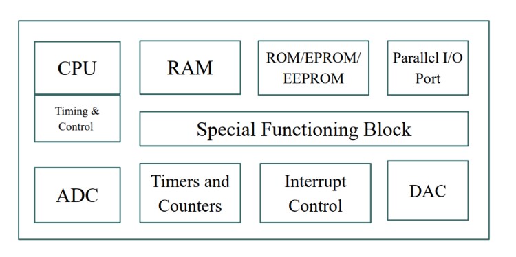
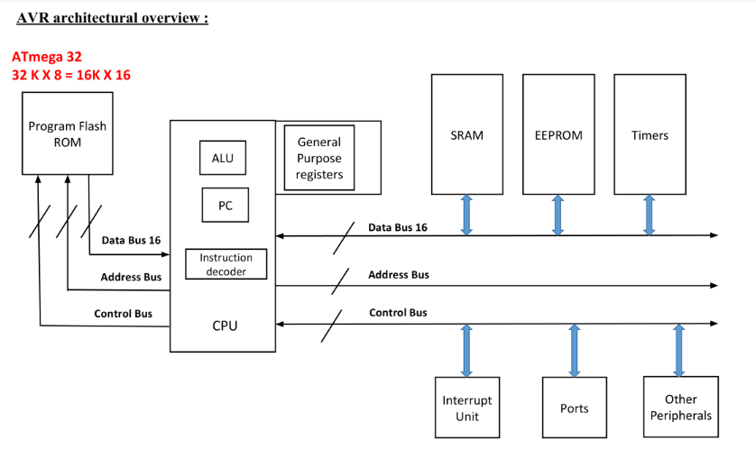
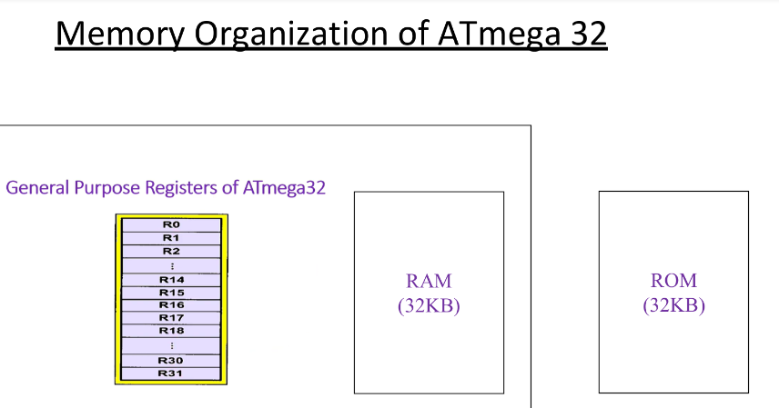
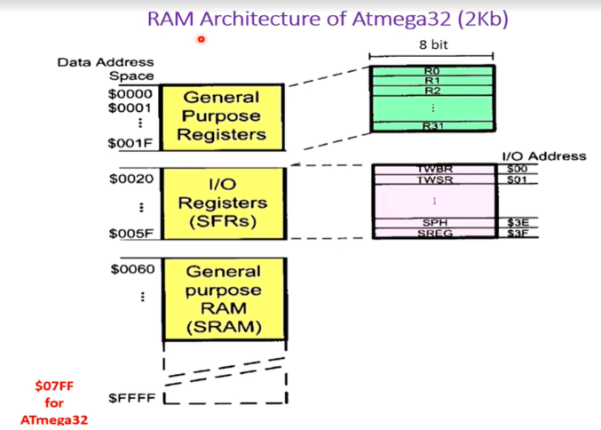
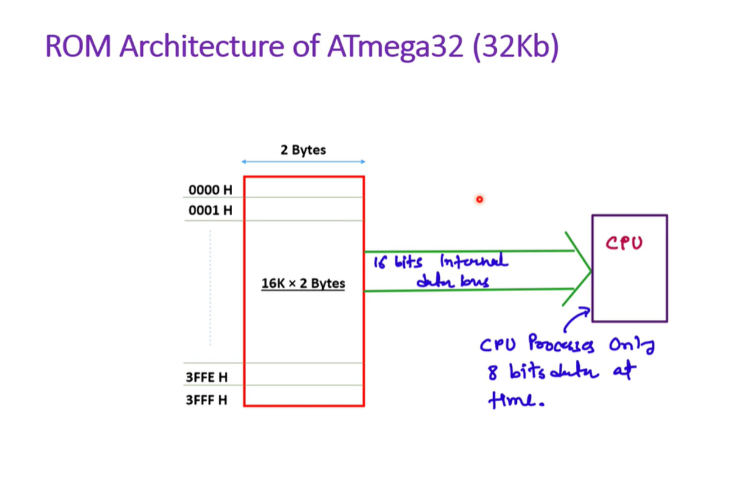

# FMP chapter 4 QB Solution
> [!attention] PROOFREAD STATUS = FALSE

***Q.1 Define term microcontroller 4 marks***  
#answer

A microcontroller is a small and low-cost microcomputer, which is designed to perform the specific tasks of embedded systems like displaying microwave's information, receiving remote signals, etc.

Microcontroller is a compressed micro computer manufactured to control the functions of embedded systems in office machines, robots, home appliances, motor vehicles, and a number of other gadgets. 

A microcontroller is comprises components like – memory, peripherals and most importantly a processor. Microcontroller is also known as “Computer-on-a-Chip”.

It is named so, because not only the CPU, but RAM, ROM, I/O ports, Timer/Counter, Serial I/Os all are put together on a single microcontroller chip.

A microcontroller also called an embedded controller because the microcontroller and its support circuits are often built into, or embedded in, the devices they control. A microcontroller is available in different word lengths like microprocessors (4bit, 8bit, 16bit, 32bit, 64bit and 128-bit microcontrollers are available today).

***

***Q.2 Draw and explain General block diagram of microcontroller (any blocks)  4/6 marks***  
> [!info] if 4 mark explain any 2 block (shortfied version ) else if more marks then explain everything else bad luck = speicifix block

#answer
 

**Memory**

-   Memory spaces such as RAM, ROM, EPROM or EEPROM are there to store data and programs.
-   For data storage, volatile memory RAM is used while for the program and operating parameter storage ROM and other memory spaces are used.  
-   A microcontroller usually has a certain amount of RAM and ROM (EEPROM, EPROM, etc) or flash memories for storing program source codes.

**Timers and Counters**
- **Timers and counters** are crucial components of a microcontroller.
- A microcontroller may include multiple timers and counters.
- These components manage various timing and counting functions within the microcontroller.
- Key operations involve clock functions, modulations, pulse generation, frequency measurement, and oscillation creation.
- They are also capable of counting external pulses.
- Additionally, there is a **watchdog timer**, which is a hardware feature used to detect software anomalies or malfunctions and automatically reset the processor if necessary.

**Parallel Input/Output Ports**
- Parallel input/output ports are primarily used to connect and drive various devices such as LCDs, LEDs, printers, and memory modules with a microcontroller.

**Serial Ports**
- Serial ports offer serial interfaces that allow communication between a microcontroller and other peripherals, including parallel ports.

**Interrupt Control**
- Interrupt control is used to manage interruptions (delays) in a running program.
- Interrupts can be either external (triggered by an interrupt pin) or internal (activated by an interrupt instruction during programming).

**Special Functioning Block**
- Some microcontrollers are designed for specific applications, such as space systems or robotics. These controllers include additional ports to perform specialized functions.
- This feature is referred to as a special functioning block.

***

***Q.3 Differentiate between microprocessor and microcontroller (1 mark for each)  4/6 marks***   

#answer

| Sr. No. | Microprocessors                                           | Microcontroller                                           |
|---------|-----------------------------------------------------------|-----------------------------------------------------------|
| 1       | It is only a general-purpose computer CPU.                | It is a microcomputer itself.                             |
| 2       | Memory, I/O ports, timers, interrupts are not available inside the chip. | All are integrated inside the microcontroller chip.       |
| 3       | Systems become bulkier and expensive.                     | Makes the system simple, economic, and compact.           |
| 4       | Microprocessors have many opcodes for moving data from external memory to CPU. | Microcontrollers have one or two opcodes for moving data.  |
| 5       | Higher accessing time required.                           | Low accessing time.                                      |
| 6       | Very few number of bit handling instructions.             | Many bit handling instructions.                          |
| 7       | Very few pins are programmable.                           | Most of the pins are programmable.                       |
| 8       | Widely used in modern PCs and laptops.                    | Widely used in small control systems and dedicated applications. |
***

***Q.4 Write applications of microcontroller with the help of suitable examples PPT 4***  
#answer

**Applications of Microcontrollers**

1. **Consumer Electronics Products**:
   - Toys, cameras, robots, washing machines, microwave ovens, and other automatic home appliances.

2. **Instrumentation and Process Control**:
   - Oscilloscopes, multimeters, leakage current testers, data acquisition and control systems.

3. **Medical Instruments**:
   - ECG machines, electronic cardiac monitors, blood gas analyzers, blood glucose monitors, MRI machines.

4. **Communication**:
   - Cell phones, telephone sets, answering machines.

5. **Office Equipment**:
   - Fax machines, printers.

6. **Multimedia Applications**:
   - MP3 players, PDAs, optical players, digital camcorders.

7. **Automobiles**:
   - Speedometers, auto-braking systems.

8. **Robotics**:
   - Domestic robots, industrial robots, medical robots, service robots, military robots, entertainment robots, space robots.
***

***Q.5 Define term AVR and classify AVR family PPT 4***  
#answer
**Introduction to AVR**

AVR microcontrollers (MCUs), introduced in 1996, are popular for project prototyping and embedded devices. They are 8-bit RISC architecture and feature on-chip programmable flash memory, SRAM, 10 data space, and EEPROM. AVR was the first to offer on-chip flash storage.

- Stands for Advanced Virtual RISC 

 (what to draw here is still unknown, will be updated later on)

***

***Q.6 Draw and explain AVR architecture PPT 8***  
#answer

**AVR Architectural Overview:**

- **Data Bus (8-bit)**: An 8-bit parallel data line through which data travels inside the MCU, making AVR an 8-bit microcontroller.

- **ALU (Arithmetic Logic Unit)**: The core component where all commands are executed.

- **Data SRAM**: Similar to the RAM in computers, used for temporary data storage.

- **EEPROM (Electrically Erasable Programmable Read-Only Memory)**: Permanent storage similar to a hard disk, used for long-term data retention.

- **I/O Lines**: Registers used as switches or controls for various AVR features.

- **32 x 8 GPR (General Purpose Registers)**: 32 registers, each 8-bit, used for general data storage. These registers have specific functions compared to SRAM.

- **Status & Control**: Special registers important for managing and monitoring the MCU.

- **Program Counter**: A register that tracks the position of the currently executing program.

- **Flash Memory**: Permanent storage used for storing the program code.

- **Instruction Register & Decoder**: Components essential for the MCU but not as critical for general use. 
***

***Q.7 List features of Atmega32 AVR (minimum 8 features) PPT 4***  
#answer

**Features of the ATmega32 Microcontroller**

- 32 x 8 general-purpose working registers
- 32 KB of in-system self-programmable flash program memory
- 1024 bytes of EEPROM
- Programmable serial USART
- 8-channel, 10-bit ADC
- One 16-bit timer/counter with separate prescaler, compare mode, and capture mode
- Available in 40-pin DIP, 44-pad QFN/MLF, and 44-lead TQFP packages
- Two 8-bit timers/counters with separate prescalers and compare modes
- 32 programmable I/O lines
- In-system programming via an on-chip boot program
- Master/slave SPI serial interface
- Programmable watchdog timer with a separate on-chip oscillator
***

***Q.8 Draw and explain memory organization of Atmega32 (2Kb) slide no. 18 for diagram***  
#answer
 
 
 
**Memory Organization of ATmega32**

- **Flash Memory (Program Memory)**: The ATmega32 has 32 KB of Flash memory. This is where the program code is stored. Flash memory is non-volatile, meaning it retains the code even when power is removed. It is organized into 16-bit words.

- **SRAM (Static Random Access Memory)**: The ATmega32 includes 2 KB of SRAM. SRAM is used for storing variables, intermediate results, and stack data during program execution. Unlike Flash memory, SRAM is volatile and loses its content when power is removed.

- **EEPROM (Electrically Erasable Programmable Read-Only Memory)**: The ATmega32 features 1 KB of EEPROM. EEPROM is non-volatile memory that can be written to and read from by the AVR microcontroller during program execution. It is typically used for storing non-volatile data that needs to be retained even when power is turned off, such as configuration settings or small amounts of user data.

- **I/O Registers**: These are memory-mapped registers used for interfacing with peripherals and controlling the microcontroller's operation. I/O Registers manage various aspects of the microcontroller, including GPIO (General Purpose Input/Output), timers, UART, SPI, and other peripherals. They are used to configure and control the behavior of these peripherals.

- **Special Function Registers (SFRs)**: These registers provide control and status information for the CPU and peripherals. SFRs are used to configure the microcontroller's operation, control interrupts, and manage power-saving modes. They also include status flags and control bits for various functions of the microcontroller.

(need to reverify what to draw)
***
### PR7BZ