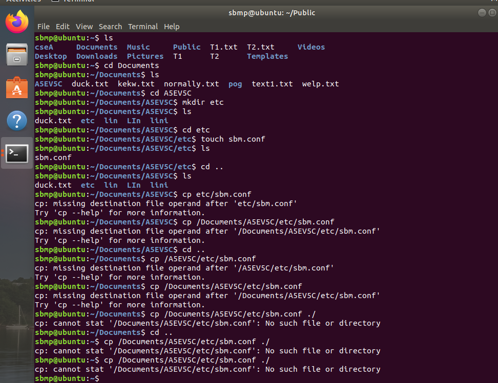
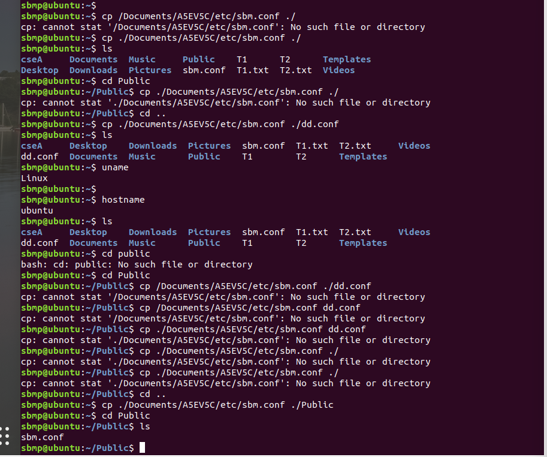

  # lxl 26/07/2024

copy  /etc/sbm.conf to current directory

create an identical copy of a directory called work
and call it work backup

copy all the jpg and gif images in the current directory
into images

to move the content of the current directory at some other location
/etc 

create a directory called my stuffs in home directory with permissions to write but others users can read it
use mkdir to see options

to create a directory tree in /temp using one command with 3 sub directory called 1 , 2 ,3 

to identify the type of file of /etc/sbm.conf 
use file command for above

to change the timestamp on A5EV5C to today's date
2024-07-26 08:35 am

-t options with touch or cat
SeE tHe OpTiOnS
 
> [!abstract] commands
>  lac < fetch
> less 
> nano (filename) = writing content in files
> localhost = current host of ur root directory
> tr = translate to change content of file from upper case to lower case
> uniq = it is a form of sort where only word will only occurs once
> word count = self explanatory
> od = different format of file like to display in hexadecimal  or like octal
> sort = self explanatory
> gunzip 

my soul died trying to perform this
 
 