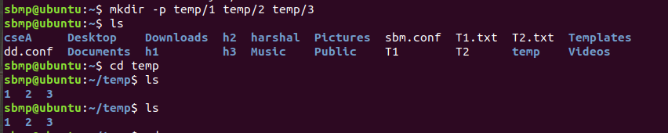
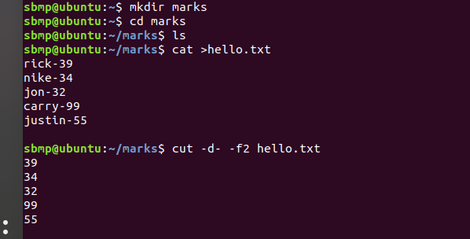

# lxl p4 02/08/2024

> [!abstract] category of commands in linux
> -   [Linux Directory Commands](https://www.javatpoint.com/linux-commands#Directory)
> -   [Linux File Commands](https://www.javatpoint.com/linux-commands#File)
> -   [Linux File Content Commands](https://www.javatpoint.com/linux-commands#Content)
> -   [Linux User Commands](https://www.javatpoint.com/linux-commands#User)
> -   [Linux Filter Commands](https://www.javatpoint.com/linux-commands#Filter)
> -   [Linux Utility Commands](https://www.javatpoint.com/linux-commands#Utility)
> -   [Linux Networking Command](https://www.javatpoint.com/linux-commands#Networking)

 refer above to perform the following stuffs which we need 
> to do
1. create a folder called marks and then make these files using nano editor then use sort 
sno, smarks , sname
2. nano smarks.txt
3. also use cut command and grap
4.  comm command is used to compare the files and used it in such way that it should only display matching column of first one
5.  stream editor (difficult to edit)
6.  tee command (similar to cat)
7.  uniq command
8.  od command and gzip command

***
to create a directory tree in /temp using one command with 3 sub directory called 1,2 3
 

cut command
 
 
