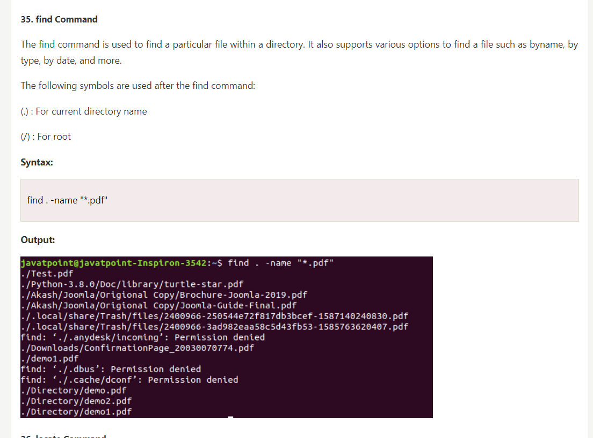

commands to perform
- find

 

- df
- ip
- ping
- host

 [vi Editor in Linux](https://www.geeksforgeeks.org/vi-editor-unix/)
using it for shell programming (default editor)
create a file cse a using vi editor
write content
welcome to linux code

| **Action**                   | **Command**                      | **Description**                                   |
|------------------------------|----------------------------------|---------------------------------------------------|
| **Start vi**                 | `vi filename`                    | Open or create a file named "filename".          |
| **Exit vi**                  | `:q`                             | Quit vi.                                         |
| **Exit without saving**      | `:q!`                            | Quit vi without saving changes.                  |
| **Save changes**             | `:w`                             | Write changes to the file.                        |
| **Save and exit**            | `:wq` or `ZZ`                   | Save changes and quit vi.                        |
| **Insert mode**              | `i`                              | Enter insert mode before the cursor.             |
| **Append mode**              | `a`                              | Enter insert mode after the cursor.              |
| **Replace mode**             | `R`                              | Enter replace mode.                              |
| **Exit insert mode**         | `Esc`                            | Return to normal mode.                            |
| **Move cursor**              | `h`                              | Move left.                                       |
|                              | `j`                              | Move down.                                       |
|                              | `k`                              | Move up.                                         |
|                              | `l`                              | Move right.                                      |
|                              | `0`                              | Move to the beginning of the line.               |
|                              | `$`                              | Move to the end of the line.                     |
|                              | `G`                              | Move to the end of the file.                     |
|                              | `gg`                             | Move to the beginning of the file.               |
| **Search**                   | `/pattern`                      | Search forward for "pattern".                    |
|                              | `?pattern`                      | Search backward for "pattern".                   |
|                              | `n`                             | Repeat the last search in the same direction.    |
|                              | `N`                             | Repeat the last search in the opposite direction. |
| **Delete**                   | `x`                             | Delete the character under the cursor.           |
|                              | `dd`                            | Delete the current line.                          |
|                              | `d$`                            | Delete from the cursor to the end of the line.   |
| **Undo/Redo**                | `u`                             | Undo the last change.                            |
|                              | `Ctrl + r`                      | Redo the last undone change.                      |
| **Copy & Paste**             | `yy`                            | Yank (copy) the current line.                    |
|                              | `p`                             | Paste after the cursor.                          |
|                              | `P`                             | Paste before the cursor.                         |
| **Visual Mode**              | `v`                             | Enter visual mode (select text).                 |
|                              | `V`                             | Enter visual line mode.                          |
|                              | `Ctrl + v`                      | Enter visual block mode.                         |
| **Line numbers**             | `:set number`                   | Show line numbers.                               |
|                              | `:set nonumber`                 | Hide line numbers.                               |
| **Replace a word**           | `r`                             | Replace the character under the cursor.          |
| **Jump to specific line**    | `:line_number`                  | Jump to the specified line number.               |
| **Save as**                  | `:w new_filename`               | Save the current buffer as "new_filename".      |

