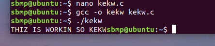
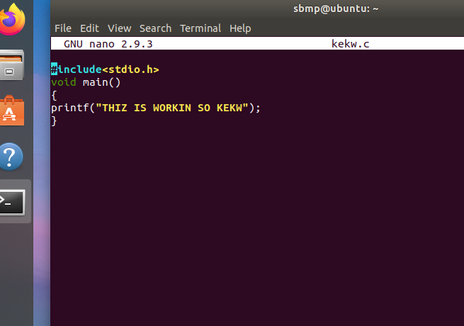

NANO

| **Action**                          | **Command**                  | **Description**                                                   |
|-------------------------------------|------------------------------|-------------------------------------------------------------------|
| **Open a File**                     | `nano filename`              | Opens the specified file. Creates it if it doesn’t exist.         |
| **Save Changes**                    | `Ctrl + O`                   | Write (save) the file. Confirm with Enter.                       |
| **Exit**                            | `Ctrl + X`                   | Exit `nano`. Prompts to save if there are unsaved changes.        |
| **Cut Text**                        | `Ctrl + K`                   | Cuts the selected text or the entire line if no text is selected. |
| **Paste Text**                      | `Ctrl + U`                   | Pastes the previously cut text.                                  |
| **Undo Changes**                    | `Ctrl + _` then `U`          | Undo the last action.                                            |
| **Redo Changes**                    | `Alt + U`                    | Redo the last undone action.                                     |
| **Search for Text**                 | `Ctrl + W`                   | Open search prompt. Enter search term and press Enter.           |
| **Search Next**                     | `Ctrl + W` then `Ctrl + W`   | Search for the next occurrence of the search term.               |
| **Go to Specific Line**             | `Ctrl + _` then enter line number | Move the cursor to a specific line number.                  |
| **Start Selection for Cut**         | `Ctrl + ^`                   | Set the starting point for selecting text.                       |
| **End Selection for Cut**           | Move cursor and press `Ctrl + K` | End the selection and cut the text.                          |
| **Justify Text**                    | `Ctrl + J`                   | Format (justify) the selected text.                              |
| **Toggle Line Numbers**             | `Alt + #`                    | Toggle the display of line numbers (if supported).               |
| **Read File Into Current Buffer**   | `Ctrl + R`                   | Insert the contents of another file into the current file.       |
| **Replace Text**                    | `Ctrl + \`                   | Open replace prompt. Enter text to find and replace.             |
| **Go to Beginning of File**         | `Ctrl + Y`                   | Move the cursor to the beginning of the file.                    |
| **Go to End of File**               | `Ctrl + V`                   | Move the cursor to the end of the file.                          |
| **Toggle Help**                     | `Ctrl + G`                   | Show help documentation with a list of commands.                 |
| **Show Current File Name**          | `Ctrl + X` then `Ctrl + X`   | Display the current file name (useful in cases where multiple files are opened). |
| **Save As**                         | `Ctrl + O`, then enter new file name | Save the current file as a new file.                          |
| **Show Cursor Position**            | `Ctrl + C`                   | Display the cursor's position (line and column).                 |

***
 
 