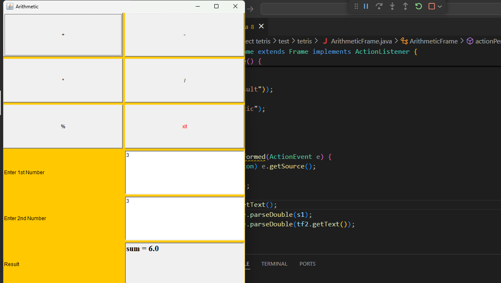

```java
import java.awt.*;
import java.awt.event.*;

public class ArithmeticFrame extends Frame implements ActionListener {

    TextField tf1, tf2, tf3;
    Button pb, mb1, mulb2, rmb3, db, eb;

    public ArithmeticFrame() {
        setLayout(new GridLayout(6, 3, 5, 5));
        setBackground(Color.orange);
        tf1 = new TextField(10);
        tf2 = new TextField(10);
        tf3 = new TextField(10);

        pb = new Button("+");
        mb1 = new Button("-");
        mulb2 = new Button("*");
        rmb3 = new Button("%");
        db = new Button("/");
        eb = new Button("xit");
        pb.addActionListener(this);
        mb1.addActionListener(this);
        mulb2.addActionListener(this);
        rmb3.addActionListener(this);
        db.addActionListener(this);
        eb.addActionListener(this);

        eb.setForeground(Color.red);
        tf3.setEditable(false);
        tf3.setFont(new Font("Serif", Font.BOLD, 20));
        add(pb);
        add(mb1);
        add(mulb2);
        add(db);
        add(rmb3);

        add(eb);
        add(new Label("Enter 1st Number"));
        add(tf1);
        add(new Label("Enter 2nd Number"));
        add(tf2);

        add(new Label("Result"));
        add(tf3);
        setTitle("Arithmetic");
        setSize(600, 700);
        setVisible(true);
    }

    public void actionPerformed(ActionEvent e) {
        Button btn = (Button) e.getSource();
        if (btn == eb) {
            System.exit(0);
        }
        String s1 = tf1.getText();
        double d1 = Double.parseDouble(s1);
        double d2 = Double.parseDouble(tf2.getText());
        String s2 = "";

        if (btn == pb) {
            s2 = "sum = " + (d1 + d2);
        } else if (btn == mb1) {
            s2 = "Difference = " + (d1 - d2);
        } else if (btn == mulb2) {
            s2 = "Product = " + (d1 * d2);
        } else if (btn == rmb3) {
            s2 = "Remainder = " + (d1 % d2);
        } else if (btn == db) {
            s2 = "Quotient = " + (d1 / d2);
        }

        tf3.setText(s2);
    }

    public static void main(String[] args) {
        new ArithmeticFrame();
    }
}
```
 