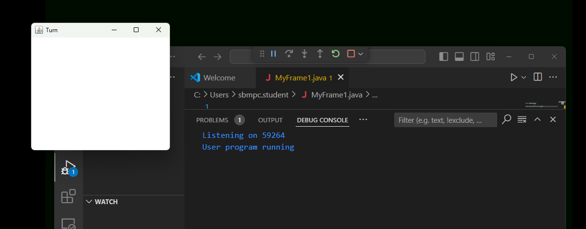

creating basic gui
MyFrame1.java
```java
import java.awt.Frame;
import java.util.*;
public class MyFrame1 extends Frame
{
    MyFrame1(String title)
    {
        super(title);
        setSize(300,300);
        this.setVisible(true);
    }
    public static void main(String[] args)
    {
        MyFrame1 window = new MyFrame1("Turn");
    }
}

```
 
***

