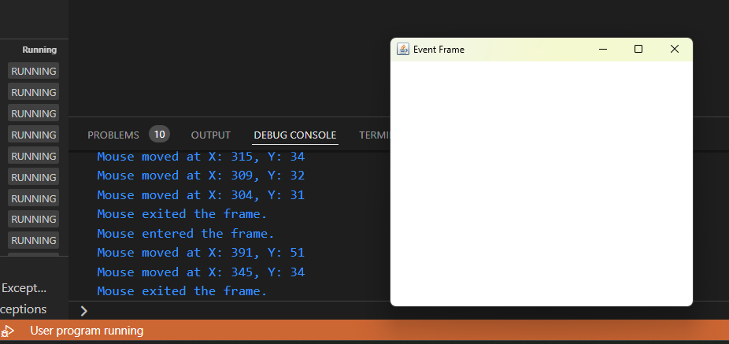
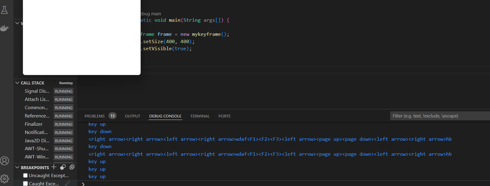

java gui mouse events


myframeevents.java
```java
import java.awt.*;
import java.awt.event.*;

public class myframeevents extends Frame implements MouseListener, MouseMotionListener {
    public myframeevents() {
        setTitle("Event Frame");
        setSize(400, 350);
        addMouseListener(this);
        addMouseMotionListener(this);
        setVisible(true);
    }

    @Override
    public void mouseClicked(MouseEvent e) {
        int x = e.getX();
        int y = e.getY();
        System.out.println("Mouse clicked at X: " + x + ", Y: " + y);
    }

    @Override
    public void mouseEntered(MouseEvent e) {
        // No coordinates for mouse entered event
        System.out.println("Mouse entered the frame.");
    }

    @Override
    public void mouseExited(MouseEvent e) {
        // No coordinates for mouse exited event
        System.out.println("Mouse exited the frame.");
    }

    @Override
    public void mousePressed(MouseEvent e) {
        int x = e.getX();
        int y = e.getY();
        System.out.println("Mouse pressed at X: " + x + ", Y: " + y);
    }

    @Override
    public void mouseReleased(MouseEvent e) {
        int x = e.getX();
        int y = e.getY();
        System.out.println("Mouse released at X: " + x + ", Y: " + y);
    }

    @Override
    public void mouseDragged(MouseEvent e) {
        int x = e.getX();
        int y = e.getY();
        System.out.println("Mouse dragged at X: " + x + ", Y: " + y);
    }

    @Override
    public void mouseMoved(MouseEvent e) {
        int x = e.getX();
        int y = e.getY();
        System.out.println("Mouse moved at X: " + x + ", Y: " + y);
    }

    public static void main(String[] args) {
        new myframeevents();
    }
}

```
 
***


keylistener events code
KeyEvents.java

```java
import java.awt.*;
import java.awt.event.*;

public class mykeyframe extends Frame implements KeyListener{

String msg="";

public mykeyframe(){
addKeyListener(this);
}

public void display(){
    System.out.println(msg);
}
@Override
public void keyPressed(KeyEvent e){
System.out.println("key down");
int key = e.getKeyCode();

switch(key){

case KeyEvent.VK_F1:
msg+="<F1>";
break;

case KeyEvent.VK_F2:
msg+="<F2>";
break;

case KeyEvent.VK_F3:
msg+="<F3>";
break;

case KeyEvent.VK_LEFT:
msg+="<left arrow>";
break;

case KeyEvent.VK_RIGHT:
msg+="<right arrow>";
break;

case KeyEvent.VK_PAGE_UP:
msg+="<page up>";
break;

case KeyEvent.VK_PAGE_DOWN:
msg+="<page down>";
break;
    }
display();
}

public void keyReleased(KeyEvent e){
    System.out.println("key up");

}

public void keyTyped(KeyEvent e){
    msg+= e.getKeyChar();
    display();
}

public static void main(String args[]){

mykeyframe frame = new mykeyframe();
frame.setSize(400,400);
frame.setVisible(true);
}
}


```
 
***
pog
```java
import java.awt.Frame;
import java.awt.event.*;

public class mywinclose extends Frame implements WindowListener{

public mywinclose(String title){

    addWindowListener(this);
    this.setTitle(title);
    setSize(300,300);
    this.setVisible(true);
}

public void windowClosing(WindowEvent e){
    System.out.println("frame closed");
    this.setVisible(false);
    dispose();
}

public void windowActivated(WindowEvent e){}
public void windowDeactivated(WindowEvent e){}
public void windowClosed(WindowEvent e){}
public void windowIconified(WindowEvent e){}
public void windowDeiconified(WindowEvent e){}
public void windowOpened(WindowEvent e){}

public static void main(String[] args) {
    
    mywinclose frame= new mywinclose("my first frame");
}

}

```