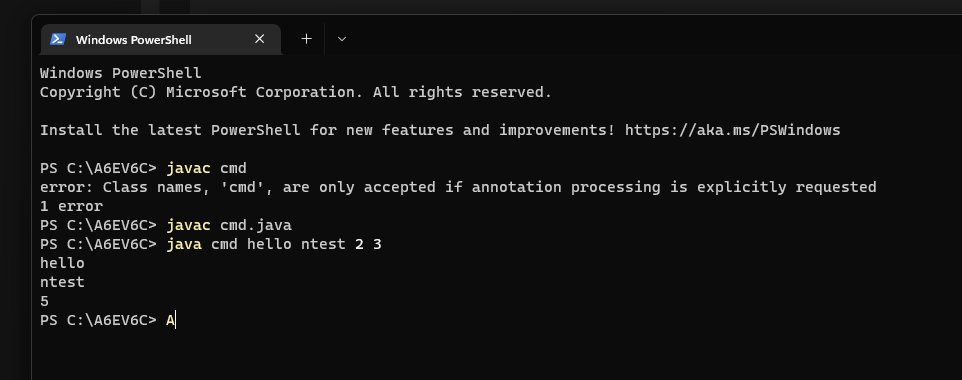

# p2 13/07/24

addition code with user input


```java
import java.util.Scanner;

class add {

    public static void main(String arg[]) {
        Scanner sc = new Scanner(System.in);
        System.out.println("Enter 1st no.:");
        int a = sc.nextInt();
        System.out.println("Enter 2nd no.:");
        int b = sc.nextInt();
        int c = a + b;
        System.out.println("result of " + a + " and " + b + " = "+ c);
    }
}
```
display all data types 
```java

import java.util.Scanner;

class display {
  public static void main(String arg[]) {
        Scanner ok = new Scanner(System.in);
        System.out.println("Enter int:");
        int a = ok.nextInt();
        System.out.println("Enter float:");
        float b = ok.nextFloat();
        System.out.println("Enter short:");
        short c = ok.nextShort();
        System.out.println("Enter long: ");
        long d = ok.nextLong();
        System.out.println("Enter double:");
        double e = ok.nextDouble();
        System.out.println("Enter String");
        String f = ok.nextLine();
        System.out.println("Enter bool");
        boolean g = ok.nextBoolean();
        System.out.println("Enter byte");
        byte h = ok.nextByte();
        System.out.println("Enter String(CHAR)");
        Character j = ok.next().charAt(0);
        
        System.out.println("Int: " + a + "\nFloat: " + b + "\nshort: " + c + "\nlong: "+ d + "\ndouble: "+ e + "\nString: " + f + "\nbool: " + g + "\nbyte: " + h +"\nchar: " + j);


    }
}
```
display this command thingy using command prompt
``` java

class cmd {

    public static void main(String args[]) {
        System.out.println(args[0]);
        System.out.println(args[1]);
        int a = Integer.parseInt(args[2]);

        int b = Integer.parseInt(args[3]);

        int c = a + b;
        System.out.println(c);

    }
}

```
 

