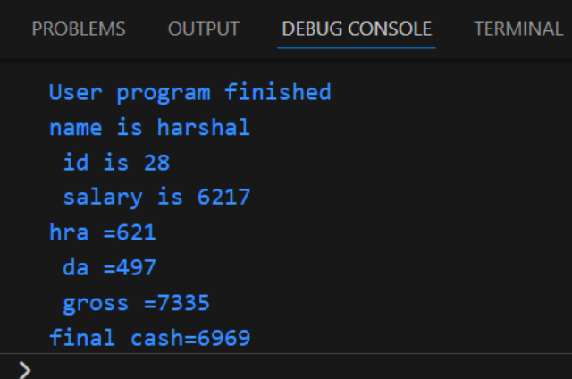

employee details + their final salary calculation 

```java
import java.util.Scanner;

class emp {

    private final String name;
    private final int id;
    private final int cash;

    public emp(String n, int i, int c) {
        this.name = n;
        this.id = i;
        this.cash = c;
    }

    public void display() {
        System.out.println("name is " + name + "\n id is " + id + "\n salary is " + cash);
    }

    public void calc() {
        int hra = (cash * 10) / 100;
        int da = (cash * 8 / 100);
        int gross = cash + hra + da;
        int tax = (gross * 5) / 100;
        int e = gross - tax;
        System.out.println("hra =" + hra + "\n da =" + da + "\n gross =" + gross + "\nfinal cash=" + e);
    }

    public static void main(String[] args) {
        Scanner sc = new Scanner(System.in);
        emp e[] = new emp[3];
        for (int wee = 0; wee < 1; wee++) {
            System.out.println("enter the name:");
            String n = sc.next();
            sc.nextLine();
            System.out.println("enter the id:");
            int i = sc.nextInt();
            System.out.println("enter the salary:");
            int c = sc.nextInt();
            e[wee] = new emp(n, i, c);
        }
        for (int wee = 0; wee < 1; wee++) {
            e[wee].display();
            e[wee].calc();
        }
    }

}

```
 