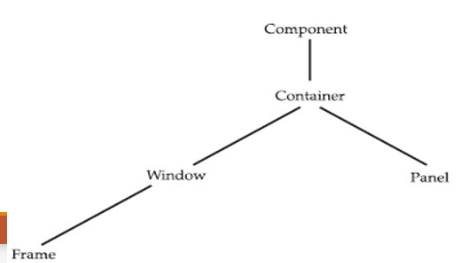
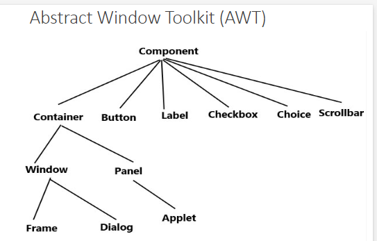
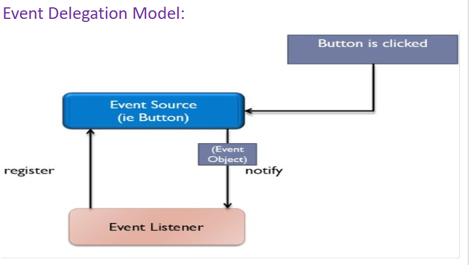

# PT-2 PRJ QB SOLUTION BY PR7BZ
***Q.1 Describe the working of following with snippets***
- **a)** try
- **b)** throw
- **c)** throws
- **d)** catch
- **e)** finally
#answer  


| **Keyword** | **Description** |
|-------------|-----------------|
| **try**     | The "try" keyword is used to specify a block where we should place an exception code. It means we can't use the try block alone. The try block must be followed by either `catch` or `finally`. |
| **catch**   | The "catch" block is used to handle the exception. It must be preceded by a try block, which means we can't use the catch block alone. It can be followed by a `finally` block later. |
| **finally** | The "finally" block is used to execute the necessary code of the program. It is executed whether an exception is handled or not. |
| **throw**   | The "throw" keyword is used to throw an exception. |
| **throws**  | The "throws" keyword is used to declare exceptions. It specifies that there may occur an exception in the method. It doesn't throw an exception. It is always used with the method signature. |


- **a)** try  
  **Explanation**: The `try` block is used to place code that may throw an exception. It must be followed by either a `catch` or `finally` block.
  
  **Snippet**:
  ```java
  try {
      int a = 10 / 0;  // This will throw ArithmeticException
  } catch (ArithmeticException e) {
      System.out.println("Exception caught: " + e);
  }
  ```

- **b)** throw  
  **Explanation**: The `throw` keyword is used to explicitly throw an exception in a program.
  
  **Snippet**:
  ```java
  public class ThrowExample {
    public static void main(String[] args) {
        int age = 15;
        if (age < 18) {
            throw new ArithmeticException("You must be at least 18.");
        }
        System.out.println("Access granted.");
    }
  } 
    ```

- **c)** throws  
  **Explanation**: The `throws` keyword is used to declare that a method might throw one or more exceptions, but it doesn't actually throw them itself.
  
  **Snippet**:
  ```java
  public class ThrowsExample {
      static void myMethod() throws ArithmeticException {
          int a = 10 / 0;  // This will cause an ArithmeticException
      }

      public static void main(String[] args) {
          try {
              myMethod();
          } catch (ArithmeticException e) {
              System.out.println("Exception caught: " + e);
          }
      }
  }
  ```

- **d)** catch  
  **Explanation**: The `catch` block is used to handle the exception thrown by the `try` block. It is written after the `try` block.
  
  **Snippet**:
  ```java
  try {
      int a = 50 / 0;  // This will throw ArithmeticException
  } catch (ArithmeticException e) {
      System.out.println("Caught exception: " + e.getMessage());
  }
  ```

- **e)** finally  
  **Explanation**: The `finally` block contains code that is always executed, whether an exception is thrown or not.
  
  **Snippet**:
  ```java
  try {
      int a = 30 / 0;  // This will throw ArithmeticException
  } catch (ArithmeticException e) {
      System.out.println("Exception caught: " + e);
  } finally {
      System.out.println("This block always executes.");
  }
  ```


***

***Q.2 Describe the class hierarchy of Exception. Also elaborate caught and uncaught exception***  
#answer  


 


- **Caught Exception**  
  - An exception that is handled using a try-catch block.  
  - If the exception occurs within the try block, the catch block executes to handle it, preventing the program from crashing.
  - example
```java
class CaughtExceptionExample {
    public static void main(String[] args) {
        try {
            int d = 0;
            int a = 42 / d;  // This will cause ArithmeticException
        } catch (ArithmeticException e) {
            System.out.println("Caught an exception: " + e);
        }
        System.out.println("Program continues normally.");
    }
}

```

- **Uncaught Exception**  
  - An exception that is not handled by any catch block.  
  - If it occurs, it propagates up the call stack, potentially causing the program to terminate unexpectedly.
  - example
```java
class Exc0 {
    public static void main(String[] args) {
        int d = 0;
        int a = 42 / d;
    }
}
```
When this program is executed, a `java.lang.ArithmeticException: / by zero` is thrown at `Exc0.main(Exc0.java:4)`. This exception is a subclass of `Exception` and specifically describes the type of error encountered. As a result, the program will terminate abnormally due to the exception.
***


***Q.3 Explain the process of creating a user-defined exception with an example program***
#answer

- To create user-defined exception class, we have to extend the `Exception` class.
- The `Exception` class defines some constructors, two of which are listed below:
  - `Exception()`  // default constructor
  - `Exception(String msg)`  // constructor with a description (msg) of the exception
- We have to override the `toString()` method (a member of the `Object` class) to customize the description of the generated exception.

**Example Program**:

```java
class MyException extends Exception {
    private int detail;

    MyException(int a) {
        detail = a;
    }

    // Overriding toString() method to provide custom exception description
    public String toString() {
        return "MyException[" + detail + "]";
    }
}

class ExceptionDemo {
    // Method that throws the user-defined exception
    static void compute(int a) throws MyException {
        System.out.println("Called compute(" + a + ")");
        if (a > 10) {
            throw new MyException(a);  // Throwing the user-defined exception
        }
        System.out.println("Normal exit");
    }

    public static void main(String args[]) {
        try {
            compute(1);   // This will execute normally
            compute(20);  // This will throw MyException
        } catch (MyException e) {
            System.out.println("Caught " + e);  // Catching the user-defined exception
        }
    }
}
```

- In this example, the `MyException` class is a user-defined exception that extends the `Exception` class.
- The `compute()` method throws a `MyException` when the value of `a` is greater than 10.
- The `toString()` method is overridden to customize the exception message.
- The `main()` method demonstrates how the exception is caught and handled using a `try-catch` block.
***

***Q.4***  
1. Write a Java program to find out the square root of a number and generate an exception for negative numbers.  
#answer
```java
import java.util.Scanner;

public class SquareRootCalculator {
    public static void main(String[] args) {
        // Predefined input
        double number = 16; // Change this value as needed

        System.out.print("Calculating the square root of: " + number + "\n");

        try {
            if (number < 0) {
                throw new ArithmeticException("Cannot calculate the square root of a negative number.");
            }
            double squareRoot = Math.sqrt(number);
            System.out.println("The square root of " + number + " is: " + squareRoot);
        } catch (ArithmeticException e) {
            System.out.println("Error: " + e.getMessage());
        } catch (Exception e) {
            System.out.println("Invalid input. Please enter a valid number.");
        }
    }
}
```
2. Write a Java program to read Employee experience (years) (lower limit = 0, upper limit = 40) and generate an exception if it is 41 or above.  
#answer  
```java
import java.util.Scanner;

public class EmployeeExperience {
    public static void main(String[] args) {
        Scanner scanner = new Scanner(System.in);
        
        System.out.print("Enter employee experience in years: ");
        
        try {
            int experience = scanner.nextInt();
            
            if (experience > 40) {
                throw new IllegalArgumentException("Experience cannot be 41 or above.");
            }
            
            System.out.println("Employee experience is: " + experience + " years.");
        } catch (IllegalArgumentException e) {
            System.out.println("Error: " + e.getMessage());
        } catch (Exception e) {
            System.out.println("Invalid input. Please enter a valid number.");
        } finally {
            scanner.close();
        }
    }
}


```
***

***Q.5 Draw the hierarchy of AWT classes. Describe any 2 in brief.***  
#answer  


<center> OR</center>

 


**Window Class:**

-   The Window class creates a top-level window.
-   A top-level window is not contained within any other object; it sits directly on the desktop. Generally, you won't create Window objects directly. Instead, you will use a subclass of Window called Frame.


**Frame Class:**

-   It is a subclass of Window class and has a title bar, menu bar, borders, and resizing corners.
-   It acts as a top-level container.
-   The default Layout of Frame is BorderLayout.
-   Used to develop GUI applications in Java.
***

***Q 5.5 Explain the following with example program:***  
#answer  

### a) Abstract Class
- An **abstract class** is a class that cannot be instantiated directly. It can contain abstract methods (methods without a body) as well as concrete methods (methods with a body).
- Abstract classes are used to define a base class from which other classes can inherit.

**Example:**
```java
abstract class Vehicle {
    abstract void start(); // Abstract method

    void stop() { // Concrete method
        System.out.println("Vehicle stopped.");
    }
}

class Car extends Vehicle {
    void start() { // Implementation of abstract method
        System.out.println("Car started.");
    }
}

public class TestAbstractClass {
    public static void main(String[] args) {
        Car car = new Car();
        car.start(); // Outputs: Car started.
        car.stop();  // Outputs: Vehicle stopped.
    }
}
```
### b) Abstract Method

-   An **abstract method** is a method that is declared without an implementation. Subclasses must provide an implementation for this method
```java
abstract class Shape {
    abstract double area(); // Abstract method
}

class Circle extends Shape {
    double radius;

    Circle(double radius) {
        this.radius = radius;
    }

    @Override
    double area() { // Implementation of abstract method
        return Math.PI * radius * radius;
    }
}

public class TestAbstractMethod {
    public static void main(String[] args) {
        Shape circle = new Circle(5);
        System.out.println("Area of Circle: " + circle.area()); // Outputs: Area of Circle: 78.53981633974483
    }
}


```
***

***Q.6 Explain event delegation model OR event handling mechanism with diagram***   (4-6 marks)
#answer  


**Event Delegation Model:**

-   In the delegation event model, listeners must register with a source in order to receive an event notification.
-   This provides an important benefit: notifications are sent only to listeners that want to receive them.


**Event**
An event is an object that represents a change in state within a source. It can be triggered by user interactions with a graphical user interface, such as pressing a button, typing on a keyboard, selecting an item, or clicking the mouse. 

Additionally, events can occur independently of user actions, such as when a timer expires, a counter reaches a specified limit, a software or hardware failure happens, or an operation concludes.

**Event Source**
 A source is an object that generates events, such as buttons, checkboxes, or menu items, triggered by changes in their internal state.

Sources must register listeners to notify them of specific event types, each having its own registration method. 

   - **General Form is**: 
     ```java
     public void addTypeListener(TypeListener el)
     ```
   Here, Type is the name of the event and el is a reference to the event listener
   
For example, the method that registers a keyboard event listener is called addKeyListener( ). The method that registers a mouse motion listener is called addMouseMotionListener( ).​


Some of the events sources are as follow
| **Component** | **Event Generated**                                 |
|---------------|-----------------------------------------------------|
| **Button**    | Action events when the button is pressed            |
| **Checkbox**  | Item events when the checkbox is selected/deselected |
| **Choice**    | Item events when the choice is changed              |
| **List**      | Action events on double-click; item events on selection/deselection |

 
***
***Q.7 Enlist all inbuilt packages***  
#answer  

- **java.lang**: Fundamental classes (e.g., `String`, `Math`, `System`, `Object`).
- **java.util**: Utility classes (e.g., collections framework, date and time utilities).
- **java.io**: Input and output classes (e.g., `File`, `InputStream`, `OutputStream`).
- **java.net**: Networking classes (e.g., sockets, URLs).
- **java.awt**: Classes for user interfaces and graphics (e.g., windows, buttons).
- **javax.swing**: Richer GUI components (e.g., `JFrame`, `JButton`).
- **java.sql**: Database access classes (e.g., JDBC).
- **java.security**: Security framework classes (e.g., authentication, authorization).
- **java.math**: Classes for arbitrary-precision arithmetic (e.g., `BigInteger`, `BigDecimal`).
- **java.text**: Formatting and parsing classes (e.g., numbers, dates).
- **java.time**: Date and time handling classes (e.g., `LocalDate`, `LocalTime`).

***

***Q.8 Difference Between AWT and Swing. Give the different Swing controls. Also write a simple program to demonstrate Swing controls.***  
#answer  


| **AWT**                                                                 | **Swing**                                                                |
|-------------------------------------------------------------------------|-------------------------------------------------------------------------|
| AWT components are platform-Java dependent.                             | Swing components are platform-independent.                               |
| AWT are heavyweight components.                                          | Swing are lightweight components.                                       |
| AWT doesn't support pluggable look and feel.                            | Swing supports pluggable look and feel.                                 |
| AWT provides less components than Swing.                                | Swing provides more powerful components such as tables, lists, scroll panes, color chooser, tabbed pane etc. |
| AWT doesn't follow MVC.                                                 | Swing follows MVC (Model View Controller) where model represents data, view represents presentation and controller acts as an interface between model and view. |

- some of the swing controls are as follow (list any 4)
JLabel
JList
JTable
JComboBox
JSlider
JMenu
AbstractButton
JButton

>Program to demonstrate different swing controls
```java
import javax.swing.*;
import java.awt.event.ActionEvent;
import java.awt.event.ActionListener;

public class SwingDemo {
    public static void main(String[] args) {
        // Create a JFrame
        JFrame frame = new JFrame("Swing Controls Demo");
        frame.setSize(400, 300);
        frame.setDefaultCloseOperation(JFrame.EXIT_ON_CLOSE);
        frame.setLayout(null);

        // Create a JLabel
        JLabel label = new JLabel("Hello, Swing!");
        label.setBounds(150, 20, 100, 30);
        frame.add(label);

        // Create a JButton
        JButton button = new JButton("Click Me");
        button.setBounds(150, 60, 100, 30);
        frame.add(button);

        // Create a JTextField
        JTextField textField = new JTextField();
        textField.setBounds(150, 100, 100, 30);
        frame.add(textField);

        // Add action listener to the button
        button.addActionListener(new ActionListener() {
            public void actionPerformed(ActionEvent e) {
                String text = textField.getText();
                label.setText("Hello, " + text + "!");
            }
        });

        // Make the frame visible
        frame.setVisible(true);
    }
}

```
***

***Q.9 Describe the Adapter class in Java***  
#answer  

An adapter class provides an empty implementation of all methods in an event listener interface. It is useful when you want to process only some events from that interface.

You can create a new event listener class by extending an adapter class and implementing only the events of interest.

For example, the `MouseMotionAdapter` class has two methods: `mouseDragged()` and `mouseMoved()`, defined by the `MouseMotionListener` interface. If you are interested only in mouse drag events, you can extend `MouseMotionAdapter` and override `mouseDragged()`, while the empty implementation of `mouseMoved()` will handle mouse motion events for you.
***

***Q.10 Explain the following Event listener with example program:***  
- **a)** ActionListener  
- **b)** KeyListener  
- **c)** MouseListener  
- **d)** MouseMotionListener  
- **e)** WindowListener  
#answer  


| Listener Type        | Description                                                   |
|----------------------|---------------------------------------------------------------|
| ActionListener       | Defines one method to receive action events.                  |
| KeyListener          | Defines three methods to recognize when a key is pressed, released, or typed. |
| MouseListener        | Defines five methods to recognize when the mouse is clicked, enters a component, exits a component, is pressed, or is released. |
| MouseMotionListener   | Defines two methods to recognize when the mouse is dragged or moved. |
| TextListener         | Defines one method to recognize when a text value changes.    |
| WindowListener       | Defines seven methods to recognize when a window is activated, closed, deactivated, deiconified, iconified, opened, or quit. |

```java
import javax.swing.*;
import java.awt.event.*;

public class EventListenerExample extends JFrame {

    public EventListenerExample() {
        // Setting up the frame
        setTitle("Event Listener Example");
        setSize(400, 300);
        setDefaultCloseOperation(JFrame.EXIT_ON_CLOSE);
        setLayout(null);

        // Adding ActionListener directly to the frame
        JButton button = new JButton("Click Me");
        button.setBounds(150, 100, 100, 30);
        add(button);

        // Adding KeyListener directly to the frame
        addKeyListener(new KeyAdapter() {
            public void keyPressed(KeyEvent e) {
                System.out.println("Key Pressed: " + e.getKeyChar()); // KeyListener event
            }
        });

        // Adding MouseListener directly to the frame
        addMouseListener(new MouseAdapter() {
            public void mouseEntered(MouseEvent e) {
                System.out.println("Mouse entered the frame."); // MouseListener event
            }
        });

        // Adding MouseMotionListener directly to the frame
        addMouseMotionListener(new MouseMotionAdapter() {
            public void mouseMoved(MouseEvent e) {
                System.out.println("Mouse moved."); // MouseMotionListener event
            }
        });

        // Adding WindowListener directly to the frame
        addWindowListener(new WindowAdapter() {
            public void windowClosing(WindowEvent e) {
                System.out.println("Window is closing."); // WindowListener event
            }
        });

    public static void main(String[] args) {
        EventListenerExample example = new EventListenerExample();
        example.setVisible(true);
    }
}

```
***


***Q.11 Enlist different layout managers in AWT***  
> [!abstract] you can only enlist if enlist asked


#answer  
> [!abstract] FlowLayout
FlowLayout is the default layout manager that arranges components in a line, similar to text in a word processor. Components are positioned left to right, top to bottom, based on the container’s orientation. When a line is full, it moves to the next line. A small gap is left between components on all sides.

> [!check] Border Layout
The `BorderLayout` class arranges components in five regions: north, south, east, west, and center. It has fixed-width components on the edges and a large center area. The constructor `BorderLayout()` creates the default layout, while `BorderLayout(int horz, int vert)` allows you to set horizontal and vertical spacing between components.

> [!abstract] Grid Layout
`GridLayout` arranges components in a two-dimensional grid defined by a specified number of rows and columns. The constructors for `GridLayout` are:
>- `GridLayout()`
>- `GridLayout(int numRows, int numColumns)`
>- `GridLayout(int numRows, int numColumns, int horz, int vert)`
>The first constructor creates a grid with one row and one column, while the second allows you to specify the number of rows and columns. The third constructor adds parameters for horizontal and vertical gaps between components.


> [!check] Null Layout 
>- If we want to set the layout manually, we have to use **null layout**.
>- We have to pass the **null** value in the **setLayout()** method: 
> ```java
>   setLayout(null);
 > ```
>- We can align each control at our desired position by considering the top-left corner as an origin (0, 0).
>- To achieve this, we have to use the **setBounds()** method:
 >  ```java
 > public void setBounds(int x, int y, int width, int height);
>  ```
>- This puts the upper left corner of the given control at location (x, y) with the specified >width and height.

***

***Q.12 Write a program in Java to handle mouse events***  
#answer  
```java
import java.awt.event.*;
import java.awt.*;

public class MyEventsFrame extends Frame implements MouseListener, MouseMotionListener {

    public MyEventsFrame() {
        setTitle("My Event Frame");
        addMouseListener(this);
        addMouseMotionListener(this);
    }

    public void mouseClicked(MouseEvent e) {
        int x = e.getX();
        int y = e.getY();
        System.out.println("Mouse Clicked at X: " + x + " - Y: " + y);
    }

    public void mouseReleased(MouseEvent e) {
        int x = e.getX();
        int y = e.getY();
        System.out.println("Mouse Released at X: " + x + " - Y: " + y);
    }

    public void mouseDragged(MouseEvent me) {
        int x = me.getX();
        int y = me.getY();
        System.out.println("Dragging mouse at " + x + ", " + y);
    }

    public void mouseMoved(MouseEvent me) {
        System.out.println("Moving mouse at " + me.getX() + ", " + me.getY());
    }

    public static void main(String[] args) {
        MyEventsFrame frame = new MyEventsFrame();
        frame.setSize(400, 350);
        frame.setVisible(true);
    }
} // end of class


```
***

***Q.13 Write a program in Java to handle key events***  
#answer  
```java
import javax.swing.*;
import java.awt.event.*;

public class KeyEventExample extends JFrame implements KeyListener {

    public KeyEventExample() {
        // Setting up the frame
        setTitle("Key Event Example");
        setSize(400, 300);
        setDefaultCloseOperation(JFrame.EXIT_ON_CLOSE);
        setLayout(null);

        // Adding KeyListener to the frame
        addKeyListener(this);

        JLabel label = new JLabel("Press any key to see its value:");
        label.setBounds(50, 100, 300, 30);
        add(label);
    }

    // Override keyPressed method
    public void keyPressed(KeyEvent e) {
        System.out.println("Key Pressed: " + e.getKeyChar());
    }

    // Override keyReleased method
    public void keyReleased(KeyEvent e) {
        System.out.println("Key Released: " + e.getKeyChar());
    }

    // Override keyTyped method
    public void keyTyped(KeyEvent e) {
        System.out.println("Key Typed: " + e.getKeyChar());
    }

    public static void main(String[] args) {
        KeyEventExample example = new KeyEventExample();
        example.setVisible(true);
    }
}


```
***

***Q.14 Write a program in Java to handle window events***  
#answer  
```java
import javax.swing.*;
import java.awt.event.*;

public class WindowEventExample extends JFrame implements WindowListener {

    public WindowEventExample() {
        // Setting up the frame
        setTitle("Window Event Example");
        setSize(400, 300);
        setDefaultCloseOperation(JFrame.EXIT_ON_CLOSE);
        setLayout(null);

        // Adding WindowListener to the frame
        addWindowListener(this);
    }

    // Override windowOpened method
    public void windowOpened(WindowEvent e) {
        System.out.println("Window opened.");
    }

    // Override windowClosing method
    public void windowClosing(WindowEvent e) {
        System.out.println("Window is closing.");
    }

    // Override windowClosed method
    public void windowClosed(WindowEvent e) {
        System.out.println("Window closed.");
    }

    // Override windowIconified method
    public void windowIconified(WindowEvent e) {
        System.out.println("Window minimized.");
    }

    // Override windowDeiconified method
    public void windowDeiconified(WindowEvent e) {
        System.out.println("Window restored.");
    }

    // Override windowActivated method
    public void windowActivated(WindowEvent e) {
        System.out.println("Window activated.");
    }

    // Override windowDeactivated method
    public void windowDeactivated(WindowEvent e) {
        System.out.println("Window deactivated.");
    }

    public static void main(String[] args) {
        WindowEventExample example = new WindowEventExample();
        example.setVisible(true);
    }
}


```
***

***Q.15 Write a program in Java to implement a simple arithmetic calculator***  
#answer
```java
import java.awt.*;
import java.awt.event.*;

public class ArithmeticFrame extends Frame implements ActionListener {

    TextField tf1, tf2, tf3;
    Button pb, mb1, mulb2, rmb3, db, eb;

    public ArithmeticFrame() {
        setLayout(new GridLayout(6, 3, 5, 5));
        setBackground(Color.Cyan);
        tf1 = new TextField(10);
        tf2 = new TextField(10);
        tf3 = new TextField(10);

        pb = new Button("+");
        mb1 = new Button("-");
        mulb2 = new Button("*");
        rmb3 = new Button("%");
        db = new Button("/");
        eb = new Button("xit");
        pb.addActionListener(this);
        mb1.addActionListener(this);
        mulb2.addActionListener(this);
        rmb3.addActionListener(this);
        db.addActionListener(this);
        eb.addActionListener(this);

        eb.setForeground(Color.red);
        tf3.setEditable(false);
        tf3.setFont(new Font("Serif", Font.BOLD, 20));
        add(pb);
        add(mb1);
        add(mulb2);
        add(db);
        add(rmb3);

        add(eb);
        add(new Label("Enter 1st Number"));
        add(tf1);
        add(new Label("Enter 2nd Number"));
        add(tf2);

        add(new Label("Result"));
        add(tf3);
        setTitle("Arithmetic");
        setSize(600, 700);
        setVisible(true);
    }

    public void actionPerformed(ActionEvent e) {
        Button btn = (Button) e.getSource();
        if (btn == eb) {
            System.exit(0);
        }
        String s1 = tf1.getText();
        double d1 = Double.parseDouble(s1);
        double d2 = Double.parseDouble(tf2.getText());
        String s2 = "";

        if (btn == pb) {
            s2 = "sum = " + (d1 + d2);
        } else if (btn == mb1) {
            s2 = "Difference = " + (d1 - d2);
        } else if (btn == mulb2) {
            s2 = "Product = " + (d1 * d2);
        } else if (btn == rmb3) {
            s2 = "Remainder = " + (d1 % d2);
        } else if (btn == db) {
            s2 = "Quotient = " + (d1 / d2);
        }

        tf3.setText(s2);
    }

    public static void main(String[] args) {
        new ArithmeticFrame();
    }
}

```  
***

***Q.16*** Differentiate between Process and Thread. (Slide 4)  
#answer  


| **Process**                                                    | **Thread**                                                      |
|---------------------------------------------------------------|----------------------------------------------------------------|
| Program/Task is in execution                                  | Part of an execution Process/Program in                        |
| Two or more programs are running simultaneously; **Examples:** 1. Java Compiler and Text Editor running parallely, 2. Media Player is playing a song and user prepares PowerPoint presentation, 3. Video player is playing while some data is getting downloaded in the background, 4. In a Video Game, objects are coming and music is played in the background | Two or more sub-parts of a program are running simultaneously; **Examples:** 1. A user types text in MS Word and prints the pages parallely, 2. Multiple tabs in a browser window, 3. Home Screen of a cell phone displays picture, battery level, signal strength, location, time, etc., 4. Tasks running in the background for UI responsiveness |
| Smallest unit to be dispatched by the OS                      | Smallest unit to be dispatched for OS                          |
| Execution of more than one process forms multitasking         | A specialized form of multitasking                             |
| Each process has its own memory address space                 | Each thread shares the memory address allocated to the process of which they are subparts |
| Context Switching is costly                                    | Context Switching is cheaper                                   |
| Heavy Weight Resource so Interprocess communication is expensive                                         | Light Weight Resource                                          so  Inter-thread communication is not expensive                   |     |
***

***Q.17*** Write a Java program to demonstrate the running of the main thread. (Slide 6) 
#answer  
```java
class CurrentThreadDemo {
    public static void main(String args[]) {
        Thread t = Thread.currentThread();
        System.out.println("Current thread: " + t);
        // change the name of the thread
        t.setName("My Thread");
        System.out.println("After name change: " + t);
        try {
            for (int n = 5; n > 0; n--) {
                System.out.println(n);
                Thread.sleep(1000);
            } // end of for
        } // end of try
        catch (InterruptedException e) {
            System.out.println("Main thread interrupted");
        }
    }
}


```
***

***Q.18*** Describe THREAD class member methods (Slides 11, 12)  
#answer  

 The **THREAD** class provides methods like **setName()** and **getName()** for naming threads, **start()** to initiate execution, **run()** for the thread's execution logic, and **sleep()** to pause the thread for a specified duration, which may throw an **InterruptedException**.

- We can set the name of a thread by using **setName()** and can obtain the name of a thread by calling **getName()**​:
    - `final void setName(String threadName)`
    - `final String getName()`

- After creating a thread, we have to start its execution, which is achieved by calling the **start()** method:  
    - `void start()`

- The execution logic of a thread is written inside the **run()** method (we have to override it). **run()** cannot be invoked explicitly, but the **start()** method calls it implicitly:  
    - `void run()`

- The **sleep()** method causes the thread to suspend execution for the specified period of milliseconds. Its general form is shown here:  
    - `static void sleep(long milliseconds) throws InterruptedException`  
    - The number of milliseconds to suspend is specified in milliseconds.  
    - This method may throw an **InterruptedException**.

***

***Q.19 Explain the isAlive() and join() methods in Java. (Slides 31, 32)***  
#answer  

- The main thread should be the last to finish; this is accomplished by calling `sleep()` within `main()` with a long enough delay.  

- How can one thread know when another thread has ended?  

- Two ways exist to determine whether a thread has finished:  
  - **First**, you can call `isAlive()` on the thread.  
    - This method is defined by `Thread`, and its general form is shown here:  
      ```java
      final boolean isAlive()
      ```  
    - The `isAlive()` method returns `true` if the thread upon which it is called is still running. It returns `false` otherwise.  

  - **The method that will be used to wait for a thread to finish is called `join()`.**  
    - ```java
      final void join() throws InterruptedException
      ```  
    - This method waits until the thread on which it is called terminates. Its name comes from the concept of the calling thread waiting until the specified thread joins it.  

***

***Q.20*** Write a Java program that extends the Thread class. (Slides 13, 14)  
#answer  
```java
class NewThread extends Thread {​

    NewThread() {​
        super("Demo Thread");​
        System.out.println("Child thread: " + this);​
        start(); // Start the thread​
    }​

    public void run() {​
        try {​
            for(int i = 5; i > 0; i--) {​
                System.out.println("Child Thread: " + i);​
                Thread.sleep(500);​
            }​
        } catch (InterruptedException e) {​
            System.out.println("Child interrupted.");​
        }​
        System.out.println("Exiting child thread.");​
    } // end of run( )​ 
} // end of class​

class ExtendThread {​
    public static void main(String args[]) {​
        new NewThread(); // create a new thread​ 
        try {​
            for(int i = 5; i > 0; i--) {​
                System.out.println("Main Thread: " + i);​
                Thread.sleep(1000);​
            }​
        } catch (InterruptedException e) {​
            System.out.println("Main thread interrupted.");​
        }​ 
        System.out.println("Main thread exiting.");​
    } // end of main( )​ 
} // end of class​


```
***
***Q.21 Discuss the concept of Thread Synchronization with the Producer-Consumer problem. (Slide 46)***  
#answer  

- When two or more threads need access to a shared resource, they need some way to ensure that the resource will be used by only one thread at a time. The process by which this is achieved is called **synchronization**.  

- Key to synchronization is the concept of the **monitor** (also called a semaphore).  

- A **monitor** is an object that is used as a mutually exclusive lock, or **mutex**.  

- Only one thread can own a monitor at a given time. When a thread acquires a lock, it is said to have **entered the monitor**.  

- All other threads attempting to enter the locked monitor will be suspended until the first thread exits the monitor. These other threads are said to be **waiting for the monitor**.  

- A thread that owns a monitor can reenter the same monitor if it so desires.  


```java
// This program is not synchronized.
class Callme {
    void call(String msg) {
        System.out.print("[" + msg);
        try {
            Thread.sleep(1000);
        } catch(InterruptedException e) {
            System.out.println("Interrupted");
        }
        System.out.println("]");
    }
}

class Caller implements Runnable {
    String msg;
    Callme target;
    Thread t;

    public Caller(Callme targ, String s) {
        target = targ;  // Corrected assignment
        msg = s;       // Corrected assignment
        t = new Thread(this);
        t.start();
    }

    public void run() {
        target.call(msg);
    }
}

class Synch {
    public static void main(String args[]) {
        Callme target = new Callme();
        Caller ob1 = new Caller(target, "Hello");
        Caller ob2 = new Caller(target, "Synchronized");
        Caller ob3 = new Caller(target, "World");
        
        // wait for threads to end
        try {
            ob1.t.join();  // Corrected method call
            ob2.t.join();  // Corrected method call
            ob3.t.join();  // Corrected method call
        } catch(InterruptedException e) {
            System.out.println("Interrupted");
        }
    }
}

```
***


# BY PR7BZ
