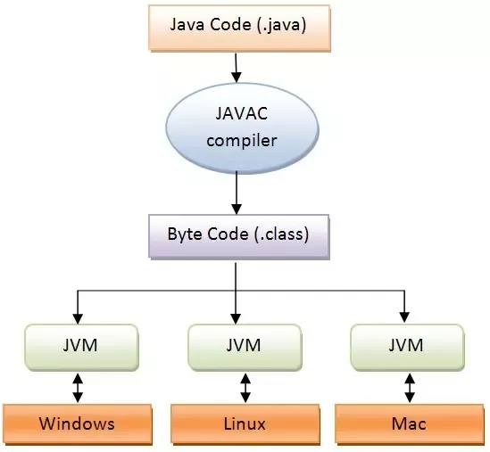

# prj pt 1 qb solution 
### Notes Factory


> [!attention] comments are just for understanding, no write them in exam


(need to add question called dynamic method dispatch as per 6 mark)


**1. Describe primitive data types of Java with appropriate code snippets. [4M]**
   
Primitive data types in Java are the basic types used to store simple values directly, such as numbers and characters. 
#### list of primitive data types
- **Integer Types**:
  - `byte`: 8-bit signed integer
  - `short`: 16-bit signed integer
  - `int`: 32-bit signed integer
  - `long`: 64-bit signed integer

- **Floating-Point Types**:
  - `float`: 32-bit floating point
  - `double`: 64-bit floating point

- **Character Type**:
  - `char`: 16-bit Unicode character

- **Boolean Type**:
  - `boolean`: true or false

#### code snippet
```java
public class Duck {
    public static void main(String[] args) {
        int a = 100;
        double b = 3.14;
        char c = 'A';
        boolean d = true;

        System.out.println("int: " + a);        // int: 100
        System.out.println("double: " + b);     // double: 3.14
        System.out.println("char: " + c);       // char: A
        System.out.println("boolean: " + d);    // boolean: true
    }
}
```
---

**2. Define bytecode with a brief description. OR Describe the "platform-independent" feature in Java. OR Describe bytecode with a suitable example. [4M]**
-> **Java is platform-independent** because it uses an intermediate form called **Java Byte Code**. When you write a Java program, it gets compiled into **byte code**, not machine-specific code. For example, if you write a Java program on a **Windows computer**, it will be compiled into **byte code**. You can then run this **byte code** on a **Linux computer** or a **Mac**, as long as there is a **Java Virtual Machine (JVM)** installed. The **JVM** interprets the **byte code** and runs the program, regardless of the underlying operating system. This is what makes **Java programs** able to run on different platforms without modification.

### refrencial diagram
   
#### <center>  draw above or below digram </center>
 
   

   

  
---

**3. Explain type casting and type conversion with a suitable example program. [4M]**

*Answer:*

Type casting is the process of converting one data type into another. Type casting can be either implicit or explicit.

- **Implicit Type Casting:** When the conversion happens automatically, it is known as implicit casting.
- **Explicit Type Casting:** When the conversion is explicitly done by the programmer.

Example:

```java
public class Cast {
    public static void main(String[] args) {
        int a = 69;
        double b = a;          // Implicit casting: int to double
        System.out.println("double: " + b); // double: 69.0

        double c = 69.78;
        int d = (int) c;      // Explicit casting: double to int
        System.out.println("int: " + d);    // int: 69
    }
}
```

---

**4. Give the OOP principles and explain each with a suitable example. [6M]**

*Answer:*

The main principles of Object-Oriented Programming (OOP) are:


1. **Encapsulation:** Combining data (variables) and methods (functions) into a single unit (class) and restricting access to some of the object's components.

   Example:

   ```java
   class Student {
       private String name;

       public void setName(String name) {
           this.name = name;
       }

       public String getName() {
           return name;
       }
   }
   ```

2. **Inheritance:** Mechanism where one class inherits features (fields and methods) from another class, similar to how a child inherits traits from their parents.

   Example:

   ```java
   class Animal {
       void eat() {
           System.out.println("This animal eats food.");
       }
   }

   class Dog extends Animal {
       void bark() {
           System.out.println("This dog barks.");
       }
   }
   ```
3. **Polymorphism:** The ability of a variable, function, or object to take on multiple forms.

   Example:

   ```java
   class Animal {
       void sound() {
           System.out.println("Animal is making a sound");
       }
   }

   class Dog extends Animal {
       void sound() {
           System.out.println("Dog is barking");
       }
   }
   ```

4. **Abstraction:** Hiding the implementation details and showing only the functionality to the user.

   Example:

   ```java
   abstract class Car {
       abstract void drive();
   }

   class BMW extends Car {
       void drive() {
           System.out.println("Driving BMW");
       }
   }
   ```

---

**5. Enlist literals in Java with examples. [4M]**

*Answer:*

Literals are the data items that have fixed values. They can be classified as:

1. **Integer Literals:**

   ```java
   int a = 10;
   ```

2. **Floating-Point Literals:**

   ```java
   float pi = 3.14f;
   ```

3. **Character Literals:**

   ```java
   char letter = 'A';
   ```

4. **String Literals:**

   ```java
   String str = "Hello World";
   ```

5. **Boolean Literals:**

   ```java
   boolean flag = true;
   ```

---

**6. Justify Java as a platform-independent language while JVM is platform-dependent. [4M]**

Java is considered platform-independent because Java programs, once compiled into bytecode, can run on any operating system that has a Java Virtual Machine (JVM). The JVM interprets the bytecode into machine code that the host system can execute, allowing the same Java program to run on different platforms without modification. However, Java is also platform-dependent because the JVM itself is specific to each operating system, meaning you need a different JVM for each platform (e.g., Windows, macOS, Linux). Thus, while Java code is platform-independent, the JVM is platform-dependent.

   
***
**7. Explain arithmetic/logical/relational operator with example OR with example program [4m]**


### Arithmetic Operators
- **Addition (`+`)**
- **Subtraction (`-`)**
- **Multiplication (`*`)**
- **Division (`/`)**
- **Modulus (`%`)**

### Logical Operators
- **AND (`&&`)**
- **OR (`||`)**
- **NOT (`!`)**

### Relational Operators
- **Equal to (`==`)**
- **Not equal to (`!=`)**
- **Greater than (`>`)**
- **Less than (`<`)**
- **Greater than or equal to (`>=`)**
- **Less than or equal to (`<=`)**

```java
public class Op {
    public static void main(String[] args) {
        int a = 10;
        int b = 5;

        // Arithmetic Operators
        int sum = a + b;        // Addition
        int product = a * b;    // Multiplication

        // Logical Operators
        boolean andResult = (a > b) && (b > 0);  // AND
        boolean orResult = (a < b) || (b > 0);   // OR

        // Relational Operators
        boolean isEqual = (a == b);   // Equal to
        boolean isGreater = (a > b);  // Greater than

        // Output results
        System.out.println("Sum: " + sum);       // Output: Sum: 15
        System.out.println("Product: " + product); // Output: Product: 50
        System.out.println("AND Result: " + andResult); // Output: AND Result: true
        System.out.println("OR Result: " + orResult);   // Output: OR Result: true
        System.out.println("Equal: " + isEqual);   // Output: Equal: false
        System.out.println("Greater: " + isGreater);  // Output: Greater: true
    }
}
```
***
**8. Explain bitwise operator with example[4m]
**
#### Bitwise AND (`&`)
- **Definition**: Performs a bitwise AND operation. Each bit of the result is `1` if both corresponding bits of the operands are `1`; otherwise, the result is `0`.

#### Bitwise OR (`|`)
- **Definition**: Performs a bitwise OR operation. Each bit of the result is `1` if at least one of the corresponding bits of the operands is `1`.

#### Bitwise NOT (`~`)
- **Definition**: Performs a bitwise NOT operation. Inverts all the bits of the operand.

```java
public class bit {
    public static void main(String[] args) {
        int a = 6;  // Binary: 0110
        int b = 4;  // Binary: 0100

        // Bitwise Operators
        int andResult = a & b;    // Bitwise AND
        int orResult = a | b;     // Bitwise OR
        int notResult = ~a;       // Bitwise NOT

        // Output results
        System.out.println("a & b: " + andResult);   // Output: a & b: 4
        System.out.println("a | b: " + orResult);    // Output: a | b: 6
        System.out.println("~a: " + notResult);      // Output: ~a: -7
    }
}


```
**9. Define the following terms with example.[6M]**
 ● Class
 ● Object
 ● Reference 


### 1. Class
- **Definition**: A class is a blueprint for creating objects. It defines a data type by encapsulating data and methods to manipulate that data.
- **Example**: 

```java
// Definition of the class 'Car'
public class Car {
    // Fields (attributes) of the class
    String color;
    String model;

    // Method of the class
    void displayInfo() {
        System.out.println("Model: " + model);
        System.out.println("Color: " + color);
    }
}
```

### 2. Object
- **Definition**: An object is an instance of a class. It represents a specific entity with its own set of attributes and methods.
- **Example**:

```java
public class Main {
    public static void main(String[] args) {
        // Creating an object of the class 'Car'
        Car myCar = new Car();

        // Setting attributes of the object
        myCar.color = "Red";
        myCar.model = "Toyota Corolla";

        // Calling a method on the object
        myCar.displayInfo();
    }
}
```

In this example, `myCar` is an object of the class `Car`.

### 3. Reference
- **Definition**: A reference is a variable that holds the memory address of an object. It allows access to the object’s attributes and methods.
- **Example**:

```java
public class Main {
    public static void main(String[] args) {
        // Creating a reference of type 'Car'
        Car myCar = new Car();

        // The reference 'myCar' points to the new 'Car' object created
        myCar.color = "Blue";
        myCar.model = "Honda Civic";

        // Using the reference to call a method on the object
        myCar.displayInfo();
    }
}
```

In this example:
- `Car myCar` is a reference variable that points to the `Car` object created.
- `myCar` is used to access the `color` and `model` attributes and to call the `displayInfo` method on the `Car` object.
***
**10. Describe the working of new operator in java. OR describe the process of creation of objects in java with suitable example.[4m]**

The `new` keyword in Java allocates memory for a new object, initializes it with the class constructor, and returns a reference to the object.

**Example**:

```java
Car myCar = new Car(); // Creates a new Car object
//initializes it, and assigns the reference to myCar
```

- **Memory Allocation**: `new Car()` allocates space for the `Car` object.
- **Initialization**: The `Car` constructor sets up the object.
- **Reference Assignment**: `myCar` holds the reference to the new `Car` object.
***
**11.Explain the process of Object creation in java.[6M]**
(NEED TO REPAIR THIS ANSWER )

```java
// Step 1: Define the class
public class Car {
    String color;
    String model;
    
    // Constructor to initialize the object
    Car(String color, String model) {
        this.color = color;
        this.model = model;
    }
    
    // Method to display object information
    void displayInfo() {
        System.out.println("Model: " + model);
        System.out.println("Color: " + color);
    }
}

public class Main {
    public static void main(String[] args) {
        // Step 2: Allocate memory and Step 3: Initialize the object
        Car myCar = new Car("Red", "Toyota Corolla");
        
        // Step 4: Reference assignment
        // 'myCar' holds the reference to the new Car object
        
        // Step 5: Use the reference to access object methods
        myCar.displayInfo(); // Calls the method to display the Car's info
    }
}
```

### How It Works

1. **Class Definition**: The `Car` class is defined with attributes and methods.
2. **Memory Allocation and Initialization**: `new Car("Red", "Toyota Corolla")` allocates memory and initializes the `Car` object.
3. **Reference Assignment**: The reference to the new `Car` object is stored in `myCar`.
4. **Object Usage**: `myCar.displayInfo()` is used to interact with the object and display its information.
***
**12.Explain the statement: public static void main(String args[]) [4m]**

```java
public static void main(String[] args)
```

This method is crucial for running your Java program as it is the entry point the Java runtime environment looks for.

- **public**: The method is accessible from anywhere, allowing the Java runtime to call it from outside the class.
  
- **static**: The method belongs to the class itself, enabling the Java runtime to invoke it without creating an instance of the class.

- **void**: The method does not return any value.

- **main**: The name of the method that the Java runtime identifies as the starting point of the application.

- **String[] args**: An array of `String` objects that can hold command-line arguments passed to the program when it runs.

***
**13. Explain System.out.println() method [4m]**


The `System.out.println()` method in Java is used to print text or data to the console. It performs the following functions:

- **System**: Represents the `System` class in the `java.lang` package, providing access to system resources.

- **out**: A static member of the `System` class, which is the standard output stream (typically the console).

- **println()**: A method of the `PrintStream` class (which `System.out` is an instance of). It prints the specified message and moves the cursor to a new line.


### Example

```java
System.out.println("Hello, World!"); // Prints "Hello, World!"
// and adds a new line
```


In this example:
- `System.out` refers to the standard output stream.
- `println("Hello, World!")` outputs the text `"Hello, World!"` and then moves to the next line.
***
**14. String class and its methods [4m/6m/8m]**
> [!attention] this answer written over here is as per 8 marks
### String Class in Java

The `String` class in Java represents a sequence of characters and provides various methods for manipulation. It is immutable, meaning once a `String` object is created, its value cannot be changed.

### Key Methods of the `String` Class

1. **length()**
   - **Description**: Returns the length of the string.
   - **Example**:
     ```java
     String str = "Hello";
     int length = str.length(); // length = 5
     ```

2. **charAt(int index)**
   - **Description**: Returns the character at the specified index.
   - **Example**:
     ```java
     String str = "Hello";
     char ch = str.charAt(1); // ch = 'e'
     ```

3. **substring(int beginIndex, int endIndex)**
   - **Description**: Returns a substring from the specified `beginIndex` to `endIndex`.
   - **Example**:
     ```java
     String str = "Hello";
     String sub = str.substring(1, 4); // sub = "ell"
     ```

4. **toUpperCase()**
   - **Description**: Converts all characters in the string to uppercase.
   - **Example**:
     ```java
     String str = "Hello";
     String upper = str.toUpperCase(); // upper = "HELLO"
     ```

5. **toLowerCase()**
   - **Description**: Converts all characters in the string to lowercase.
   - **Example**:
     ```java
     String str = "Hello";
     String lower = str.toLowerCase(); // lower = "hello"
     ```

6. **trim()**
   - **Description**: Removes leading and trailing whitespace from the string.
   - **Example**:
     ```java
     String str = "  Hello  ";
     String trimmed = str.trim(); // trimmed = "Hello"
     ```

7. **replace(CharSequence target, CharSequence replacement)**
   - **Description**: Replaces all occurrences of `target` with `replacement`.
   - **Example**:
     ```java
     String str = "Hello World";
     String replaced = str.replace("World", "Java"); // replaced = "Hello Java"
     ```

8. **split(String regex)**
   - **Description**: Splits the string around matches of the given regular expression.
   - **Example**:
     ```java
     String str = "one,two,three";
     String[] parts = str.split(","); // parts = ["one", "two", "three"]
     ```

  > [!hint] OR instead do this
  > YOU CAN EXPLAIN IT USING COMBINED CODE WHICH REPRESENTS EXAMPLE OF ALL ABOVE METHODS
```java
public class Exhausting {
    public static void main(String[] args) {
        // Initial string
        String str = "  Hello World  ";

        // 1. length()
        int length = str.length(); // length = 15
        System.out.println("Length: " + length);

        // 2. charAt(int index)
        char ch = str.charAt(7); // Corrected to index 7 to get 'W'
        System.out.println("Character at index 7: " + ch);

        // 3. substring(int beginIndex, int endIndex)
        String sub = str.substring(2, 7); // sub = "Hello"
        System.out.println("Substring (2, 7): " + sub);

        // 4. toUpperCase()
        String upper = str.toUpperCase(); // upper = "  HELLO WORLD  "
        System.out.println("Uppercase: " + upper);

        // 5. toLowerCase()
        String lower = str.toLowerCase(); // lower = "  hello world  "
        System.out.println("Lowercase: " + lower);

        // 6. trim()
        String trimmed = str.trim(); // trimmed = "Hello World"
        System.out.println("Trimmed: " + trimmed);

        // 7. replace(CharSequence target, CharSequence replacement)
        String replaced = str.replace("World", "Java"); // replaced = "  Hello Java  "
        System.out.println("Replaced: " + replaced);

        // 8. split(String regex)
        String[] parts = str.split(" ");
        System.out.println("Split by space:");
        for (String part : parts) {
            System.out.println("[" + part + "]");
        }
    }
}

```
**15. Explain parameterized constructor in with example program. OR explain constructor overloading.**
### Parameterized Constructor in Java

A parameterized constructor is a constructor that accepts arguments to initialize an object with specific values. It allows you to create objects with initial values provided at the time of creation.

### Example

```java
public class Book {
    String title;
    String author;
    int year;

    // Parameterized constructor 1
    Book(String title) {
        this.title = title;
        this.author = "Unknown";
        this.year = 0;
    }

    // Parameterized constructor 2
    Book(String title, String author) {
        this.title = title;
        this.author = author;
        this.year = 0;
    }

    // Parameterized constructor 3
    Book(String title, String author, int year) {
        this.title = title;
        this.author = author;
        this.year = year;
    }

    // Method to display book details
    void displayInfo() {
        System.out.println("Title: " + title);
        System.out.println("Author: " + author);
        System.out.println("Year: " + year);
    }

    public static void main(String[] args) {
        // Creating objects using parameterized constructors
        Book book1 = new Book("Java Basics");
        Book book2 = new Book("Java Basics", "John Doe");
        Book book3 = new Book("Java Basics", "John Doe", 2023);

        book1.displayInfo();
        book2.displayInfo();
        book3.displayInfo();
    }
}
```

### Explanation

- **Book(String title)**: Initializes the book with a title and default values for author and year.
- **Book(String title, String author)**: Initializes the book with a title and author, and a default year.
- **Book(String title, String author, int year)**: Initializes the book with title, author, and year.
***
**16. xplain 1D array(compile-time and run-time both) with example program.[6m]**

A one-dimensional (1D) array is a linear structure that holds elements of the same type in a single line, with each element accessed by its index starting from 0.
### Compile-Time and Run-Time Behavior
> [!attention] This Answer is wrong will be correct (as in example part when you take user input, 2nd array will use scanner thingy)
-   **Compile-Time**: (PRE DEFINED INPUT) At compile time, the array is defined with a specified size and type. The compiler checks the array declaration and initialization for correctness.
    
-   **Run-Time**:(USER INPUT) At run time, the array is allocated memory based on its size. Elements can be accessed and modified using their indices.
```java
public class ae {
    public static void main(String[] args) {
        // Compile-Time Array Initialization (Pre-defined input)
        int[] compileTimeArray = {10, 20};
        
        // Run-Time Array Initialization (User input)
        int[] runTimeArray = new int[2];
        runTimeArray[0] = 30;
        runTimeArray[1] = 40;

        // Print both arrays using a single for loop
        System.out.println("Array Elements:");
        for (int i = 0; i < compileTimeArray.length; i++) {
            System.out.println("Compile-Time Array, Index " + i + ": " + compileTimeArray[i]);
            System.out.println("Run-Time Array, Index " + i + ": " + runTimeArray[i]);
        }
    }
}
```
**17.Explain passing and returning objects to and from the method (function) with example program. [8m]**
### Explanation

In Java, you can pass objects to methods and return objects from methods. This allows methods to modify the object data or create and return new objects. When you pass an object to a method, you're passing a reference, enabling the method to alter the object's attributes. Returning an object from a method allows you to create and send back an object.

### Example Program

```java
class Person {
    String name;
    int age;

    // Constructor to initialize Person object
    Person(String name, int age) {
        this.name = name;
        this.age = age;
    }

    // Method to display person details
    void displayInfo() {
        System.out.println("Name: " + name);
        System.out.println("Age: " + age);
    }
}

public class Main {
    // Method to update the age of a Person object
    static void updateAge(Person person, int newAge) {
        person.age = newAge;
    }

    // Method to create and return a new Person object
    static Person createPerson(String name, int age) {
        return new Person(name, age);
    }

    public static void main(String[] args) {
        // Create a Person object
        Person person = new Person("Alice", 25);
        person.displayInfo(); // Display initial info

        // Update the person's age
        updateAge(person, 30);
        person.displayInfo(); // Display updated info

        // Create and display a new Person object
        Person newPerson = createPerson("Bob", 40);
        newPerson.displayInfo();
    }
}
```

### How It Works

- **Passing Objects**: `updateAge(Person person, int newAge)` modifies the `age` attribute of the passed `Person` object.
- **Returning Objects**: `createPerson(String name, int age)` creates and returns a new `Person` object with the given values.
***
**18. Explain static data and static member method and static block with example program.[6m]**
### Static Data, Static Member Methods, and Static Blocks in Java

**Static Data**:
- Shared among all instances of a class; it belongs to the class itself rather than any specific instance.

**Static Member Methods**:
- Belong to the class and can be called without creating an instance; they can only access static data and other static methods.

**Static Blocks**:
- Run once when the class is first loaded into memory, used for initializing static variables.

### Example Program

```java
public class Example {
    // Static data
    static int instanceCount = 0;
    
    // Static block
    static {
        System.out.println("Static block executed.");
        instanceCount = 5; // Initialize static data
    }

    // Constructor
    Example() {
        instanceCount++;
    }

    // Static method
    static void displayInstanceCount() {
        System.out.println("Instance count: " + instanceCount);
    }

    public static void main(String[] args) {
        Example.displayInstanceCount(); // Output before creating instances

        new Example();
        new Example();

        Example.displayInstanceCount(); // Output after creating instances
    }
}
```

### Output

```
Static block executed.
Instance count: 5
Instance count: 7
```
***


**19. Explain how to take user input using scanner class. [4m]**  


The `Scanner` class in Java reads input from various sources, such as the console, and provides methods to handle different data types.

### Example

```java
import java.util.Scanner;

public class UserInputExample {
    public static void main(String[] args) {
        Scanner sc = new Scanner(System.in);

        System.out.print("Name: ");
        String name = sc.nextLine(); // Read a string input

        System.out.print("Age: ");
        int age = sc.nextInt(); // Read an integer input

        System.out.println("Name: " + name);
        System.out.println("Age: " + age);
    }
}
```

In this example:
- `new Scanner(System.in)` initializes the `Scanner` for input.
- `nextLine()` reads a string.
- `nextInt()` reads an integer.
***

**20. Explain array of objects with example. (or a program will be asked.) [6m]**

An array of objects in Java is a collection of instances of a class stored in an array. Each element in the array is a reference to an object of the specified class.

### Example

```java
class Student {
    String name;
    int age;

    // Constructor
    Student(String name, int age) {
        this.name = name;
        this.age = age;
    }

    // Method to display student details
    void display() {
        System.out.println("Name: " + name + ", Age: " + age);
    }
}

public class ArrayOfObjectsExample {
    public static void main(String[] args) {
        // Create an array of Student objects
        Student[] students = new Student[3];

        // Initialize each element with a new Student object
        students[0] = new Student("Alice", 20);
        students[1] = new Student("Bob", 22);
        students[2] = new Student("Charlie", 19);

        // Display details of each student
        for (Student student : students) {
            student.display();
        }
    }
}
```

### Explanation

- **Class Definition**: `Student` class with `name` and `age` fields, a constructor, and a `display` method.
- **Array Initialization**: `Student[] students = new Student[3];` creates an array of `Student` objects.
- **Object Creation**: `students[0] = new Student("Alice", 20);` initializes each array element with a `Student` object.
- **Display**: A loop iterates over the array and calls `display()` on each `Student` object.
***

**21. Describe the working of “this” with an example program. [8m]**

In Java, the `this` keyword refers to the current instance of a class. It is used to access instance variables, methods, and differentiate between instance variables and parameters with the same name.

### Example

```java
class Person {
    String name;
    int age;

    // Constructor with parameters
    Person(String name, int age) {
        this.name = name; // 'this.name' refers to the instance variable
        this.age = age;   // 'this.age' refers to the instance variable
    }

    // Method to display details
    void display() {
        System.out.println("Name: " + this.name); // 'this.name' refers to the instance variable
        System.out.println("Age: " + this.age);   // 'this.age' refers to the instance variable
    }
}

public class ThisKeywordExample {
    public static void main(String[] args) {
        Person person = new Person("Alice", 30); // Creates a new Person object

        person.display(); // Outputs: Name: Alice, Age: 30
    }
}
```

### Explanation

- **Constructor**: `this.name = name;` and `this.age = age;` clarify that `name` and `age` are instance variables.
- **Method**: `this.name` and `this.age` access the instance variables of the current object.
***

**22. Explain Access modifiers in java. [4m]**  
Access modifiers in Java define the scope and accessibility of fields, methods, constructors, and classes.
1. **Private**: Accessible only within the same class.
2. **Default**: Accessible within the same package (no modifier).
3. **Protected**: Accessible within the same package and by subclasses.
4. **Public**: Accessible from anywhere (within and outside the package).
Here is the table summarizing the access levels of Java access modifiers:

| Access Modifier | Within Class | Within Package | Outside Package | By Subclass |
|-----------------|--------------|----------------|-----------------|-------------|
| **Private**     | Yes          | No             | No              | No          |
| **Default**     | Yes          | Yes            | No              | No          |
| **Protected**   | Yes          | Yes            | No       | Yes         |
| **Public**      | Yes          | Yes            | Yes             | Yes         |
***

**23. Explain constructor chaining with example program. [4m]**
(in code use super keyword !!! need to be fix this question only)

Constructor chaining in Java is the process of calling one constructor from another within the same class or a subclass. This helps to avoid code duplication and allows for more flexible object initialization.

### Example

```java
class Employee {
    String name;
    int id;

    // Constructor 1
    Employee() {
        this("Unknown", 0); // Calls Constructor 2
    }

    // Constructor 2
    Employee(String name) {
        this(name, 0); // Calls Constructor 3
    }

    // Constructor 3
    Employee(String name, int id) {
        this.name = name;
        this.id = id;
    }

    void display() {
        System.out.println("Name: " + name);
        System.out.println("ID: " + id);
    }
}

public class ConstructorChainingExample {
    public static void main(String[] args) {
        Employee emp1 = new Employee();           // Calls Constructor 1
        Employee emp2 = new Employee("Alice");    // Calls Constructor 2
        Employee emp3 = new Employee("Bob", 101); // Calls Constructor 3

        emp1.display(); // Outputs: Name: Unknown, ID: 0
        emp2.display(); // Outputs: Name: Alice, ID: 0
        emp3.display(); // Outputs: Name: Bob, ID: 101
    }
}
```

### Explanation

- **Constructor 1** calls **Constructor 2** with default values.
- **Constructor 2** calls **Constructor 3** with a default ID.
- **Constructor 3** initializes the `name` and `id` fields directly.

***

**24. Explain Multilevel Inheritance in java with suitable program [6m]**  


Multilevel inheritance occurs when a class inherits from another class, which is also inherited by another class, forming a chain of inheritance.

### Example

```java
class Animal {
    void eat() { System.out.println("eating..."); }
}

class Dog extends Animal {
    void bark() { System.out.println("barking..."); }
}

class BabyDog extends Dog {
    void weep() { System.out.println("weeping..."); }
}

public class TestInheritance2 {
    public static void main(String[] args) {
        BabyDog d = new BabyDog();
        d.weep();  // Outputs: weeping...
        d.bark();  // Outputs: barking...
        d.eat();   // Outputs: eating...
    }
}
```

### Explanation

- **Animal** is the base class with a method `eat()`.
- **Dog** extends **Animal** and adds a method `bark()`.
- **BabyDog** extends **Dog** and adds a method `weep()`.
- **BabyDog** inherits methods from both **Dog** and **Animal**.
***

**25. Enlist different types of inheritance and Explain all with example program [6m]**  


### Types of Inheritance

1. **Single Inheritance**
2. **Multiple Inheritance** (through interfaces)
3. **Multilevel Inheritance**
4. **Hierarchical Inheritance**
5. **Hybrid Inheritance** (conceptual, usually avoided in Java)

### Combined Example Program

```java
// Single Inheritance
class Animal {
    void eat() { System.out.println("Animal eats"); }
}

// Multiple Inheritance (through interfaces)
interface Flyable {
    void fly();
}

interface Swimmable {
    void swim();
}

// Multilevel Inheritance
class Mammal extends Animal {
    void breathe() { System.out.println("Mammal breathes"); }
}

// Hierarchical Inheritance
class Dog extends Mammal {
    void bark() { System.out.println("Dog barks"); }
}

class Cat extends Mammal {
    void meow() { System.out.println("Cat meows"); }
}

// Multiple Inheritance Implementation
class Duck implements Flyable, Swimmable {
    public void fly() { System.out.println("Duck flies"); }
    public void swim() { System.out.println("Duck swims"); }
}

public class InheritanceDemo {
    public static void main(String[] args) {
        // Single Inheritance
        Dog dog = new Dog();
        dog.eat();    // Animal eats
        dog.breathe(); // Mammal breathes
        dog.bark();   // Dog barks

        // Hierarchical Inheritance
        Cat cat = new Cat();
        cat.eat();    // Animal eats
        cat.breathe(); // Mammal breathes
        cat.meow();   // Cat meows

        // Multiple Inheritance
        Duck duck = new Duck();
        duck.fly();   // Duck flies
        duck.swim();  // Duck swims
    }
}
```

### Explanation

- **Single Inheritance**: `Dog` inherits from `Mammal`, which in turn inherits from `Animal`.
- **Multiple Inheritance**: `Duck` implements both `Flyable` and `Swimmable` interfaces.
- **Multilevel Inheritance**: `Dog` inherits from `Mammal`, and `Mammal` inherits from `Animal`.
- **Hierarchical Inheritance**: `Dog` and `Cat` both inherit from `Mammal`.
***

**26. Explain final Keyword with example [4m]**  
considering final keyword in refrence with variable.

The `final` keyword makes a variable constant; its value cannot be changed after initialization (constant).

### Example

```java
class Example {
    final int CONSTANT = 10; // Final variable, value cannot be changed

    void display() {
        System.out.println("Constant: " + CONSTANT);
    }
}

public class FinalVariableDemo {
    public static void main(String[] args) {
        Example ex = new Example();
        ex.display(); // Output: Constant: 10
    }
}
```
***

**27. Explain Super Keyword with example [4m]**  


The `super` keyword in Java is used to refer to the superclass of the current object. It allows access to superclass methods and constructors that have been overridden or hidden.

### Example

```java
class Bird {
    void display() {
        System.out.println("Bird class");
    }
}

class Duck extends Bird {
    void display() {
        super.display(); // Calls the display() method of the Bird class
        System.out.println("Duck class");
    }
}

public class duckquack {
    public static void main(String[] args) {
        Duck obj = new Duck();
        obj.display(); 
        // Output: 
        // Bird class
        // Duck class
    }
}
```

### Explanation

- `super.display()` in the `Duck` class calls the `display` method of the `Bird` class before executing the `Duck` class’s own `display` method.
***

**28. Explain Method Overriding with example program [6m]**  


Method overriding allows a subclass to provide a specific implementation for a method already defined in its superclass. The method in the subclass has the same name, return type, and parameters as in the superclass.

### Example

```java
class Animal {
    void makeSound() {
        System.out.println("Animal makes a sound");
    }
}

class Dog extends Animal {
    @Override
    void makeSound() {
        System.out.println("Dog barks");
    }
}

public class MethodOverridingDemo {
    public static void main(String[] args) {
        Dog myDog = new Dog();
        myDog.makeSound(); // Output: Dog barks
    }
}
```

### Explanation

- **Superclass Method**: `makeSound()` in `Animal` class.
- **Overridden Method**: `makeSound()` in `Dog` class provides a specific implementation.
- **Result**: When `myDog.makeSound()` is called, it executes the `makeSound()` method defined in the `Dog` class.
***

**29. Difference between class and object [4m]**

| Parameter       | Class                                        | Object                                       |
|-----------------|----------------------------------------------|----------------------------------------------|
| Definition      | A blueprint or template for creating objects | An instance of a class                       |
| Declaration     | Declared using the `class` keyword           | Created using the `new` keyword              |
| Example         | `class Car {}`                               | `Car myCar = new Car();`                     |
| Memory          | Defines structure and behavior, no memory allocated for data | Allocates memory for storing data            |
| Access          | Defines attributes and methods               | Accesses attributes and methods of the class |
| Usage           | Used to create objects                       | Represents a specific instance of a class   |
***

**30. Difference between compile time polymorphism and run time polymorphism [4m]**

| Parameter                  | Compile-Time Polymorphism                   | Run-Time Polymorphism                        |
|----------------------------|----------------------------------------------|----------------------------------------------|
| Definition                 | Method Overloading and Operator Overloading | Method Overriding                           |
| Binding Time               | Compile-time                                | Runtime                                      |
| Method Resolution          | Resolved during compilation                  | Resolved during execution                    |
| Flexibility                | Based on method signatures within the same class | Achieved through inheritance and overriding |
| Type of Polymorphism       | Static                                       | Dynamic                                       |
| Example                    | Method overloading: same method name, different parameters | Method overriding: same method signature in subclass |
***
### XTRAS (Quick Read)
#### Decision Making in Java

**Simple `if` Statement**  
The `if` statement executes a block of code if a specified condition is true.  
**Syntax:**
```java
if (condition) {
    // code to execute if condition is true
}
```
**Example:**
```java
public class Main {
    public static void main(String[] args) {
        int num = 10;
        if (num > 5) {
            System.out.println("Number is greater than 5");
        }
    }
}
```

**`if...else` Statement**  
The `if...else` statement executes one block of code if the condition is true and another block if it is false.  
**Syntax:**
```java
if (condition) {
    // code to execute if condition is true
} else {
    // code to execute if condition is false
}
```
**Example:**
```java
public class Main {
    public static void main(String[] args) {
        int num = 4;
        if (num > 5) {
            System.out.println("Number is greater than 5");
        } else {
            System.out.println("Number is not greater than 5");
        }
    }
}
```

**`else if` Ladder**  
The `else if` ladder is used to check multiple conditions sequentially.  
**Syntax:**
```java
if (condition1) {
    // code to execute if condition1 is true
} else if (condition2) {
    // code to execute if condition2 is true
} else {
    // code to execute if all conditions are false
}
```
**Example:**
```java
public class Main {
    public static void main(String[] args) {
        int num = 3;
        if (num > 5) {
            System.out.println("Number is greater than 5");
        } else if (num == 5) {
            System.out.println("Number is equal to 5");
        } else {
            System.out.println("Number is less than 5");
        }
    }
}
```

**`switch` Statement**  
The `switch` statement executes a block of code based on the value of a variable.  
**Syntax:**
```java
switch (variable) {
    case value1:
        // code to execute if variable equals value1
        break;
    case value2:
        // code to execute if variable equals value2
        break;
    // additional cases
    default:
        // code to execute if variable doesn't match any case
}
```
**Example:**
```java
public class Main {
    public static void main(String[] args) {
        int day = 3;
        switch (day) {
            case 1:
                System.out.println("Monday");
                break;
            case 2:
                System.out.println("Tuesday");
                break;
            case 3:
                System.out.println("Wednesday");
                break;
            case 4:
                System.out.println("Thursday");
                break;
            case 5:
                System.out.println("Friday");
                break;
            case 6:
                System.out.println("Saturday");
                break;
            case 7:
                System.out.println("Sunday");
                break;
            default:
                System.out.println("Invalid day");
        }
    }
}
```

**Conditional Operator (Ternary Operator)**  
The conditional operator is a shorthand for `if...else` and takes three operands.  
**Syntax:**
```java
condition ? expression1 : expression2;
```
**Example:**
```java
public class Main {
    public static void main(String[] args) {
        int num = 10;
        System.out.println(num > 5 ? "Number is greater than 5" : "Number is not greater than 5");
    }
}
```

### Decision Making with Loops

**`while` Loop**  
The `while` loop executes a block of code as long as the specified condition is true.  
**Syntax:**
```java
while (condition) {
    // code to execute
}
```
**Example:**
```java
public class Main {
    public static void main(String[] args) {
        int i = 0;
        while (i < 5) {
            System.out.println(i);
            i++;
        }
    }
}
```

**`do...while` Loop**  
The `do...while` loop is similar to the `while` loop but guarantees the block of code is executed at least once.  
**Syntax:**
```java
do {
    // code to execute
} while (condition);
```
**Example:**
```java
public class Main {
    public static void main(String[] args) {
        int i = 0;
        do {
            System.out.println(i);
            i++;
        } while (i < 5);
    }
}
```

**`for` Loop**  
The `for` loop is used to iterate over a range or sequence and is more compact than a `while` loop.  
**Syntax:**
```java
for (initialization; condition; increment) {
    // code to execute
}
```
**Example:**
```java
public class Main {
    public static void main(String[] args) {
        for (int i = 0; i < 5; i++) {
            System.out.println(i);
        }
    }
}
```

### Jumps in Loops: `break` and `continue`

**`break` Statement**  
The `break` statement exits from a loop or switch statement prematurely.  
**Example:**
```java
public class Main {
    public static void main(String[] args) {
        for (int i = 0; i < 10; i++) {
            if (i == 5) {
                break;
            }
            System.out.println(i);
        }
    }
}
```

**`continue` Statement**  
The `continue` statement skips the remaining code inside the loop for the current iteration and proceeds to the next iteration.  
**Example:**
```java
public class Main {
    public static void main(String[] args) {
        for (int i = 0; i < 10; i++) {
            if (i == 5) {
                continue;
            }
            System.out.println(i);
        }
    }
}
```
***
## by PR7BZ