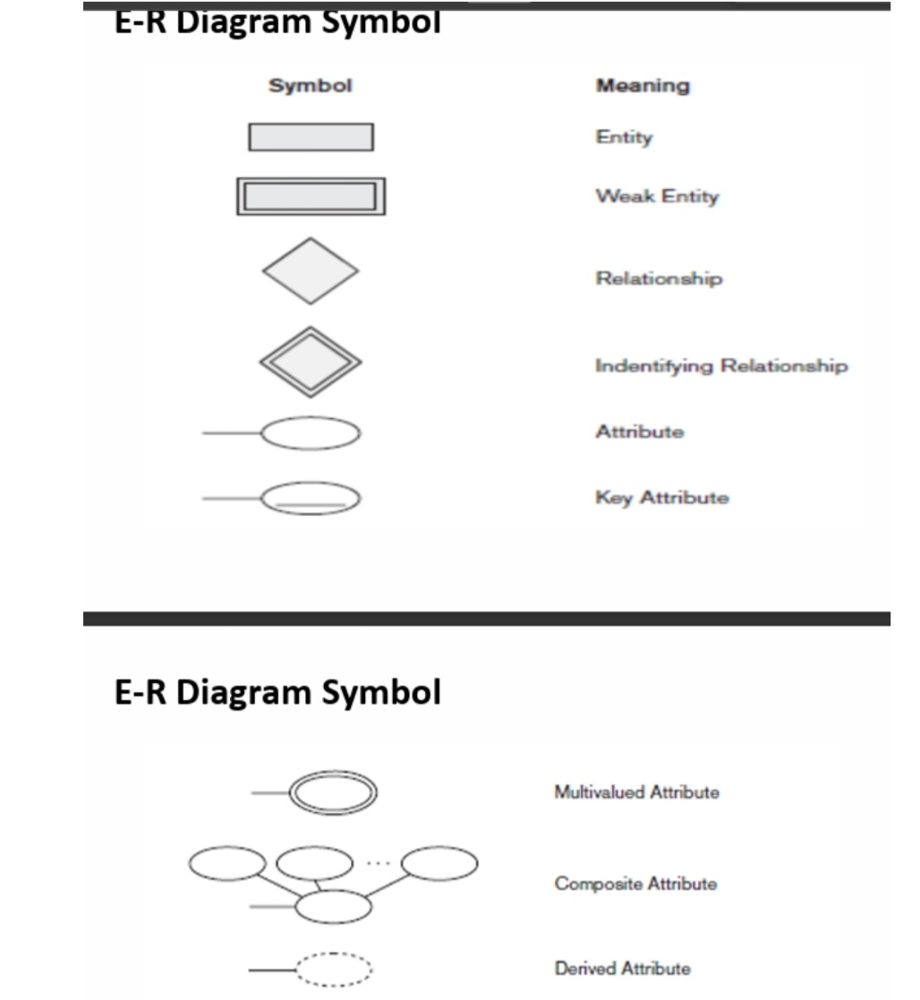
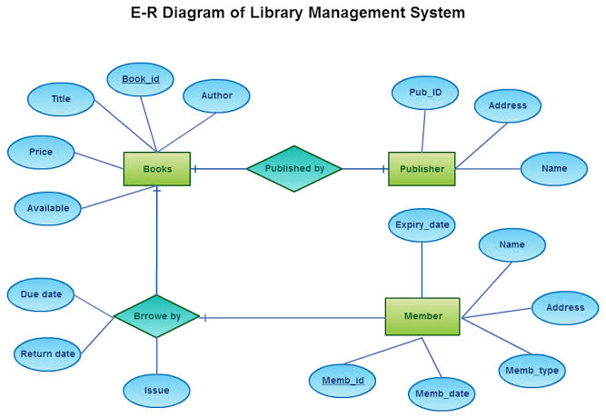
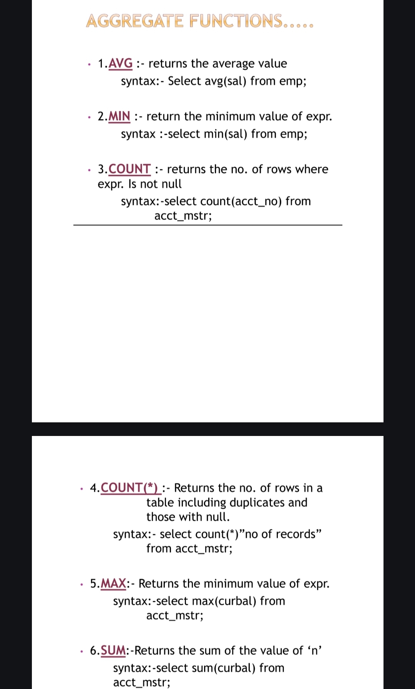
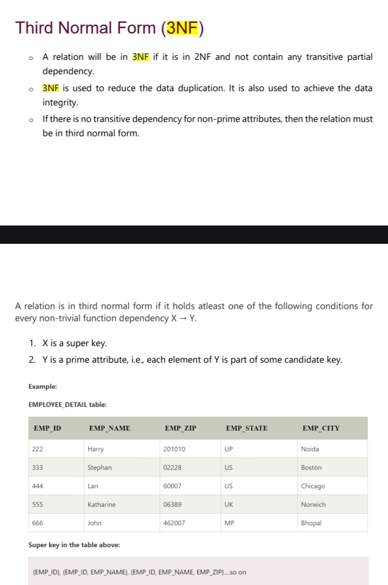

***

***Q1: Draw and label any 8 symbols in an ER diagram.***  
#answer
 

***

***Q2: Draw an ER diagram for a Library Management System. Write entities, attributes, and mention mapping cardinality.***  
#answer
 
***

***Q3: Describe aggregate functions with an example.***  
#answer
Aggregate functions are SQL functions that perform calculations on a set of values and return a single value. 


 

***

***Q4: Explain the GROUP BY clause and HAVING clause.***
#answer
The SQL GROUP BY clause is used with the SELECT statement to arrange identical data into groups. It follows the WHERE clause and precedes the ORDER BY clause. GROUP BY groups multiple records based on the user's requirements, often on fields with repetitive values.

Syntax:
```sql
SELECT <column1, column2, ...>, <aggregate function>(exp)  
FROM <table_name>  
WHERE [condition]  
GROUP BY <column1, column2, ...>;
```

The **HAVING clause** filters groups after the **GROUP BY** clause is applied. Unlike the **WHERE clause**, which places conditions on individual rows, **HAVING** filters conditions on the grouped results. It is used in summary queries similar to **WHERE** but for groups.

**Syntax**:
```sql
SELECT column1, column2, ...  
FROM table_name  
GROUP BY column1, column2  
HAVING condition;

```
***
Explain 3NF with an example.***  
#answer

  