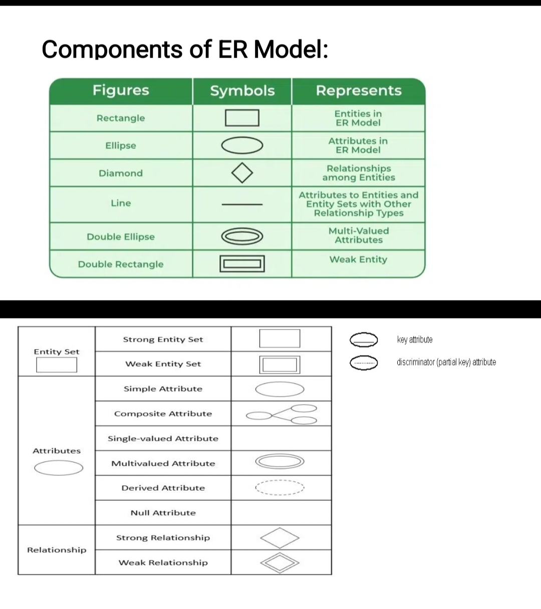
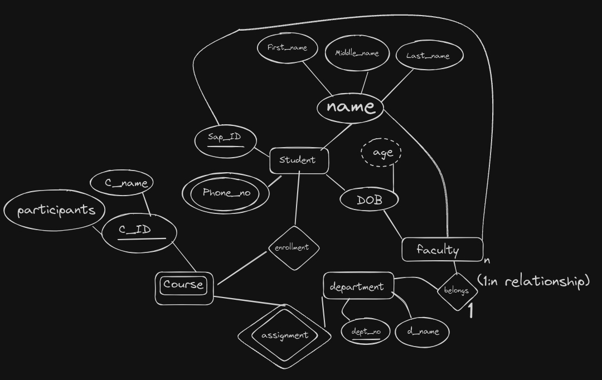

theory

### Why We Need ER Model

An Entity-Relationship (ER) model is crucial for database design. It maps out data entities, their attributes, and relationships, ensuring data consistency and simplifying database planning. This model serves as a blueprint for constructing an efficient database and facilitates communication among stakeholders.

### What is ER Model

The ER model is a conceptual framework that describes a database's structure using entities, attributes, and relationships. Developed by Peter Chen, it visually represents how data entities interact, making it easier to organize and understand complex data relationships before creating the database.

### Data Models

A data model is a framework that defines how data is structured, stored, and related within a database. It helps organize and manage data efficiently.

### Types of Data Models

1. **Hierarchical Model**: Data is organized in a tree-like structure with parent-child relationships.
2. **Network Model**: Data is arranged in a graph with multiple parent-child links.
3. **Relational Model**: Data is stored in tables with rows and columns, widely used in SQL databases.
4. **Entity-Relationship (ER) Model**: Uses entities, attributes, and relationships to represent data, used for designing databases.
5. **Object-Oriented Model**: Combines data and behavior using objects, similar to object-oriented programming.

### Components of ER Model (in Table)

| Component     | Description                                                               |
|---------------|---------------------------------------------------------------------------|
| Entity        | An object or concept about which data is stored (e.g., Customer, Product).|
| Attribute     | A property or characteristic of an entity (e.g., Customer Name).          |
| Relationship  | A link between entities showing their interaction (e.g., Purchases).      |
| Primary Key   | A unique identifier for an entity instance (e.g., Customer ID).           |
| Cardinality   | The numerical relationship between entities (e.g., One-to-Many).          |

 

procedure (at your own risk, not verified/correct)
 

