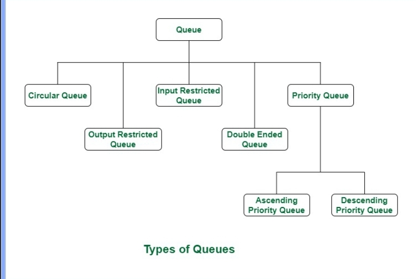

12-24 marks
```c
#include <stdio.h>

int factorial(int n) {
    return (n == 0) ? 1 : n * factorial(n - 1);
}

int fibonacci(int n) {
    return (n <= 1) ? n : fibonacci(n - 1) + fibonacci(n - 2);
}

int main() {
    int num = 5;
    printf("Factorial of %d is %d\n", num, factorial(num));
    printf("Fibonacci of %d is %d\n", num, fibonacci(num));
    return 0;
}
```
***
| **Symbol Scanned** | **Postfix Result (P)**    | **Stack**        |
|--------------------|---------------------------|------------------|
| `(`                |                           | `(`              |
| `A`                | `A`                       | `(`              |
| `–`                | `A`                       | `( -`            |
| `(`                | `A`                       | `( - (`          |
| `B`                | `A B`                     | `( - (`          |
| `/`                | `A B`                     | `( - ( /`        |
| `C`                | `A B C`                   | `( - ( /`        |
| `)`                | `A B C /`                 | `( -`            |
| `*`                | `A B C /`                 | `( - *`          |
| `D`                | `A B C / D`               | `( - *`          |
| `+`                | `A B C / D *`             | `( +`            |
| `E`                | `A B C / D * E`           | `( +`            |
| `)`                | `A B C / D * E +`         |                  |
| `*`                | `A B C / D * E +`         | `*`              |
| `F`                | `A B C / D * E + F`       | `*`              |
| `%`                | `A B C / D * E + F`       | `* %`            |
| `G`                | `A B C / D * E + F G`     | `* %`            |
|                    | `A B C / D * E + F G % *` |                  |

***
| **Symbol Scanned** | **Postfix Result (P)**    | **Stack**        |
|--------------------|---------------------------|------------------|
| `(`                |                           | `(`              |
| `A`                | `A`                       | `(`              |
| `+`                | `A`                       | `( +`            |
| `B`                | `A B`                     | `( +`            |
| `)`                | `A B +`                   |                    |
| `*`                | `A B +`                   | `*`              |
| `C`                | `A B + C`                 | `*`              |
| `+`                | `A B + C *`               | `+`              |
| `(`                | `A B + C *`               | `+ (`            |
| `D`                | `A B + C * D`             | `+ (`            |
| `-`                | `A B + C * D`             | `+ ( -`          |
| `E`                | `A B + C * D E`           | `+ ( -`          |
| `)`                | `A B + C * D E -`         | `+`              |
| `/`                | `A B + C * D E -`         | `+ /`            |
| `F`                | `A B + C * D E - F`       | `+ /`            |
| `+`                | `A B + C * D E - F /`     | `+`              |
| `G`                | `A B + C * D E - F / G`   | `+`              |
|                    | `A B + C * D E - F / G +` |                  |

***
 
### Queue Overview

A **queue** is a first-in, first-out (FIFO) data structure where elements are added at the rear and removed from the front. Queues can be implemented using arrays or linked lists.

### Types of Queues

1. **Circular Queue**: 
   - Connects the last position back to the first, forming a circle.
   - **Uses**: Memory management, traffic systems, CPU scheduling.
   - **Time Complexity**: O(1).

2. **Input Restricted Queue**: 
   - Input is allowed only from one side (rear), while deletion can occur from both ends.

3. **Output Restricted Queue**: 
   - Input can be from both ends, but deletion occurs only from the front.

4. **Double Ended Queue (Deque)**: 
   - Allows insertion and deletion at both ends.

5. **Priority Queue**: 
   - Each element has a priority; served based on that priority.
   - **Types**:
     - **Ascending**: Remove the smallest element first.
     - **Descending**: Remove the largest element first.
