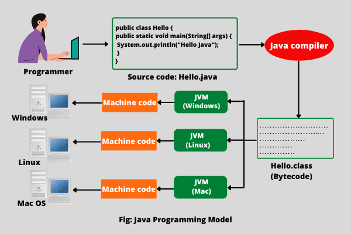
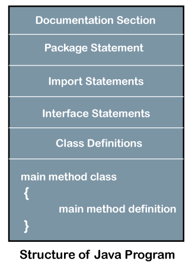

1. procedureal oriented programming  **V/S**  object oriented programming 

***
2. features of object oriented programming
   
   ***
3. enlist famous language of object oriented programming
- C#
- C++
- Java
- Python
- Ruby
- Swift
***
4. explain the role of jvm in execution of java program


### Need for Java Program Execution

To run a Java program, the source code must be compiled into bytecode and executed by the JVM.

### Role of JVM in Execution

1. **Compilation**: Converts `.java` to `.class` file.
2. **Class Loader**: Loads `.class` files.
3. **Memory Allocation**: divides memory into  heap (for objects) and stack (for method calls and variables).
4. **Execution**: Runs `main` method.
5. **Garbage Collection**: Reclaims memory from unused objects.
***

5. how is java platform independent 
-> **Java is platform-independent** because it uses an intermediate form called **Java Byte Code**. When you write a Java program, it gets compiled into **byte code**, not machine-specific code. For example, if you write a Java program on a **Windows computer**, it will be compiled into **byte code**. You can then run this **byte code** on a **Linux computer** or a **Mac**, as long as there is a **Java Virtual Machine (JVM)** installed. The **JVM** interprets the **byte code** and runs the program, regardless of the underlying operating system. This is what makes **Java programs** able to run on different platforms without modification.
   
***
6. justify jvm is platform dependent while java is platformer independent
- **JVM is platform-dependent**: It is tailored to interact with the specific operating system and hardware it runs on, requiring different implementations for different platforms (e.g., Windows, macOS, Linux).

- **Java is platform-independent**: Its programs are compiled into bytecode, which can be executed on any platform with a compatible JVM, following the "write once, run anywhere" principle.
***
  7. give the structure of java program 
     ### Structure of a Java Program

- **Documentation Section**: Comments that describe the program.

- **Package Statement**: Defines a package for organizing classes.

- **Import Statements**: Import other Java classes needed for the program.

- **Interface Section**: Declares interfaces implemented by the class.

- **Class Definition**: Defines the main class of the program.

- **Main Method**: Entry point of the program where execution begins.

- **Method Definitions**: Additional methods/functions used in the program.

Each section organizes different aspects of the code, helping in structure and readability.
***
8. define a class and give it's example

   ### Defining a Class in Java

A class in Java is a blueprint for creating objects. It defines the attributes (fields) and behaviors (methods) that the objects created from the class will have.

#### Syntax:
```java
class ClassName {
    // Fields
    type fieldName;
    
    // Constructor
    ClassName(parameters) {
        // Initialization code
    }
    
    // Methods
    returnType methodName(parameters) {
        // Method code
    }
}
```

### Example:
```java
class Car {
    // Fields
    String color;
    String model;
    int year;
    
    // Constructor
    Car(String color, String model, int year) {
        this.color = color;
        this.model = model;
        this.year = year;
    }
    
    // Method
    void displayInfo() {
        System.out.println("Color: " + color);
        System.out.println("Model: " + model);
        System.out.println("Year: " + year);
    }
    
    public static void main(String[] args) {
        // Creating an object of Car
        Car myCar = new Car("Red", "Toyota", 2020);
        
        // Calling method
        myCar.displayInfo();
    }
}
```

### Explanation:
- **Fields**: `color`, `model`, and `year` represent the attributes of the Car.
- **Constructor**: Initializes the fields with the provided values.
- **Method**: `displayInfo()` prints the car's details.
- **Main Method**: Creates an object of `Car` and calls `displayInfo()` to display its attributes.
***
9.
***
10.
***


11. explain the meaning of public  static void main (String[] args)
->
```public  static void main (String[] args) ```  is essential for your program to run, as it is the specific entry point that the Java runtime environment looks for when starting your application.

- **public**: This keyword means that the method is accessible from anywhere in the program. It's public to allow the Java runtime to call it from outside the class.
  
- **static**: This means that the method belongs to the class itself, not to instances of the class. This allows the Java runtime to call this method without having to create an instance of the class.

- **void**: This indicates that the method does not return any value.

- **main**: This is the name of the method. It's special because the Java runtime looks for this method when starting the program.

- **String[] args**: This is an array of `String` objects. It allows the program to accept arguments from the command line when it is run.

