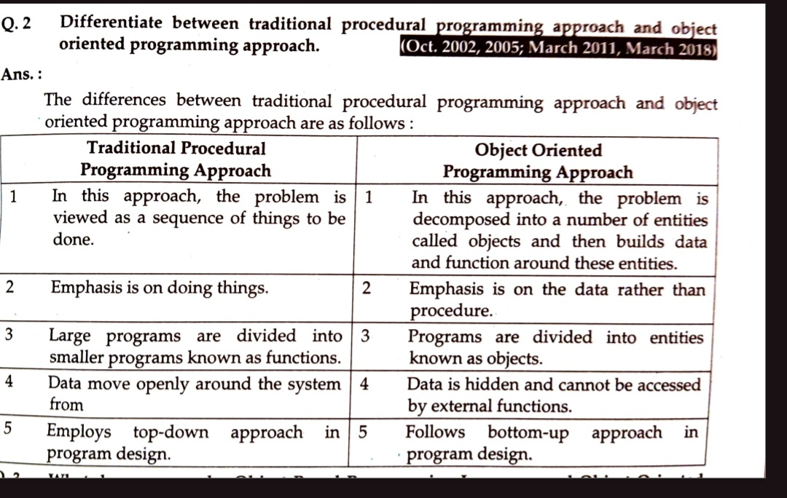
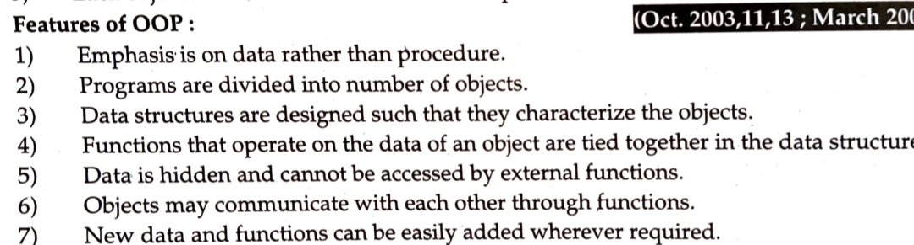
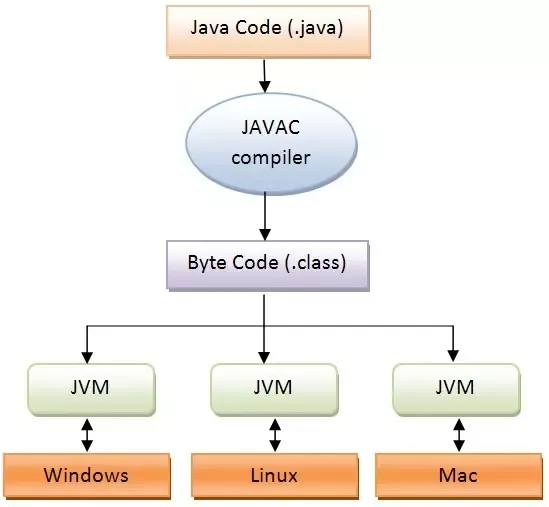

1. procedureal oriented programming  **V/S**  object oriented programming 

2. features of object oriented programming
   
3. enlist famous language of object oriented programming
- C#
- C++
- Java
- Python
- Ruby
- Swift

4. explain the role of jvm in execution of java program

### Need for Java Program Execution

To run a Java program, the source code must be compiled into bytecode and executed by the JVM.

### Role of JVM in Execution

1. **Compilation**: Converts `.java` to `.class` file.
2. **Class Loader**: Loads `.class` files.
3. **Memory Allocation**: Manages heap (for objects) and stack (for method calls and variables).
4. **Execution**: Runs `main` method.
5. **Garbage Collection**: Reclaims memory from unused objects.