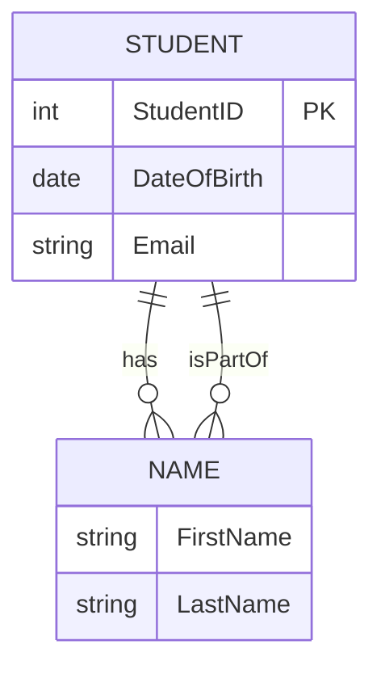

```mermaid
erDiagram
    STUDENT {
        int StudentID PK
        date DateOfBirth
        string Email
    }
    
    STUDENT ||--o{ NAME : has
    
    NAME {
        string FirstName
        string LastName
    }
    
    NAME }o--|| STUDENT : isPartOf
```