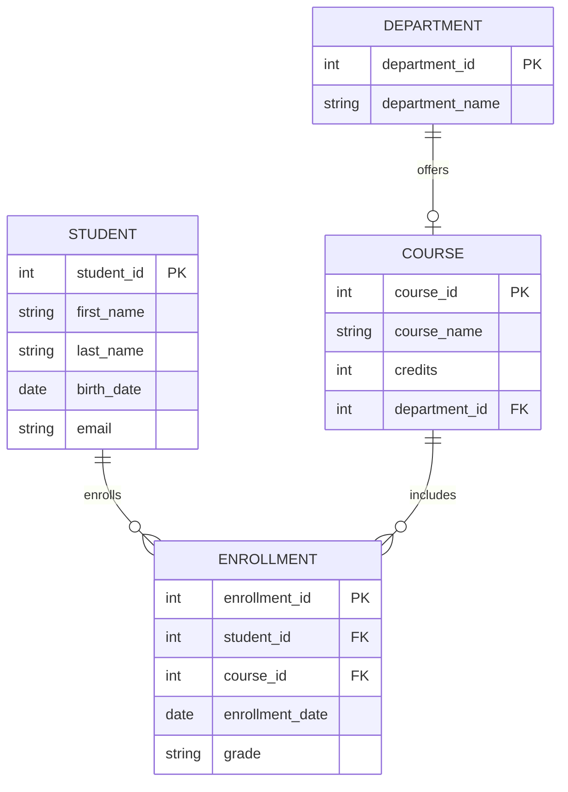

```mermaid
erDiagram
    STUDENT {
        int student_id PK
        string first_name
        string last_name
        date birth_date
        string email
    }
    
    COURSE {
        int course_id PK
        string course_name
        int credits
        int department_id FK
    }
    
    DEPARTMENT {
        int department_id PK
        string department_name
    }
    
    ENROLLMENT {
        int enrollment_id PK
        int student_id FK
        int course_id FK
        date enrollment_date
        string grade
    }
    
    STUDENT ||--o{ ENROLLMENT : enrolls
    COURSE ||--o{ ENROLLMENT : includes
    DEPARTMENT ||--o| COURSE : offers

```