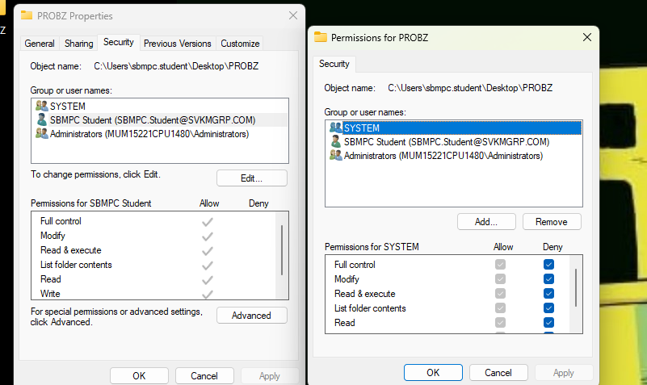
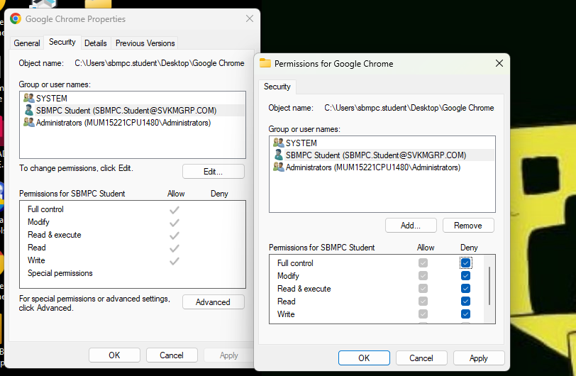
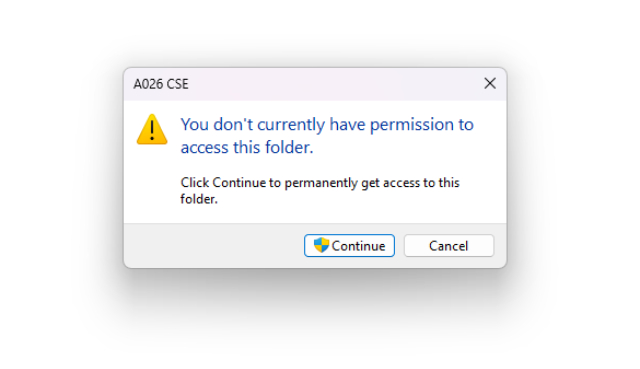

## CSY Experiment 2

### Aim : Implementing Authentication using any library.

### **Theory**  
Windows allows you to manage access to folders or apps by modifying user or group permissions. These permissions, such as **Allow** or **Deny**, define what actions users can perform on the specified resource (e.g., read, write, modify). These settings are controlled through the **Security tab** in the folder or application's **Properties**. Changes are enforced immediately, but user log-out and re-login ensure that permissions are refreshed.


### **Procedure**  

1. **Navigate to the Folder/App**  
   - Right-click the folder or app and select **Properties**.  

2. **Access Security Settings**  
   - Go to the **Security** tab and click **Edit** under the "Group or user names" section.
   


3. **Modify Permissions**  
   - Select the user or group.  
   - Check **Allow** or **Deny** boxes for specific permissions (e.g., Read, Write).  

<br>
4. **Apply Changes**  
   - Click **Apply**, then **OK** to save the changes.  

5. **Log Out and Re-Log In**  
   - Log out of the current user account.  
   - Log in again to ensure permissions are updated and enforced.  


```**Note**: **Deny** permissions override **Allow** permissions if both are applied to the same user/group. ```


### Conclusion : Hence we Implemented Authentication using any library.

 
 