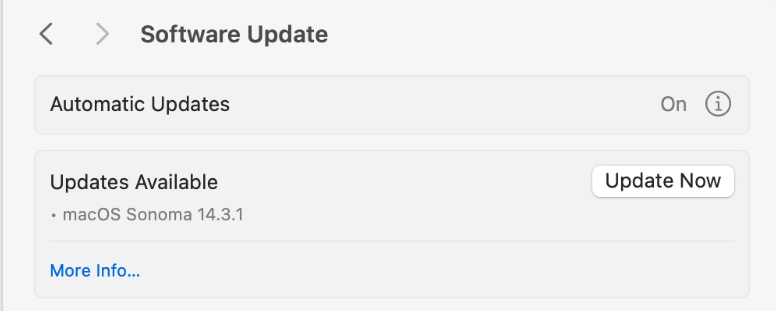
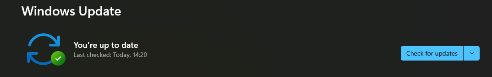
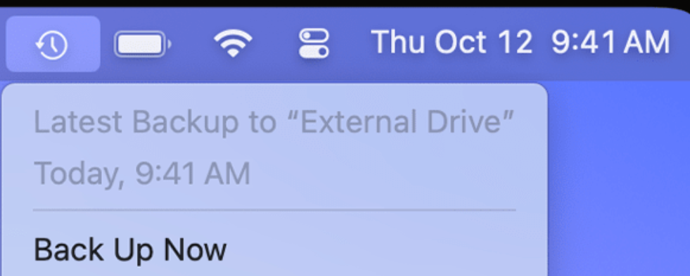
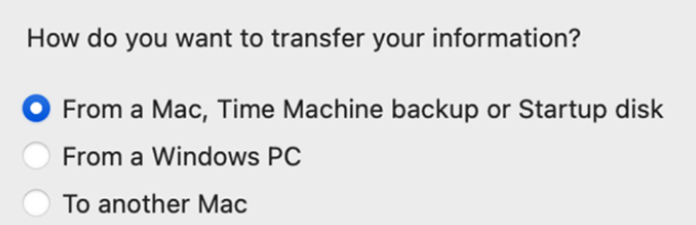
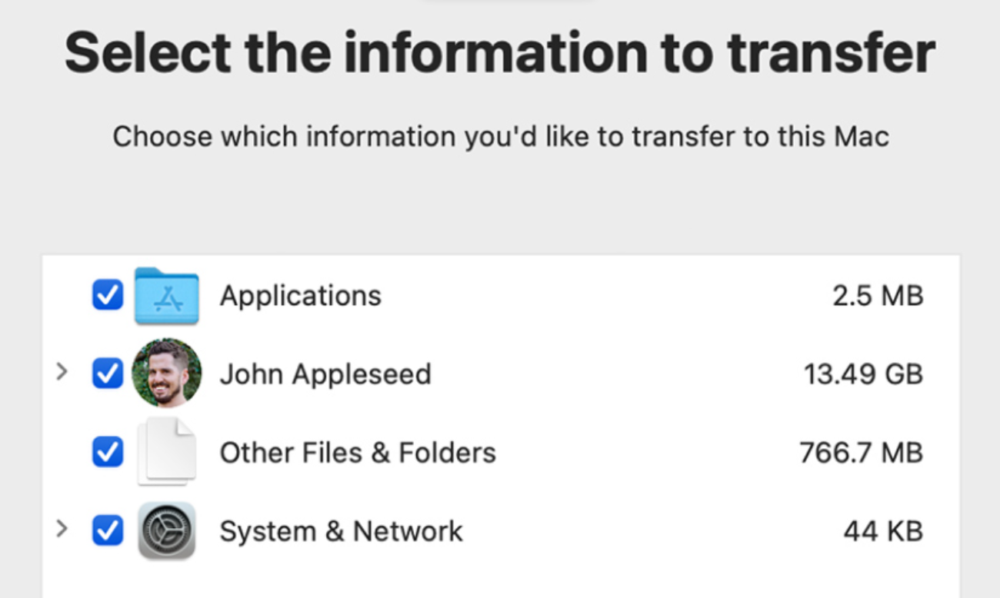

## Aim: Set up operating system Update, And perform backup and restore of System


### Updating System For MacOs

1.  Open Software Update. You can [use](https://support.apple.com/guide/mac-help/search-with-spotlight-mchlp1008/mac) [Spotlight](https://support.apple.com/guide/mac-help/search-with-spotlight-mchlp1008/mac)  in the menu bar to search for "Software Update", then open it from the search results. Or open it from settings:
    
    -   From the Apple menu  in the corner of your screen, choose System Settings. Click General in the sidebar of the window that opens, then click Software Update on the right.
        
    -   In earlier versions of macOS, choose Apple menu  > System Preferences, then click Software Update.
        
2.  When opened, Software Update automatically begins checking for new software.
    
    -   If new software is available for your Mac, click the button to Update 
    -   If new software is not available for your Mac, Software Update says that your Mac is up to date. Software Update shows only software that is compatible with your Mac model. For example, if your Mac is not compatible with a later version of macOS, Software Update does not offer it to you. 
    
3.  Before installation begins, you are asked to enter your administrator password. It's the password you use to log in to your Mac. 
    
4.  During installation, your Mac might restart and show a progress bar or blank screen several times. 

***
### Updating System For Linux

#### Use System Update Process

The system update process is a straightforward way to update all packages, including the Linux kernel, to the latest available versions. Before starting, [check the current kernel version](https://phoenixnap.com/kb/check-linux-kernel-version) with the [uname](https://phoenixnap.com/kb/uname-linux) command:

```
uname -r
```


The output consists of:

-   **6.2.0** - The kernel version number.
-   **37** - The kernel's specific release or build number.
-   **generic** - Indicates the kernel flavor. The **generic** flavor is a common choice for regular desktop and server systems.

#### Step 1: Update System Packages

Use **`sudo apt update`** to update the local package index. The command retrieves information about the latest available package versions from the [repositories](https://phoenixnap.com/glossary/what-is-a-repository) configured on the system.

Use this command:

```
sudo apt update
```

If there’s a newer kernel version, the command finds it and marks it for download and installation. However, the command does not install or upgrade any packages.

#### Step 2: Run the upgrade

To upgrade the installed packages, including the kernel, to the latest versions available in the repositories, run:

```
sudo apt upgrade
```


This command installs the latest Linux kernel version. Verify the changes with **`uname -r`**.

Execute:

```
uname -r
```


The output hasn't changed in this case because the kernel was already at its latest version.

***
### Updating System For Windows


#### 1. **Open Settings**

-   Press **Windows + I** or click the **Start** menu and select **Settings**.

#### 2. **Go to Windows Update**

-   In the Settings window, click on **Windows Update** in the left sidebar.

#### 3. **Check for Updates**

-   Click the **Check for updates** button.

#### 4. **Install Available Updates**

-   If updates are found, click **Install now** to begin the process.

#### 5. **Restart Your PC (If Required)**

-   After the updates are installed, restart your PC if prompted.

#### 6. **Verify Updates**

-   After restarting, return to **Windows Update** to ensure there are no further updates available.


 
***
## Backup and Restore for Windows 
Type and search **[Backup settings]** in the Windows search bar, then click **[Open]**.

Select **[Add a drive]**, then **select a drive which you want to use to back up your files**.        
If you want to back up your files to an external device, please make sure it has been connected.
After choosing a drive, the **Automatically back up my files** option will be enabled, and then please select **[More options]** to set up the cycle time and folder of backup settings.
The following will list which folders are backed up, and you also can select **[Add a folder]** to add the folders you want to back up.
After the setup is completed, please select **[Back up now]**
After the backup is completed, it will display as below.        

If you want to change to different backup drive, you need to stop using your current backup drive first. Please select **[Stop using drive]**, then you will be able to choose another drive to back up your file.
***
1.  Type and search **[Backup settings]** in the Windows search bar①, then click **[Open]**.        

2.  Select **[More options]**.        

3.  Scroll down the page and select **[Restore files from a current backup]**.        
 
4.  **You can select a file/folder, multiple files/folders, or** all folders from the backup drive to restore it. After the selection is completed, click the **[Restore]** icon and then Windows will start restoring your files.        
    Click the **left arrow** and **right arrow** icon to browse different versions of your files and folders by date.        
           
    

### Backup and Restore on Linux


The ****Back Up Linux Data**** can be easily returned to the device when the device is free from danger using the ****Restore Linux Data**** operation. Unfortunately, Linux doesn't come up with any software that can ****Back Up & Restore Data in Linux****. To ****Back Up & Restore Linux Data****, you need to install any third-party application on the device.

#### How to Install Deja-Dup Application to Back Up & Restore Linux Data?

****Step 1:**** Open the [****Linux Terminal****](https://www.geeksforgeeks.org/basic-linux-commands/) & execute the following command to update packages before installation.

```sudo apt update```


****Step 2:**** Now, to install the third-party application Deja-Dup on Linux, the following command will be used.

```sudo apt install deja-dup```


So, the Deja-Dup application is now installed on the Linux. So, you can ****Back Up Data & Restore on Linux**** with the help of [Graphical User Interface](https://www.geeksforgeeks.org/gui-full-form/).

#### How to Back Up Data in Linux Using Deja-Dup?

****Step 1:**** Execute the ****Back-Up Application**** & click on ****Create My First Backup.****


****Step 2:**** Click on the ****Forward**** button.


****Step 3:**** It will take some time & the backup will be completed.


 The ****Linux Data Back-Up Process**** is completed with a couple of clicks on the Deja-Dup application.

#### How to Restore Data in Linux using Deja-Dup?

****Step 1:**** Open the ****Back-Up Application**** again. And click on the ****Restore Tab****. Now, select the ****Folder or File**** to restore and click ****Restore****.


****Step 2:**** Click on the ****Restore**** button again.


****Step 3:**** The Restore operation is completed on Linux.


***
### Backup and Restore for MacOs

#### Back up your Mac with Time Machine

If you have a USB drive or other external storage device, you can use Time Machine to automatically back up your files, including apps, music, photos, email, and documents.


#### Connect a storage device to your Mac

Connect an [external storage device](https://support.apple.com/en-us/102423), such as a USB drive or Thunderbolt drive.

-   Use a storage device with at least twice the storage capacity of your Mac. For example, if your Mac has 1TB of storage, your backup disk should ideally have at least 2TB of storage. If Time Machine needs more storage space, your Mac will let you know.
    
-   Use your Time Machine backup disk only for Time Machine backups, not for storage of other files.*
    

#### Set up the storage device as your backup disk


1.  From the Apple menu in the corner of your screen, choose System Settings.
    
2.  Click General in the sidebar, then click Time Machine on the right.
    
3.  Click Add Backup Disk, or click the Add button (+).
    
4.  Select your connected storage device and click Set Up Disk.
    
5.  During setup:
    
    -   Your Mac might ask if you want to erase the storage device so that it can be used for Time Machine. Either erase it or select a different backup disk or volume.
        
    -   Your Mac might ask whether this computer should claim existing backups created on a different computer. Claim the backups if you want them to become part of the backups for this Mac.
        

After setup, your Mac immediately begins using the storage device to make backups.

#### Make a backup

To back up now, choose Back Up Now from the Time Machine menu in the menu bar. Or wait for the next [automatic backup](https://support.apple.com/en-us/104984#frequency).

Use the same menu to stop or skip a backup or check its progress. The top of the menu shows how much of the current backup is done, or the date and time of the latest backup:

 

Backup is done
#### Restore
1.  If you need to reinstall macOS, do that before continuing. For example, if your Mac starts up to a flashing question mark, you need to first reinstall macOS. [Learn how to reinstall macOS](https://support.apple.com/en-us/102655).
    
2.  Make sure that your Time Machine backup disk is connected to your Mac and turned on.
    
3.  Open Migration Assistant on your Mac.
    
    -   Migration Assistant is in the Utilities folder of your Applications folder. To open the Utilities folder directly, you can choose Go > Utilities from the menu bar in the Finder. Or [use Spotlight](https://support.apple.com/guide/mac-help/search-with-spotlight-mchlp1008/mac) to search for Migration Assistant.
        
    -   If your Mac starts up to a setup assistant, which asks for details like your country and network, continue to the next step, because the setup assistant includes a migration assistant.
        
4.  When asked how you want to transfer your information, select the option to transfer from a Mac, Time Machine backup, or startup disk. Then click Continue.
    
 
5.  Select your Time Machine backup, then click Continue.
    
 
6.  Choose a backup and click Continue.
 
7.  Select the information to transfer.
  
8.  Before clicking Continue, learn what it means to transfer a user account. In the example pictured here, John Appleseed is a user account. If an account on your Mac has the same name, Migration Assistant asks whether to rename or replace:
    
    -   Rename: The account on your Time Machine backup will appear as an additional user on your Mac, with a separate login and home folder.
        
    -   Replace: The account on your Time Machine backup will replace the identically named account on your Mac.
        
9.  Large transfers might need hours to complete, and might seem to pause occasionally. You might want to start in the evening and allow migration to complete overnight. Click Continue to start the transfer.
    
10.  After Migration Assistant is done, quit Migration Assistant, then log in to the migrated account on your Mac to see its files.

***
## Conclusion: Hence, we successfully Set up operating system Update, And perform backup and restore of System 
