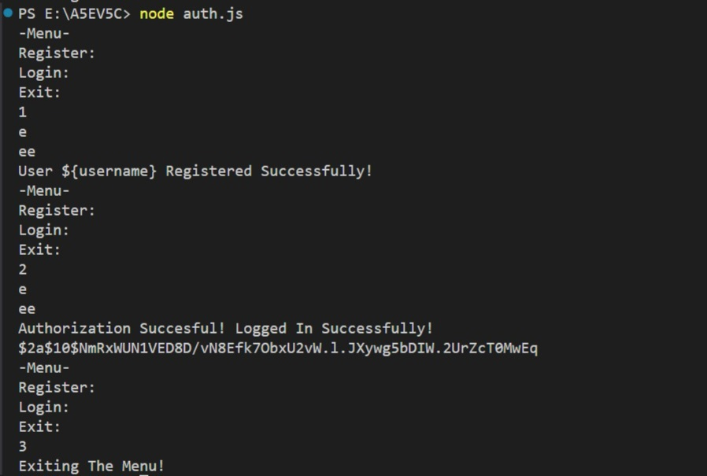

Authenticate user and password code
```js
const bcrypt = require("bcryptjs");
const readline = require("readline");
const r1 = readline.createInterface({
    input: process.stdin,
    ouput: process.stdout,
});

const userDatabase = {};
const registerUser = async (username,password) => {
    if (userDatabase[username]) {
        console.log("Username Already Taken!");
        return;
    }
    const saltRounds = 10;
    const hashedPassword = await bcrypt.hash(password,saltRounds);
    userDatabase[username] = hashedPassword;
    console.log("User ${username} Registered Successfully!");
}

const authenticateUser = async (username,password) => {
    const hashedPassword = userDatabase[username];
    if (!hashedPassword) {
        console.log("Authentication Failed!");
        return;
    }
    const match = await bcrypt.compare(password,hashedPassword);
    if (match) {
        console.log("Authorization Succesful! Logged In Successfully!");
      console.log(hashedPassword);
    } else {
        console.log("Authorization Failed!");
    }
}

const displaymenu = () => {
    console.log("-Menu-");
    console.log("Register:");
    console.log("Login:");
    console.log("Exit:");
    r1.question("Choose Option[1,2,3]:", async (choice) => {
        switch (choice) {
            case "1" : r1.question("Enter A Username : ",(username) => {
                r1.question("Enter A Password :",async (password) => {
                    await registerUser(username,password);
                    displaymenu();
                })
            });
            break;
            case "2" : case "1" : r1.question("Enter Username : ",(username) => {
                r1.question("Enter The Password :",async (password) => {
                    await authenticateUser(username,password);
                    displaymenu();
                })
            });
            break;
            case "3" :  console.log("Exiting The Menu!");
                        r1.close();
            break;
        }
    });
}
displaymenu();
```

***
output
 

***
python version
```python
import bcrypt

user_database = {}

def register_user():
    username = input("Enter A Username: ").strip()
    if username in user_database:
        print("Username Already Taken!")
        return
    password = input("Enter A Password: ").strip()
    user_database[username] = bcrypt.hashpw(password.encode(), bcrypt.gensalt())
    print(f"User {username} Registered Successfully!")

def authenticate_user():
    username = input("Enter Username: ").strip()
    password = input("Enter The Password: ").strip()
    if username in user_database and bcrypt.checkpw(password.encode(), user_database[username]):
        print("Authorization Successful! Logged In Successfully!")
    else:
        print("Authorization Failed!")

while True:
    print("\n- Menu -\n1. Register\n2. Login\n3. Exit")
    choice = input("Choose Option [1,2,3]: ").strip()
    if choice == "1":
        register_user()
    elif choice == "2":
        authenticate_user()
    elif choice == "3":
        print("Exiting The Menu!")
        break
    else:
        print("Invalid choice. Please try again.")

```