### Packet Sniffing (4 Marks)

 

- **Definition:**  
  Packet sniffing is the process of capturing and analyzing data packets transmitted over a network using software or hardware tools to monitor network traffic.

- **Legitimate Use:**  
  Network administrators use packet sniffers for troubleshooting, analyzing traffic, detecting faults, and ensuring secure and efficient network performance.

- **Malicious Use:**  
  Attackers use sniffers to capture sensitive data like passwords and credit card numbers, often as part of Man-in-the-Middle (MITM) attacks on unsecured networks.

- **Prevention Measures:**
MAC Address Filtering: Restrict network access to authorized devices only.
  Using encryption (HTTPS, VPNs), secure network configurations by Replacing insecure protocols (e.g., use SSH instead of Telnet,FTPS instead of FTP)
 intrusion detection systems helps prevent unauthorized packet sniffing.

  ***

### Port Scanning (4 Marks)

- **Definition:**  
  Port scanning is the process of sending packets to specific ports on a host to discover open, closed, or filtered ports.  
  - **Open Port:** A port that is actively accepting connections.  
  - **Closed Port:** A port that is not accepting connections (often due to a service not running).  
  - **Filtered Port:** A port where responses are blocked by a firewall or filtering device, making it appear as if it is closed.

- **Types of Scanning:**  
  Common types include **TCP connect scanning**, **SYN scanning**, and **UDP scanning**, each using different methods to probe ports.

- **Legitimate Use:**  
  Network administrators use port scanning to identify open ports, assess security, and manage vulnerabilities on their network.

- **Malicious Use:**  
  Attackers use port scanning to identify vulnerable services and potential entry points for exploits.

- **Prevention Measures:**  
  - **Use Firewalls:** Block or filter unnecessary ports.  
  - **Enable IDS:** Detect and alert on scanning attempts.  
  - **Close Unused Ports:** Disable services that are not required.  
  - **Restrict IP Access:** Allow only trusted devices..

***
### Define cyber crime. Discuss any two types of cyber crimes with examples. (4 / 6 Marks)
#answer

Cyber crime refers to any illegal activity carried out using computers, networks, or digital devices. It encompasses:

● Unauthorized Access: Illicitly breaking into systems (hacking).

● Data Breaches: Exfiltrating confidential or personal information.

● Online Fraud: Phishing scams, identity theft, credit‑card fraud.

● Malware Distribution: Spreading viruses, ransomware, or spyware.

Types of Cyber Crimes:

1. Phishing:

It is a method used by cybercriminals to deceive individuals into providing sensitive information like usernames, passwords, or credit card details by pretending to be a legitimate entity.

Example: An email that appears to be from a bank asking users to verify their account details by clicking on a malicious link.

2. Hacking:

Gaining unauthorized access to data in a system or computer.

Example: A hacker breaching a company’s database to steal customer data like names, contact details, and payment information.

 ***

### ***Q.12 Explain the term 'cyber law'. Why is it important in the digital world? (4 / 6 Marks)***  
#answer

- **Cyber law** is the law that deals with crimes and legal issues related to the internet, computers, and digital communication.

 Importance of Cyber Law:

- **Protects people** from online crimes like hacking, fraud, and identity theft.  
- **Helps in safe online transactions** and e-commerce.  
- **Keeps personal data and privacy safe.**  
  
- **Helps punish misuse** of the internet and digital platforms.

***
### ***Q. How did the IT Act 2008 amendment address issues related to cyber terrorism and identity theft? (4 / 6 Marks)***  
#answer

 Cyber Terrorism – Section 66F:
- Defines cyber terrorism as any act done using a computer or network with intent to threaten the unity, integrity, security, or sovereignty of India.
- Includes unauthorized access to critical information infrastructure that can cause serious harm.
- **Punishment:** Imprisonment up to **life imprisonment** for those convicted.

 Identity Theft – Section 66C:
- Deals with fraudulent or dishonest use of someone else's digital identity (like password, signature, or any other unique identification feature).
- **Punishment:** Imprisonment up to **3 years** and/or fine up to **₹1 lakh**.

***
### List and explain the main components of the SSL protocol suite

SSL stands for "Secure Socket Layer".
What is SSL?
SSL is a protocol for establishing secure links between networked computers.
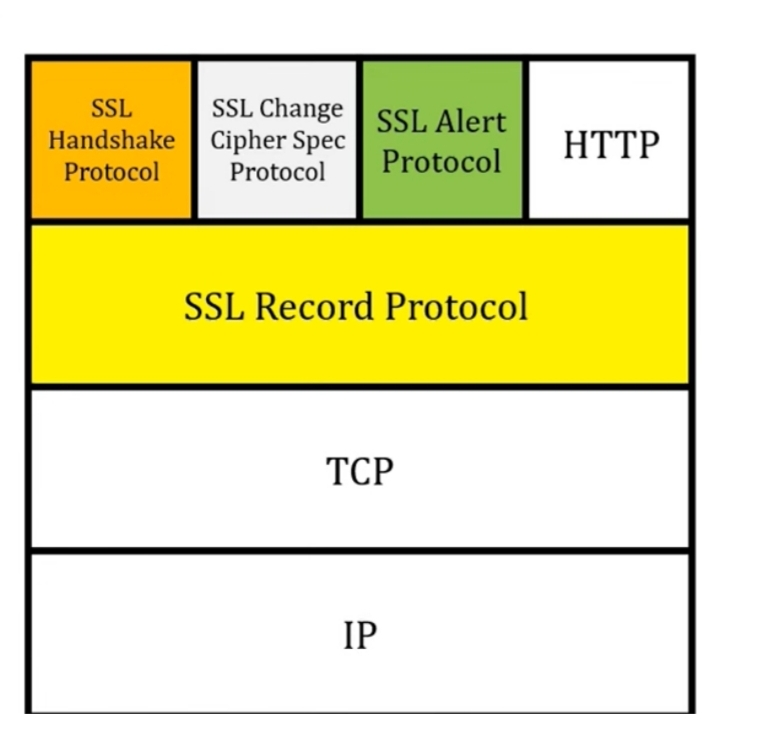 
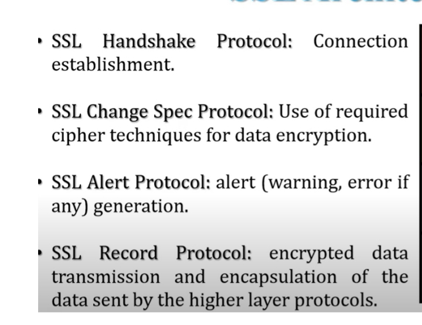 

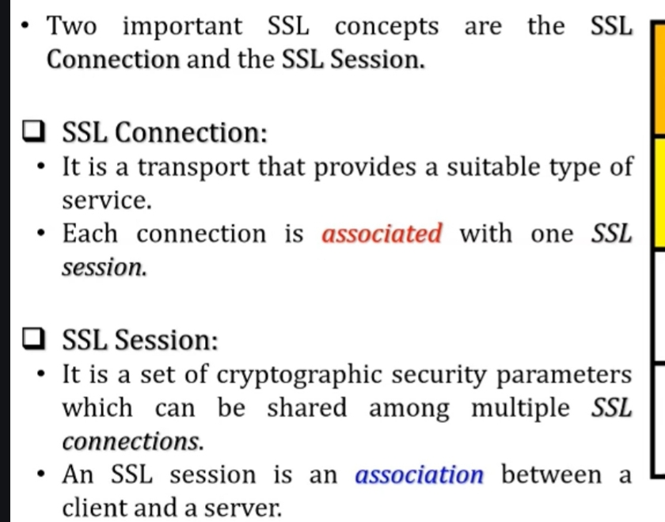  
***
### Purpose of the SSL Handshake Protocol:

• The SSL Handshake Protocol is used to establish a secure communication session between a client and a server.
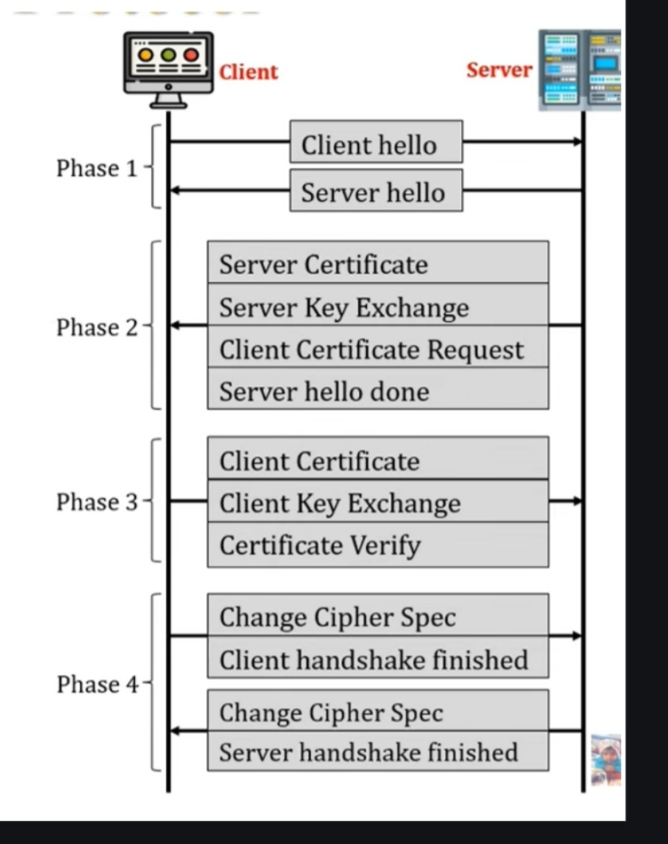 
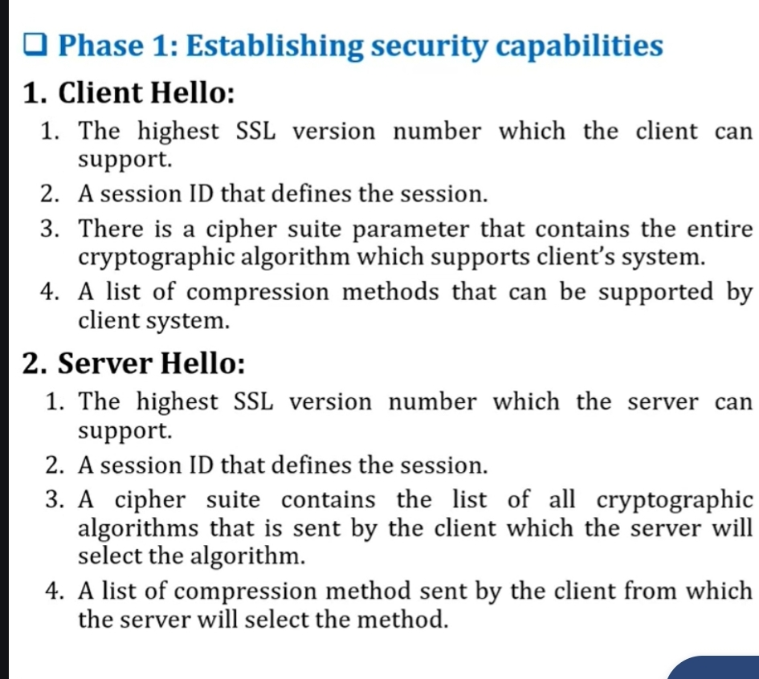 
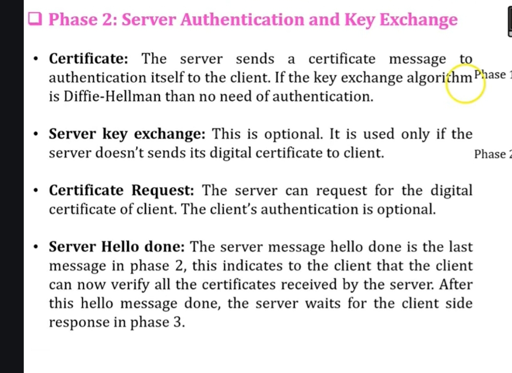 
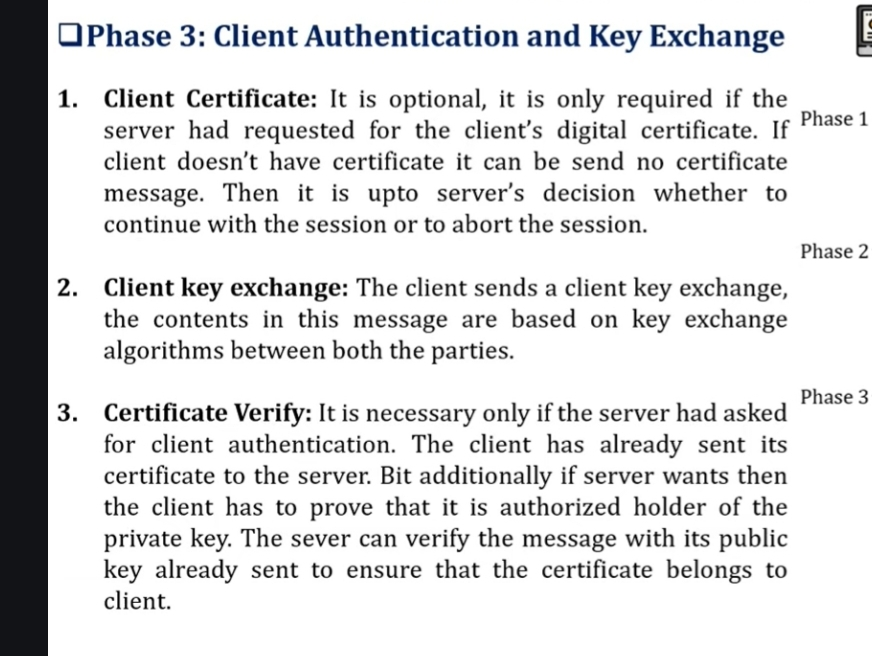 
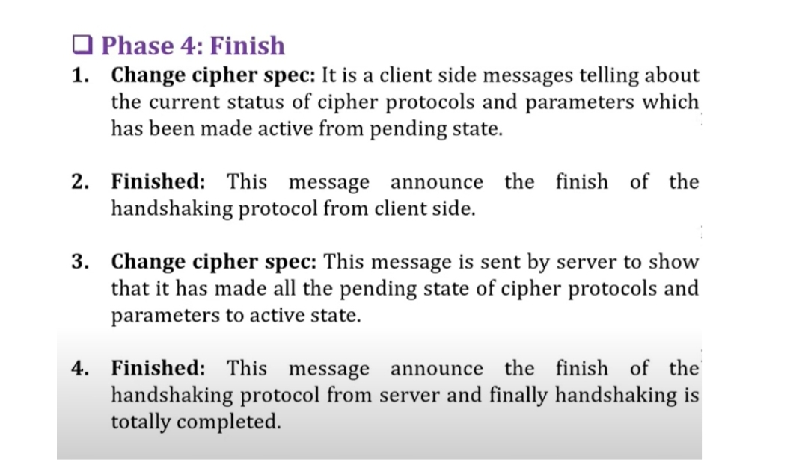  
***
### Explain how the SSL Alert Protocol works. What types of alerts can it generate?

The SSL Alert Protocol is used to convey alert messages between the client and server regarding errors or warnings during communication.

These alerts help in handling problems by terminating the connection when necessary.
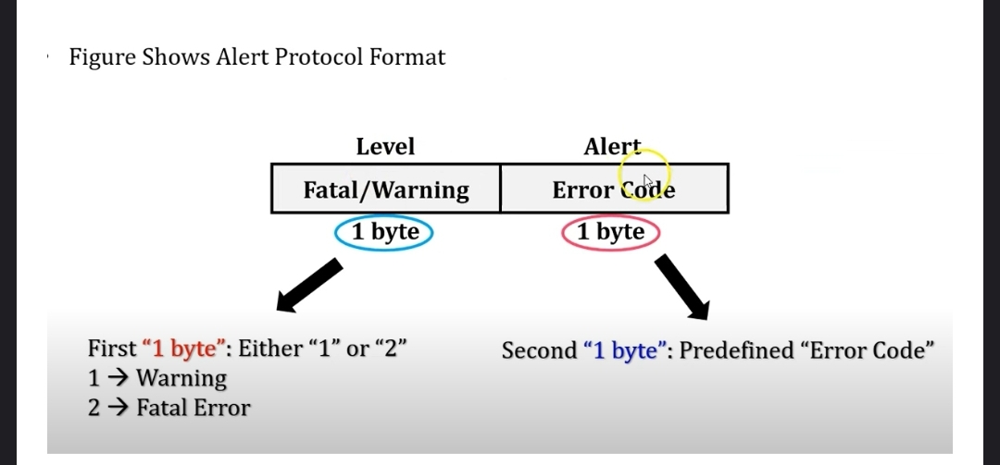 
1. Warning Alerts (non-fatal, connection may continue):
2. Fatal Alerts (serious error, connection must terminate)
***
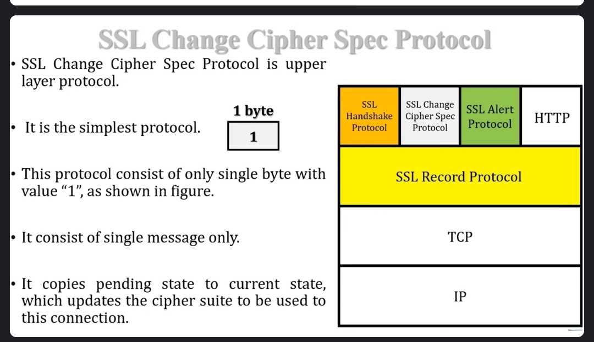 
***
### ***Q.1 What is IPsec? Mention its main components and purpose.***  
#answer

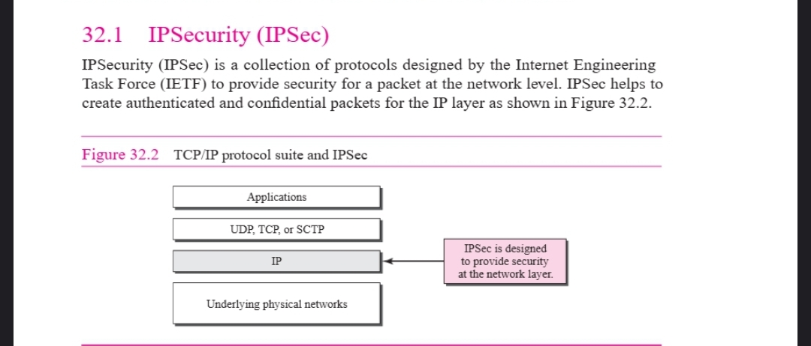 

**Purpose of IPsec:**
- **Confidentiality**: Ensures that data is encrypted and inaccessible to unauthorized parties.  
- **Integrity**: Ensures that data has not been altered during transmission.  
- **Authentication**: Verifies the identities of the communicating parties.  
- **Anti-replay protection**: Prevents attackers from resending captured packets.

**Main Components of IPsec:**
- **Authentication Header (AH)**:  
  - Provides **data integrity** and **authentication**.  
  - Does **not provide encryption**.  
- **Encapsulating Security Payload (ESP)**:  
  - Provides **data confidentiality**, **integrity**, and **authentication**.  
  
- **Key Management Protocols**:  
  - Such as **Internet Key Exchange (IKE)**, used to negotiate and manage cryptographic keys.
 

  ***

### Differentiate between the two IPsec modes: Transport Mode and Tunnel Mode.
 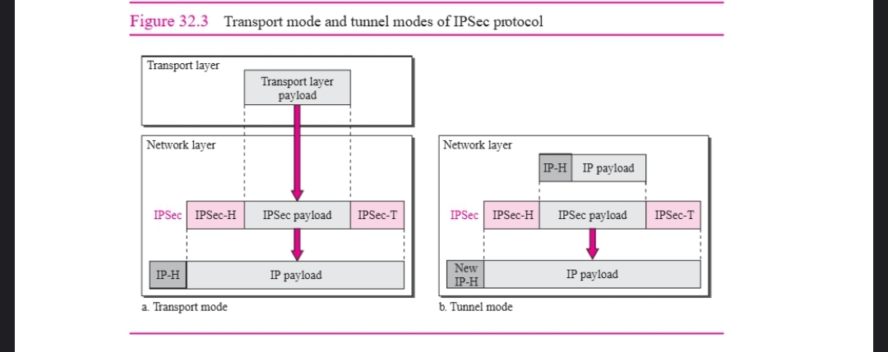  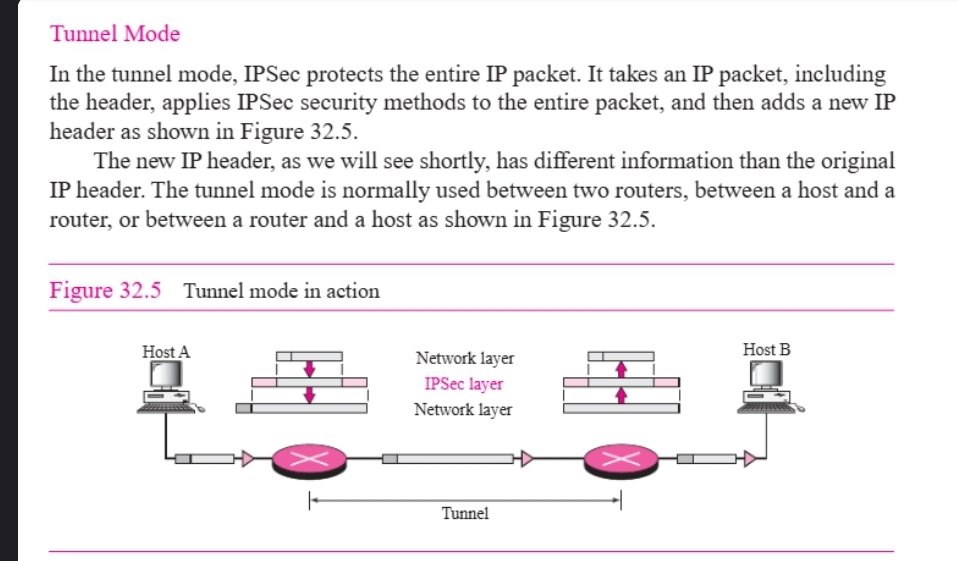
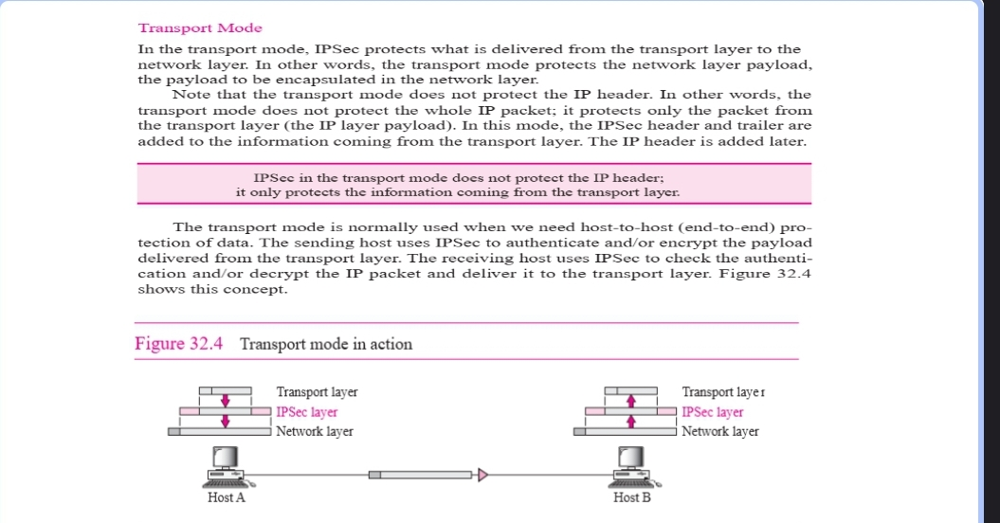 
***
### What is the role of the Ticket Granting Server (TGS) in the Kerberos authentication process

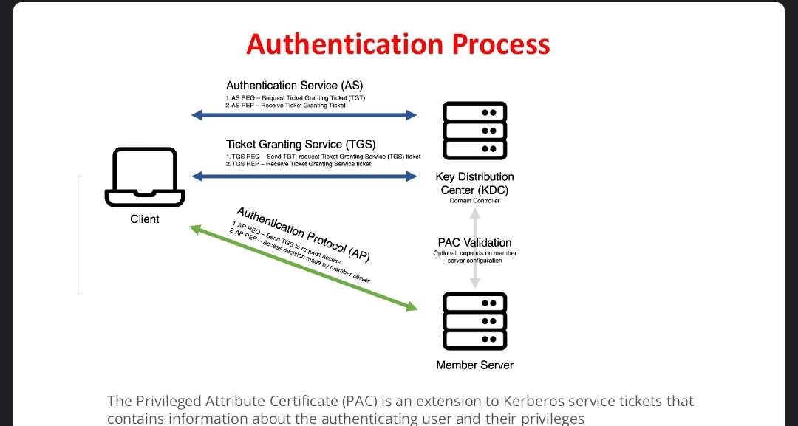 
The Ticket Granting Server (TGS) plays a crucial role in the Kerberos authentication process, which is designed to enable secure authentication over an insecure network.

Role of the TGS in Kerberos:

Issues Service Tickets:
Once a user is authenticated by the Authentication Server (AS) and receives a Ticket Granting Ticket (TGT), the user sends the TGT to the TGS to request access to a specific service.

Validates the TGT:
The TGS validates the TGT and ensures it hasn’t expired or been tampered with.

Generates a Service Ticket:
If validation is successful, the TGS generates a service ticket (also called a session ticket), which includes:

A new session key

Identity of the user

Timestamp and validity period

Destination service information

Provides the Service Ticket to the Client:
This service ticket is then used by the client to authenticate to the desired Application Server (AS or SS) without re-entering credentials.

