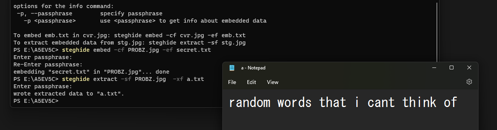

### To hide a message in an image
```bash
steghide embed -cf cover.jpg -ef secret.txt -p yourpassphrase
```


### Flags explained:

-cf : Cover File (image/audio to hide data in)

-ef : Embed File (file to be hidden)

-sf : Stego File (optional output file with hidden data)

-p  : Passphrase for encryption/decryption


***

 