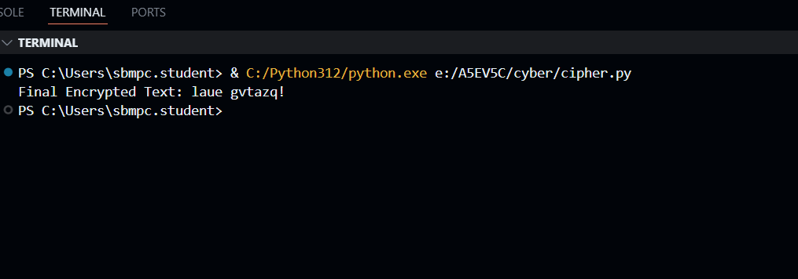

  ## CSY SLA 2 


```python
import random
import string

def keyword_cipher(text: str, keyword: str) -> str:
    """
    Implements a keyword-based substitution cipher.
    
    - Constructs a unique alphabet using the provided keyword.
    - Duplicates in the keyword are removed while preserving order.
    - The remaining letters of the alphabet are appended to form a complete mapping.
    - Works with both uppercase and lowercase text.
    """
    alphabet = string.ascii_lowercase  # Standard alphabet
    
    # Remove duplicates from keyword while preserving order
    seen = set()
    keyword_unique = "".join(ch for ch in keyword.lower() if not (ch in seen or seen.add(ch)))
    
    # Generate cipher alphabet
    remaining_letters = "".join(ch for ch in alphabet if ch not in keyword_unique)
    key = keyword_unique + remaining_letters  # Ensure 26 letters in total

    # Create translation table for both lowercase and uppercase
    table = str.maketrans(alphabet + alphabet.upper(), key + key.upper())

    return text.translate(table)

def atbash_cipher(text: str) -> str:
    """
    Implements the Atbash cipher, a simple monoalphabetic substitution cipher.
    
    - The alphabet is reversed (A ↔ Z, B ↔ Y, etc.).
    - Works with both uppercase and lowercase letters.
    - Non-alphabetic characters remain unchanged.
    """
    alphabet = string.ascii_lowercase
    reversed_alphabet = alphabet[::-1]
    table = str.maketrans(alphabet + alphabet.upper(), reversed_alphabet + reversed_alphabet.upper())
    return text.translate(table)


def vigenere_cipher(text: str, key: str) -> str:
    """
    Implements the Vigenère cipher, a polyalphabetic substitution cipher.
    
    - Uses a repeating keyword to determine shifts for each letter.
    - Each letter is shifted by the corresponding letter in the key.
    - Works with both uppercase and lowercase letters.
    - Non-alphabetic characters remain unchanged.
    """
    key = key.lower()
    key_length = len(key)
    key_as_int = [ord(i) - 97 for i in key]
    text_as_int = [ord(i) - (65 if i.isupper() else 97) for i in text if i.isalpha()]
    ciphertext = ''
    index = 0
    for char in text:
        if char.isalpha():
            base = 65 if char.isupper() else 97
            value = (text_as_int[index] + key_as_int[index % key_length]) % 26
            ciphertext += chr(value + base)
            index += 1
        else:
            ciphertext += char
    return ciphertext

# SLA 2 CSY BELOWWWWWWWWWWWWWWWWW

def mul(text: str, vigenere_key: str, keyword: str) -> str:

    vigenere_encrypted = vigenere_cipher(text, vigenere_key)
    atbash_encrypted = atbash_cipher(vigenere_encrypted)
    final_encrypted = keyword_cipher(atbash_encrypted, keyword)
    return final_encrypted

text = "turn around!"
vigenere_key = "random"
keyword = "works"                                                                                                                                                                                                                                                                    

encrypted_text = mul(text, vigenere_key, keyword)
print("Final Encrypted Text:", encrypted_text)


```
 