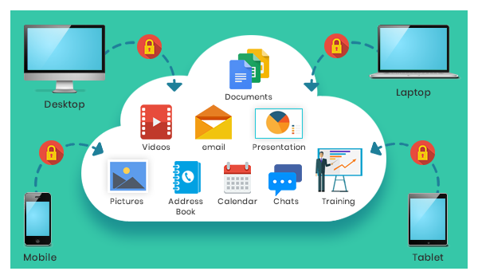
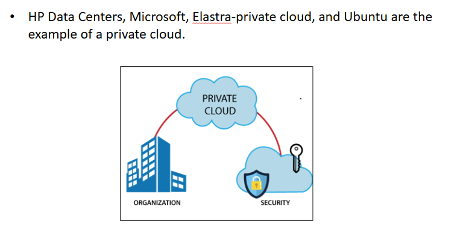
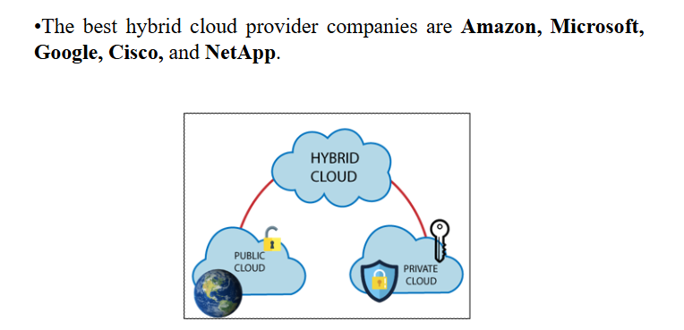
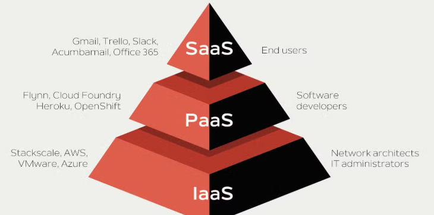
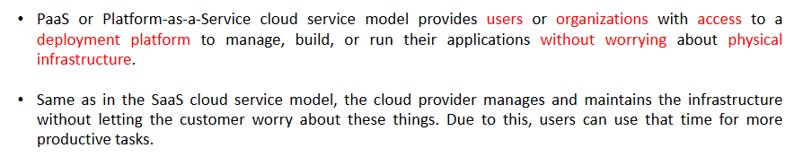
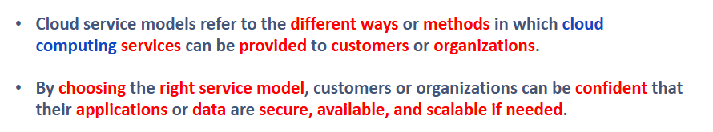
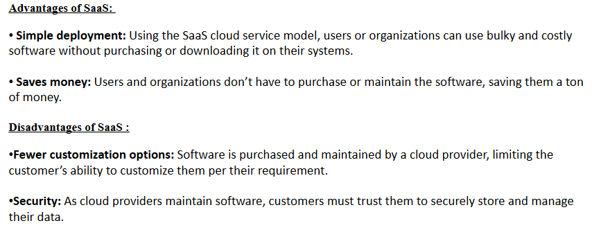
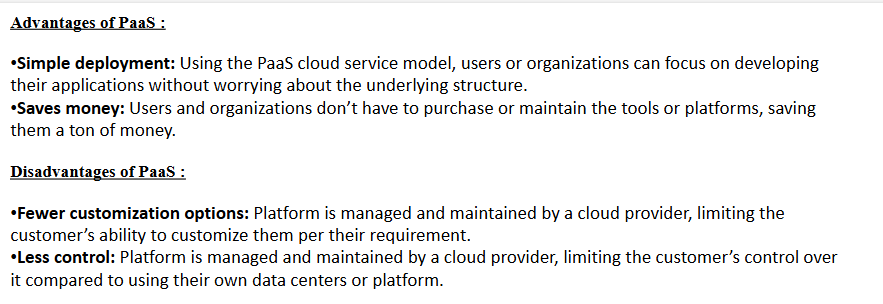
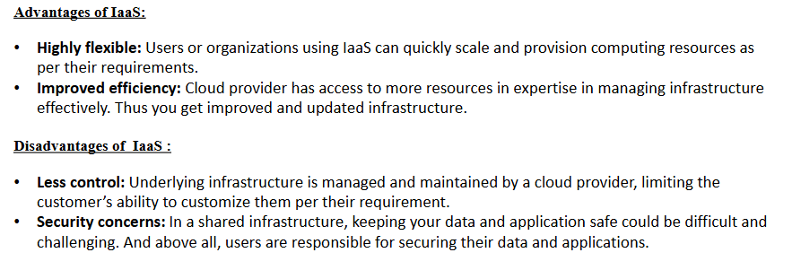
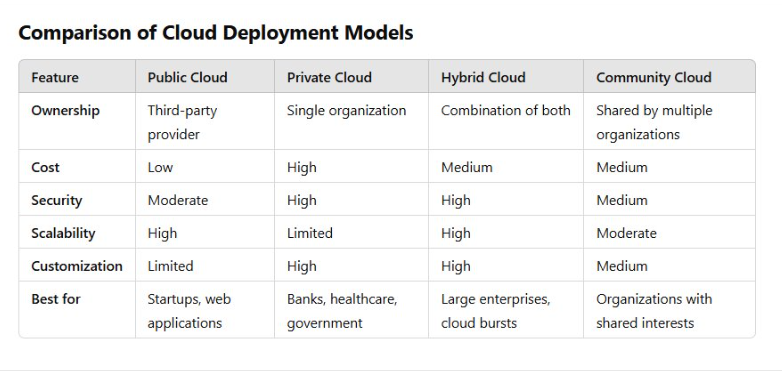

  # Unit 4: Interfacing and Programming IoT Boards

### ***Q.1 Draw and explain architecture of Raspberry Pi. (6/8 Marks)***  
#answer  

- **Processor:**    Raspberry Pi uses Broadcom BCM2835 system on chip which is an ARM processor and Video core Graphics Processing Unit (GPU). It is the heart of the Raspberry Pi which controls the operations of all the connected devices and handles all the required computations
- **HDMI:**    High Definition Multimedia Interface is used for transmitting video or digital audio data to a computer monitor or to digital TV. This HDMI port helps Raspberry Pi to connect its signals to any digital device such as a monitor digital TV or display through an HDMI cable.
- **GPIO ports:**    General Purpose Input Output ports are available on Raspberry Pi which allows the user to interface various I/P devices.
- **USB ports:** Enables connection of peripherals such as a mouse, keyboard, or other I/O devices.
- **SD card:**  The SD card slot is available on Raspberry Pi. An SD card with an operating system installed is required for booting the device.
- **Ethernet:** Provides wired network access which is available only on Raspberry Pi Model B.
- **Power Supply:** A micro-USB power connector supports a 5V power supply.
- **Display:** The Display Serial Interface (DSI) allows connection to LCDs using 15-pin ribbon cables.

***  

### ***Q.2 Write features of Raspberry Pi 4.***  
#answer  
 - **CPU:** Raspberry Pi boards use ARM11 series processors for handling logical and mathematical operations.
- **HDMI Port:** Supports video output to display devices like TVs via an HDMI cable.
- **Graphics Processing Unit (GPU):** Enhances the speed of image rendering.
- **Memory (RAM):** Initially had 256MB RAM, with the latest Raspberry Pi 4 model offering up to 8GB RAM.
- **Ethernet Port:** Enables wired internet connectivity.
- **SD Card Slot:** Stores data as Raspberry Pi lacks a built-in hard drive.

***  

### ***Q.3 List Applications of RPi 4.***  
> [!attention] Question was same as previous one, assuming that instead of features, this question is based on Applications of RPI 4

#answer  

➤ Raspberry Pi is used for **Game plays** in **Media streamers**.

➤ Raspberry Pi is used in **arcade machines cabinet** for **Game plays**.

➤ It is also used in **home automation systems** for general-purpose uses.

➤ Raspberry Pi is installed in **cars** and **internet radios** for entertainment purposes.

➤ In modern technologies like **controlling robots**, **cosmic computers**, looking for meteorites, etc.

➤ Raspberry Pi is used widely in making **Bots**.

***  

### ***Q.4 Write features of Raspberry Pi models 4.***  
#answer  
**Raspberry Pi 4**

* The Raspberry Pi 4 was released in the year **2019**.
* It is the latest model of Raspberry Pi and has many extra features compared to its previous model.
* Raspberry Pi 4 has a **quad-core 64-bit processor**.
* The clock frequency is also increased to **1.8 GHz**.
* Apart from it, SDRAM support is also available in various sizes (1GB, 2GB, 4GB, or 8GB).
* In Raspberry Pi 4, there is a **gigabit ethernet** access along with **Bluetooth 5.0 and BLE**.
* It has **2 USB 3.0** and **2.0 ports** each for various connection purposes.

**Raspberry Pi 4 Model B**

* It is the latest product in the popular Raspberry Pi range of computers.
* It offers ground-breaking increases in **processor speed**, **multimedia performance**, **memory**, and **connectivity** compared to the prior-generation Raspberry Pi 3 Model B+, while retaining backwards compatibility and similar power consumption.
* For the end user, Raspberry Pi 4 Model B provides desktop performance comparable to entry-level x86 PC systems.
***  

### ***Q.5 List any six features of RPi 4 Model - B. (4/6 Marks)***  
#answer  
- **Processor:** Broadcom BCM2711, quad-core Cortex-A72 (ARM v8) 64-bit SoC @ 1.5GHz  
- **Memory:** Available in 1GB, 2GB, or 4GB LPDDR4 RAM  
- **Connectivity:**  
  - 2.4 GHz and 5.0 GHz IEEE 802.11b/g/n/ac Wi-Fi  
  - Bluetooth 5.0 and BLE  
  - Gigabit Ethernet  
  - 2 × USB 3.0 ports and 2 × USB 2.0 ports  
- **GPIO:** Standard 40-pin GPIO header
- **Video & Sound:**  
  - 2 × micro HDMI ports (up to 4Kp60 supported)  
  - 2-lane MIPI DSI display port  
  - 2-lane MIPI CSI camera port  
  - 4-pole stereo audio and composite video port  
- **Multimedia Support:**  
  - H.265 (4Kp60 decode)  
  - H.264 (1080p60 decode, 1080p30 encode)  
  - OpenGL ES 3.0 graphics  
***  

### ***Q.6 Differentiate between Arduino and Raspberry Pi. (6 Marks)***  
> [!info] write any 6

#answer   
| S No. | Arduino | Raspberry Pi |
| --- | --- | --- |  
| 1.  | Control unit of the Arduino is from the Atmega family. | The control unit of Raspberry Pi is from the ARM family. |
| 2.  | Arduino is based on a microcontroller. | Raspberry Pi is based on a microprocessor. |
| 3.  | Arduino boards have a simple hardware and software structure. | Raspberry Pi boards have a complex architecture of hardware and software. |
| 4.  | CPU architecture: 8-bit. | CPU architecture: 64-bit. |
| 5.  | It uses very little RAM, 2 kB. | Raspberry Pi requires more RAM, 1 GB. |
| 6.  | It clocks a processing speed of 16 MHz. | Raspberry Pi clocks a processing speed of 1.4 GHz. |
| 7.  | It is cheaper in cost. | Raspberry Pi is expensive. |
| 8.  | It has a higher I/O current drive strength. | Raspberry Pi has a lower I/O current drive strength. |
| 9.  | It consumes about 200 mW of power. | It consumes about 700 mW of power. |
| 10. | Its logic level is 5V. | Its logic level is 3V. |
| 11. | It does not have internet support. | It has an inbuilt Ethernet port and WiFi support. |
| 12. | Some of the applications of Arduino are traffic light countdown timers, weighing machines, etc. | Some of the applications of Raspberry Pi are stop-motion cameras, robot controllers, and game servers. |
| 13. | An operating system is **not** required for Arduino. | An operating system **is** required for Raspberry Pi. |
| 14. | Two tiny cores in Arduino with **32 MHz**. | Single core with **700 MHz**. |

  

---

# Unit 5: Cloud Computing and Data Management

### ***Q.1 Define term cloud computing with the help of suitable diagram. (4 Marks)***  
#answer  
 

-   **Cloud computing** is a way to use computer services, like storing information or running programs, over the **internet** without using our machines or equipment (**local computers and servers**).
    
-   It makes it easy for people to **access data from anywhere** in the world.
    
-   One example of cloud computing is **online storage services** like **Dropbox** or **Google Drive**. They let us **save files in a different place** and **open them on any device** with internet access. 
*** 
### ***Q.2 Explain types of cloud deployment models (any 3) use, diagrams, examples. (6/8 Marks)***  
> [!abstract] mentioned all 4, but  you need to write any 3 or as per the question

#answer  

Cloud deployment models define how cloud resources are deployed, managed, and accessed ​  

There are 4 types of clouds deployment models

**Public cloud**

-   Public Cloud provides a **shared platform** that is accessible to the **general public** through an Internet connection.
-   Public cloud operated on the **pay-as-per-use model** and administrated by the **third party**, i.e., Cloud service provider.
-   In the Public cloud, the **same storage** is being used by **multiple users** at the **same time**.
-   Amazon Elastic Compute Cloud (EC2), Microsoft Azure, IBM's Blue Cloud, Sun Cloud, and Google Cloud are examples of the public cloud.

  

**Cloud Storage Services (Google Drive, Dropbox, OneDrive)**

-   Scenario: People and businesses store files, documents, and photos in the cloud.
-   How Public Cloud Helps:
    -   Provides **anytime, anywhere access** to files.
    -   Data is stored on public cloud servers managed by **Google, Microsoft, or Dropbox**.
***  
**Private cloud**
-   Private cloud is also known as an **internal cloud** or **corporate cloud**.
-   Private cloud provides computing services to a **private internal network (within the organization)** and **selected users** instead of the general public.
-   Private cloud provides a **high level of security** and **privacy** to data through firewalls and internal hosting. It also ensures that operational and sensitive data are not accessible to third-party providers.

Example: where the **Private cloud** is used:

-   **Scenario:** Organization store confidential files, internal documents, and sensitive data on a **private cloud** for enhanced security and control.
    
-   **How Private Cloud Helps:**
    
    -   Ensures **restricted access**, allowing only authorized personnel to view or edit files.
        
    -   Data is stored on **privately managed servers** within the organization or a dedicated cloud environment.
***
**Hybrid Cloud**

-   Hybrid cloud is a combination of public and private clouds. **Hybrid cloud = public cloud + private cloud**
-   The main aim to combine these clouds (Public and Private) is to create a unified, automated, and well-managed computing environment.
-   In the Hybrid cloud, non-critical activities are performed by the public cloud and critical activities are performed by the private cloud.
-   Mainly, a hybrid cloud is used in **finance, healthcare, and Universities**.

Example: where the **Hybrid cloud** is used:

-   **Scenario:** **Businesses, hospitals, and educational institutions** use a **hybrid cloud** to store and manage data, combining the benefits of both public and private clouds.
    
-   **How Hybrid Cloud Helps:**
    
    -   Stores **sensitive data** on a **private cloud** while utilizing the **public cloud** for general or less critical data.
        
    -   Provides **scalability and flexibility**, allowing organizations to adjust storage needs dynamically.

***
**Community Cloud**

Community cloud is a cloud infrastructure that allows systems and services to be accessible by a group of several organizations to share the information. It is owned, managed, and operated by one or more organizations in the community, a third party, or a combination of them.
 
Example: where the **Community cloud** is used:

-   **Scenario:** **Government agencies** use a **community cloud** to store and manage classified documents, citizen records, and inter-departmental data while ensuring compliance with national security regulations.
    
-   **How Community Cloud Helps:**
    
    -   Provides a **shared but restricted infrastructure**, allowing multiple government departments to collaborate securely.
        
    -   Ensures **data sovereignty, privacy, and regulatory compliance** while improving efficiency in public service operations.

***
### ***Q.3 Explain (mentioned cloud type) & write any 2 advantages and disadvantages. (4 Marks)***  
> [!abstract] mentioned all 4, but  you need to write 1 as per the question
> 
#answer  

**Public cloud**

-   Public Cloud provides a **shared platform** that is accessible to the **general public** through an Internet connection.
-   Public cloud operated on the **pay-as-per-use model** and administrated by the **third party**, i.e., Cloud service provider.
-   In the Public cloud, the **same storage** is being used by **multiple users** at the **same time**.
-  Microsoft Azure, IBM's Blue Cloud, Sun Cloud, and Google Cloud are examples of the public cloud.
  
**Advantages of Public Cloud**

1.  **Low Cost**
    
    -   Public cloud has a **lower cost** than private or hybrid cloud, as it **shares the same resources** with a large number of consumers.
        
2.  **Location Independent**
    
    -   Public cloud is **location independent** because its services are **offered through the internet**.

**Disadvantages of Public Cloud**

1.  **Low Security**
    
    -   Public cloud is **less secure** because **resources are shared publicly**.
        

        
3.  **Less Customizable**
    
    -   Public cloud is **less customizable** than the **private cloud**.
***  
**Private cloud**
-   Private cloud is also known as an **internal cloud** or **corporate cloud**.
-   Private cloud provides computing services to a **private internal network (within the organization)** and **selected users** instead of the general public.
-   Private cloud provides a **high level of security** and **privacy** to data through firewalls and internal hosting. It also ensures that operational and sensitive data are not accessible to third-party providers.
-   HP Data Centers, Microsoft, Elastra-private cloud, and Ubuntu are the example of a private cloud.

 **Advantages of Private Cloud**

1.  **More Control**
    
    -   Private clouds offer **greater control** over resources and hardware compared to public clouds, as they are **accessible only to selected users**.

        
3.  **Improved Performance**
    
    -   Private cloud delivers **better performance** with **enhanced speed and greater storage capacity**.

**Disadvantages of Private Cloud**

1.  **High Cost**
    
    -   The cost is **higher than a public cloud** because setting up and maintaining **hardware resources** is **expensive**.
        

4.  **Skilled People**
    
    -   **Expert professionals** are required to **manage and operate** private cloud services efficiently.
***
**Hybrid Cloud**

-   Hybrid cloud is a combination of public and private clouds. **Hybrid cloud = public cloud + private cloud**
-   The main aim to combine these clouds (Public and Private) is to create a unified, automated, and well-managed computing environment.
-   In the Hybrid cloud, non-critical activities are performed by the public cloud and critical activities are performed by the private cloud.
-   Mainly, a hybrid cloud is used in **finance, healthcare, and Universities**.
-   The best hybrid cloud provider companies are Amazon, Microsoft, Google, Cisco, and NetApp.

 **Advantages of Hybrid Cloud**

1.  **Security**
    
    -   Hybrid cloud is **secure** because **critical activities** are performed by the **private cloud**.
        
5.  **Risk Management**
    
    -   Hybrid cloud provides an **excellent way for companies to manage risk** by balancing workloads between **private and public cloud environments**.

 **Disadvantages of Hybrid Cloud**

1.  **Networking Issues**
    
    -   In a **hybrid cloud**, networking becomes **complex** due to the integration of both **private and public cloud environments**.
        

        
3.  **Reliability**
    
    -   The **reliability of services** depends on the **cloud service providers**, which may impact performance and availability.
***
**Community Cloud**

Community cloud is a cloud infrastructure that allows systems and services to be accessible by a group of several organizations to share the information. It is owned, managed, and operated by one or more organizations in the community, a third party, or a combination of them.
 **Advantages of Community Cloud**

1.  **Cost-Effective**
    
    -   Community cloud is **cost-effective** as it is **shared among multiple organizations** or a **specific community**, reducing overall expenses.
        

        
3.  **Security**
    
    -   Community cloud provides **better security** than the **public cloud**, though it is **less secure** compared to the **private cloud**.
        

 **Disadvantages of Community Cloud**

-   Community cloud is not a good choice for every organization.
    
-   Slow adoption to data.
    

***  

### ***Q.4 List any 6 benefits of cloud computing. (4 Marks)***  
#answer  

***  
### ***Q.5 Explain types of cloud services with the help of diagram. (6 Marks)***  
#answer  
 

**SaaS**
- SaaS or Software-as-a-Service cloud service model provides users or organizations with access to software applications that are hosted and maintained by the cloud service provider.

-   Users or organizations can access the software using the internet and any browser.
    
-   There is no need to purchase costly software and install bulky software on your own system in order to use it. SaaS is also known as "On-Demand Software."
    
***
**PaaS**

 
***  
**IaaS**

-   IaaS or Infrastructure-as-a-Service cloud service model provides users or organizations with virtualized computing resources, such as VM, networking, storage, etc.
  
-   Infrastructure-as-a-Service or IaaS allows customers or organizations to run their applications and manage their data.
-   This cloud service model helps customers reduce the cost and complexity of purchasing or managing physical servers.
-   IaaS is also known as “Hardware-as-a-Service.”
***
### ***Q.6 Define term cloud service model and list different types of models. (4 Marks)***  
#answer  
 
 
***  

### ***Q.7 Explain cloud service models with the help of examples. (6/8 Marks)***  
#answer  

**SaaS**
- SaaS or Software-as-a-Service cloud service model provides users or organizations with access to software applications that are hosted and maintained by the cloud service provider.

-   Users or organizations can access the software using the internet and any browser.
    
-   There is no need to purchase costly software and install bulky software on your own system in order to use it. SaaS is also known as "On-Demand Software."

1. Scenario: A company leverages Google Docs to effortlessly create and share documents online, eliminating the need for software installation.
Service Model: SaaS (Software as a Service)

    
***
**PaaS**

 

2. Scenario: A developer seamlessly builds and deploys an application using Google App Engine, without the hassle of managing servers or infrastructure.
Service Model: PaaS (Platform as a Service)

   

***  
**IaaS**

-   IaaS or Infrastructure-as-a-Service cloud service model provides users or organizations with virtualized computing resources, such as VM, networking, storage, etc.
  
-   Infrastructure-as-a-Service or IaaS allows customers or organizations to run their applications and manage their data.
-   This cloud service model helps customers reduce the cost and complexity of purchasing or managing physical servers.
-   IaaS is also known as “Hardware-as-a-Service.”

3. Scenario: A startup opts to rent AWS EC2 virtual machines to host its website, avoiding the costs and complexities of purchasing physical servers.
Service Model: IaaS (Infrastructure as a Service)

 
***  

### ***Q.8 Explain IaaS/SaaS/PaaS any one service model & write advantages and disadvantages. (4 Marks)***  
> [!abstract] Mentioned all 3 but you need to write any 1

#answer  
**SaaS**
- SaaS or Software-as-a-Service cloud service model provides users or organizations with access to software applications that are hosted and maintained by the cloud service provider.

-   Users or organizations can access the software using the internet and any browser.
    
-   There is no need to purchase costly software and install bulky software on your own system in order to use it. SaaS is also known as "On-Demand Software."
 
    
***
**PaaS**

 
 
***  
**IaaS**

-   IaaS or Infrastructure-as-a-Service cloud service model provides users or organizations with virtualized computing resources, such as VM, networking, storage, etc.
  
-   Infrastructure-as-a-Service or IaaS allows customers or organizations to run their applications and manage their data.
-   This cloud service model helps customers reduce the cost and complexity of purchasing or managing physical servers.
-   IaaS is also known as “Hardware-as-a-Service.”
 
***  

### ***Q.9 Identify IaaS/PaaS/SaaS service model by given scenario. (4 Marks)***  
#answer  
> [!abstract] Example case scenario given below to understand all 4 models

#### **Scenario 1:**  
*A popular e-commerce platform experiences heavy traffic spikes during flash sales and holiday seasons. It needs an infrastructure that can automatically scale based on demand.*  
- **Answer: IaaS**  
- **Why?** The company requires **scalable infrastructure**, such as virtual machines, load balancers, and networking, which are core **IaaS** components.

#### **Scenario 2:**  
*A national defense organization needs to store and process highly classified intelligence data, ensuring absolute security and restricted access.*  
- **Answer: IaaS**  
- **Why?** The organization needs **full control over infrastructure, security, and compliance**, which is best provided by **IaaS** solutions like dedicated cloud servers.

#### **Scenario 3:**  
*A pharmaceutical company collaborates with multiple research institutions and hospitals to develop new medications while ensuring compliance with medical data regulations.*  
- **Answer: PaaS**  
- **Why?** **PaaS** provides a **development and data-sharing platform** for researchers while ensuring compliance and security.

#### **Scenario 4:**  
*A university ensures secure storage of student records and internal communication while maintaining data compliance.*  
- **Answer: SaaS**  
- **Why?** Universities often use **SaaS solutions** like Google Workspace, Microsoft Office 365, or custom education management software to handle student records and communication.

#### **Scenario 5:**  
*A smart city project needs to process real-time traffic data and maintain secure infrastructure data storage.*  
- **Answer: PaaS**  
- **Why?** **PaaS** enables real-time data processing, application development, and integration of IoT and analytics tools.

#### **Scenario 6:**  
*A film production company uses shared high-performance computing resources and secure collaboration tools for large-scale animation projects.*  
- **Answer: IaaS**  
- **Why?** **IaaS** offers high-performance **compute instances and storage** required for rendering and processing large animation files.

#### **Scenario 7:**  
*An airline company uses a cloud service for flight bookings and customer support while keeping passenger data secure.*  
- **Answer: SaaS**  
- **Why?** The airline relies on **SaaS solutions** for booking, ticketing, and customer relationship management (CRM) services.

#### **Scenario 8:**  
*A fitness-tracking app benefits from scalability and cost-effective resource allocation as its user base grows.*  
- **Answer: SaaS**  
- **Why?** The app operates as a **SaaS product**, providing users with software access over the internet without managing infrastructure.

***  
### Q.10 Comparison of cloud deployment models
#answer

---

# Unit 6: Applications of IoT

### ***Q.1 How can IoT enhance automation and reduce manual labor in future factories? (6 Marks)***  
#answer  
***  

### ***Q.2 How can existing factory equipment be retrofitted with IoT devices? (4 Marks)***  
#answer  
***  

### ***Q.3 What are the key challenges of integrating IoT into brownfield environments? (4/6 Marks)***  
#answer  
***  

### ***Q.4 Explain brownfield in IoT. (4 Marks)***  
#answer  
***  

### ***Q.5 Describe brownfield deployment in the following sectors: (4/6 Marks)***  
- **Healthcare Industry**  
- **Industrial IoT**  
- **Smart Buildings**  
#answer  
***  

### ***Q.6 Mention four key benefits of IoT for enhancing the customer shopping experience in retail industry. (4 Marks)***  
#answer  
***  

### ***Q.7 List four challenges in implementing IoT in the retail industry. (4 Marks)***  
#answer  
***  

### ***Q.8 Define IoT and explain its role in the retail industry, Oil & Gas Industry, Healthcare industry, home automation, agriculture. (6/8 Marks)***  
#answer  
***  

### ***Q.9 Explain how IoT enhances customer experience in retail with examples. (6 Marks)***  
#answer  
***  

### ***Q.10 Describe the architecture of an IoT-based retail system/agriculture system, home automation system. (6/8 Marks)***  
#answer  
***  

# BY PR7BZ
