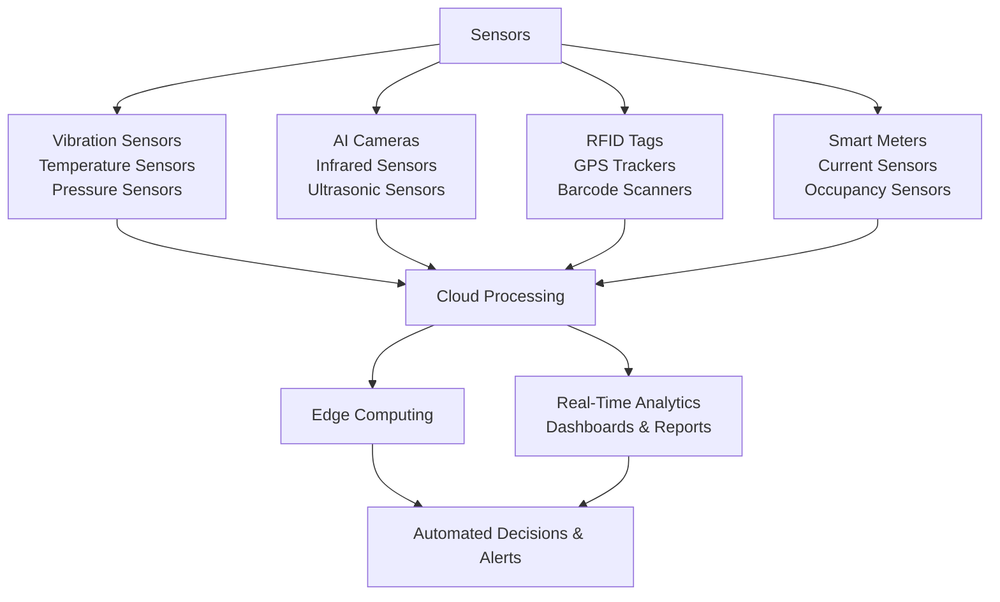

## **IoT Experiment No: 11**

### **Aim:** Case Study on IoT Application for Industry

### Theory: Case Study on IoT Application for **Bajaj Electricals’ Manufacturing Process**

Bajaj Electricals is one of India’s leading manufacturers of electrical appliances, lighting solutions, and infrastructure projects. It produces a wide range of products, including fans, kitchen appliances, water heaters, and LED lighting. Despite being a trusted brand, Bajaj Electricals has faced **operational inefficiencies, supply chain disruptions, and inconsistent product quality** due to the absence of IoT-driven automation.

While competitors like **Havells, Philips, and Syska** have rapidly adopted **IoT-enabled smart manufacturing**, Bajaj Electricals continued to rely on **traditional manufacturing processes** for a long time. This delay in adopting **smart factory solutions, predictive maintenance, and real-time analytics** has negatively impacted its competitiveness.

#### **Challenges Due to the Lack of IoT Integration**

The absence of IoT in Bajaj Electricals' operations has led to **unplanned downtime**, where machines break down unexpectedly, causing production delays and higher costs. Without predictive maintenance, failures occur without warning, leading to frequent disruptions and increased expenses.

**Inefficient quality control** is another issue, as defect detection is manual, allowing faulty products to reach later production stages. This results in **higher rework costs, material wastage, and inconsistent product quality**, unlike IoT-enabled factories that use AI-powered sensors for real-time defect detection.

**Supply chain delays** have also been a challenge due to static inventory tracking, leading to raw material shortages or overstocking. In contrast, IoT-based logistics enable **real-time tracking**, optimizing inventory and ensuring timely restocking.

Additionally, **high energy costs** have been a burden since machines and lights operate at full capacity even when not needed. IoT-driven smart meters could have optimized energy consumption, reducing waste and lowering expenses.

### **IoT-Based Process That Could Have Improved Operations**

The implementation of **IoT-driven smart manufacturing** could have significantly improved the efficiency and cost-effectiveness of Bajaj Electricals' operations. One key area is **predictive maintenance**, where **vibration sensors, temperature sensors, and pressure sensors** could continuously monitor machine health. These sensors would detect early signs of wear and tear, helping prevent unexpected breakdowns. By analyzing real-time data, maintenance teams could schedule repairs proactively, reducing downtime by **30-40%** and minimizing costly disruptions.

Incorporating **automated quality control** would have further enhanced production efficiency. **AI-powered cameras, infrared sensors, and ultrasonic sensors** could have been used to detect defects in real time, ensuring only high-quality products reached customers. These smart inspection systems would have eliminated human error, reduced material wastage, and improved product consistency, strengthening customer trust in the brand.

For **smart supply chain management**, **RFID tags, GPS trackers, and barcode scanners** could have been deployed to provide real-time visibility into inventory movement. This would allow Bajaj Electricals to optimize warehouse storage, prevent shortages, and reduce excess stock. Cloud-based monitoring would have streamlined supply chain operations, ensuring faster restocking and on-time deliveries, giving the company a competitive edge.

Finally, **real-time data analytics** could have been facilitated through **IoT-enabled dashboards, humidity sensors, and production flow sensors** to monitor factory conditions and machine performance. These systems would provide instant insights into operational efficiency, allowing managers to make data-driven decisions quickly. With live monitoring of key metrics, Bajaj Electricals could have improved production agility, optimized resource utilization, and strengthened its market position through advanced IoT integration.

***

The above diagram represents the **IoT-based architecture** for Bajaj Electricals' manufacturing process, integrating **sensors, cloud computing, and real-time analytics**. Various sensors, including **vibration, temperature, AI cameras, RFID tags, and smart meters**, collect data, which is then processed via **cloud computing** and **edge computing**. This enables **real-time analytics, automated decisions, and alerts**, enhancing **efficiency, predictive maintenance, and operational optimization**.

####  Benefits of IoT Implementation

-   **Reduced Downtime:** Predictive maintenance using **vibration, temperature, and pressure sensors** minimizes unexpected machine failures.
    
-   **Improved Product Quality:** **AI-powered cameras, infrared, and ultrasonic sensors** enable real-time defect detection, reducing rework costs.
    
-   **Optimized Inventory Management:** **RFID tags, GPS trackers, and barcode scanners** provide **real-time stock tracking**, preventing shortages and overstocking.
    
-   **Lower Energy Costs:** **Smart meters, current sensors, and occupancy sensors** optimize energy consumption, reducing waste and expenses.
    
-   **Faster Decision-Making:** **Cloud computing and edge processing** enable **real-time analytics**, improving efficiency and agility.
    
  

#### Conclusion: Hence, We did a Case Study on IoT Application for Industry
    
