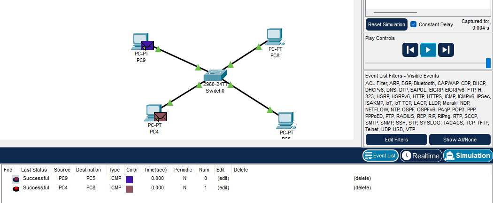
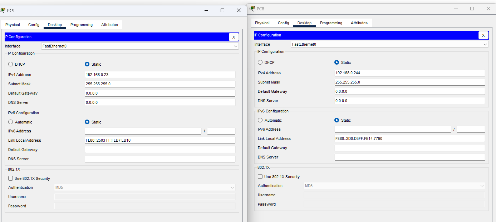
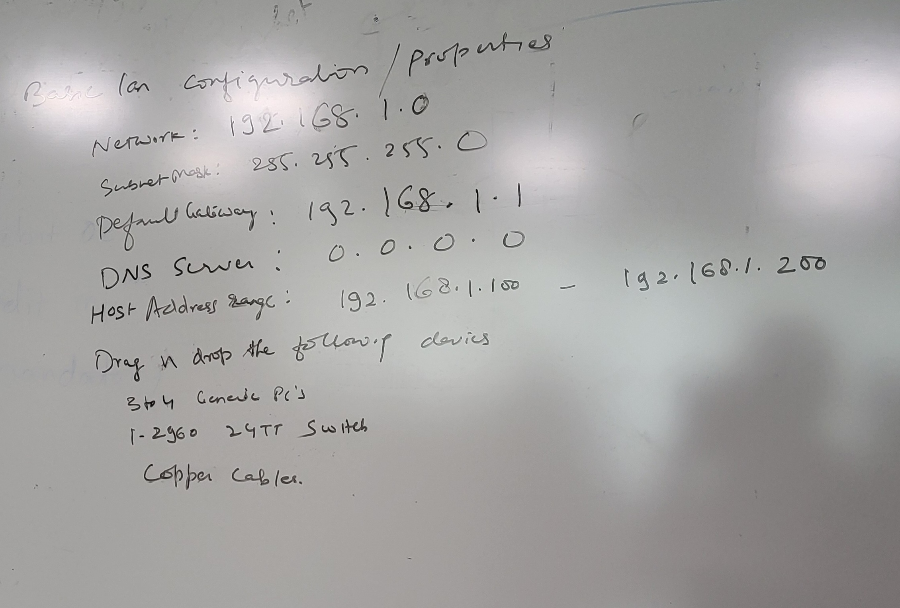

## START
## practical 1 nwa 

1] what is cisco packet tracker 
use/feature 6-7 points

2] 
### Steps to install cisco packet tracker 
[How to Install Cisco Packet Tracer on Windows? - GeeksforGeeks](https://www.geeksforgeeks.org/how-to-install-cisco-packet-tracer-on-windows/)
 
with screenshots

3] configuration of pc and switches and write ip addresses in a network as example
 
 

4] basics of configuration/properties
 

## END

***
## course:  [Free Computer Networking Course by Cisco: Start Learning Now (netacad.com)](https://www.netacad.com/courses/networking-basics?courseLang=en-US)

### practical notes

peer to peer 
set up lan using hub
set up lan using switch

perform practical

***
use copper straight over cable for connecting two different types of devices like pc and switch
use copper cross over cable for connecting two same device like pc with pc

***

#### for each of the following 4 network, discuss the consequences with the connection phase (draw the diagram for below question)

6 devices arranged in bus topology (2-3 lines)

4 devices arranged in a ring topology

5 devices arranged in a mesh topology

7 devices arranged in star topology

#### draw a hybrid topology with a ring backbone and tree bus network

#### assume 5 devices arrange in a mesh topology , how many cables are needed and how many ports are needed for each device